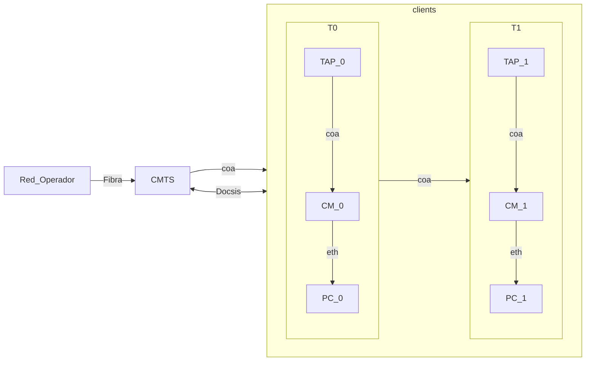

# Arquitectura de la red
<% tp.file.creation_date() %> (YYYY-MM-DD) @ 12:14
Rodríguez López, Alejandro // UO281827

Tags:
	#showable
	Hecho en #EPI
	Sobre #Redes 
	Para #Apuntes 
	Otros:
	Refs:
 

- HFC: Hybrid Fiber Coaxial.
- HTTX: ? To The X.

La cabecera del proveedor reparte conexiones de fibra, a medida que se acerca al usuario, se van sustituyendo por cable coaxial.
Se trata de hacer que la fibra llegue directamente hasta el usuario.

Docsis: Data Over Cable Service Interface Specification