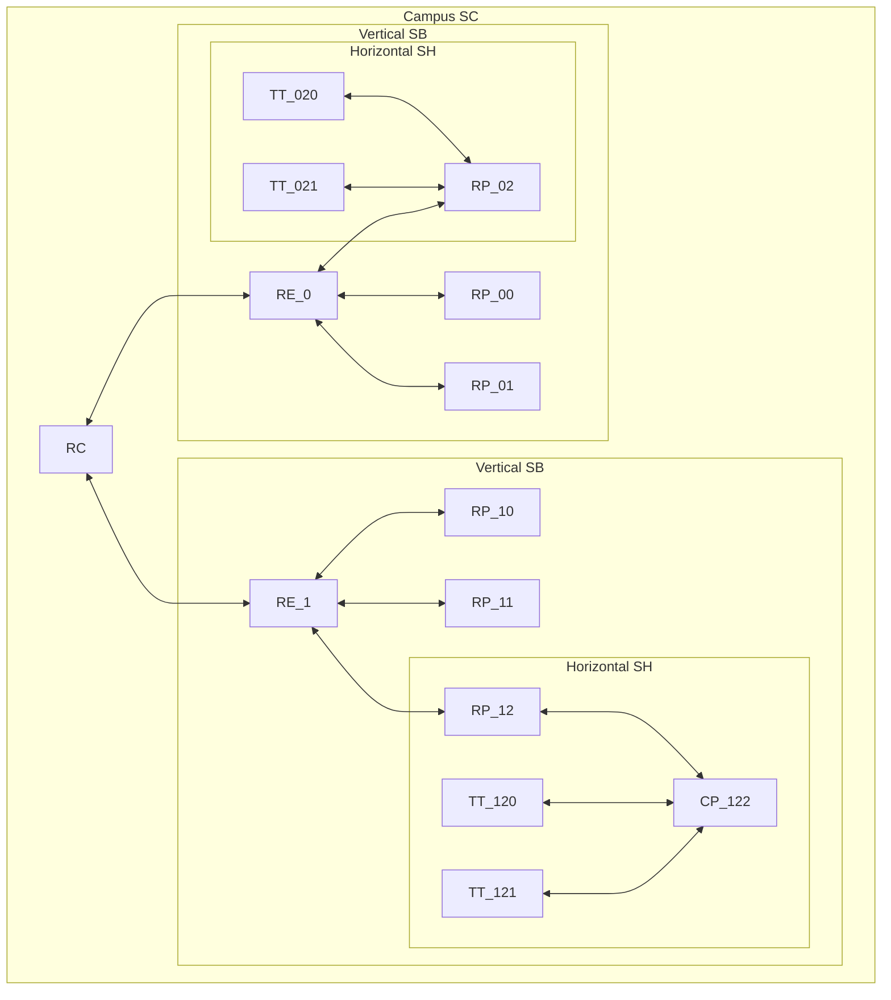

# Repartidores
<% tp.file.creation_date() %> (YYYY-MM-DD) @ 11:20
Rodríguez López, Alejandro // UO281827

Tags:
	#showable
	Hecho en #EPI
	Sobre #Redes
	Para #Apuntes 
	Otros:
	Refs:
 

- RC - Repartidor de Campus.
- RE - Repartidor de Edificio.
- RP - Repartidor de Planta.
- CP - Consolidation point (Repetidor).
- TT - (RJ45).

1. Cableado de Campus ~ (SC)
	- Une RE con RC.
	- Dependiente de la aplicación.
	- Cableado:
		- Voz: Cobre de 2 pares UTP Cat 3.
		- Datos: Fibra óptica Monomodo.
3. Cableado Vertical ~ (SB)
	- Une RP con RE.
	- Dependiente de la aplicación.
	- Cableado:
		- Voz: Cobre de 2 pares UTP Cat 3.
		- Datos: Fibra óptica Multimodo.
4. Cableado horizontal ~ (SH)
	- Une TT con RP, RP con CP o CP con TT.
	- Independiente de la aplicación.
	- Cobre 4 pares UTP Cat. 6 o Fibra óptica (FTPH) Multimodo.