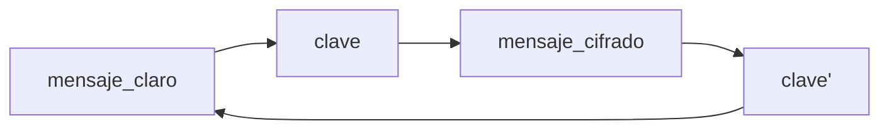

# 10 Seguridad
2023-04-24 14:07 (YYYY-MM-DD) @ 14:07
Rodríguez López, Alejandro // UO281827

Tags:
	#showable
	Hecho en #EPI
	Sobre #Distribuidos 
	Para #Apuntes 
	Otros:
	Refs:
 

## Amenazas
- Interceptación. Rompe la confidencialidad.
- Interrupción. Rompe la disponibilidad.
- Modificación. Rompe la integridad y la autenticidad.
- Fabricación. Rompe diferentes aspectos.

## Mecanismos de seguridad
- Criptografía. Cifra información.
- Control de acceso. Limita qué usuarios tiene acceso a qué recursos.
- Autenticación. Verifica la identidad de un cliente.
- Auditoría. Registra todas las incidencias de seguridad.

## Criptografía

- Clave simétrica: clave = clave'
- Clave asimétrica: clave != clave'

Las clave asimétricas están emparejadas matemáticamente. Lo que una cifra la otra descifra.

### Hash criptográfico

Una función hash a secas recibe una gran cantidad de bytes y retorna una cantidad mucho menor de bytes.
La operación realizada para obtener los bytes de salida es determinista, lo que implica que para la misma entrada siempre se produce la misma salida. Tampoco es reversible, por lo que desde el resultado del hash no se puede obtener la entrada que se utilizó.

Dada una función hash $h(x)$, $h(x)$ cumple con lo siguiente:
- Dado un valor $a$ no es posible encontrar un mensaje $m'$ tal que $a = h(m')$.
- Conocidos $m$ y $a = h(m)$, no es posible encontrar otro $m'$ tal que $a = h(m')$. (Resistencia débil a la colisión).
- No es posible generar dos valores $m$ y $m'$ tales que $h(m) = h(m')$. (Resistencia fuerte a la colisión).

### Clave simétrica
#### Orientado a bloques
El mensaje $M$ se divide en bloques de $n$ bytes.
Cada bloque se cifra individualmente aplicando el mismo algoritmo y clave.
Si el mensaje $M$ no es múltiplo de $n$, entonces es necesario rellenar para lo que hay que aplicar algoritmos criptográficos ya que el rellenado podría facilitar un descifrado imprevisto.

2023-04-27 (YYYY-MM-DD) @ 10:03

### Clave asimétrica

Utiliza dos claves $k_s$ (Clave privada) y $k_p$ (Clave pública).

Sean:
- $E(m,k)$ la función que cifra el mensaje $m$ con la clave $k$.
- $D(m', k')$ la función que descifra el mensaje $m'$ con la clave $k'$.
Entonces:
- $D(E(m, k_p),k_s) = m$
- $D(E(m, k_s), k_p) = m$

La clave privada ($k_s$) no se comunica a nadie.
La clave pública ($k_p$) es conocida por todos.

#### Certificación
Las claves públicas se pueden certificar.
Para certificar la clave, se calcula el hash de la clave (aka, figerprint) y se compara con el fingerprint de quien originó la clave.
Quien certifica la clave, la firma con su clave.
