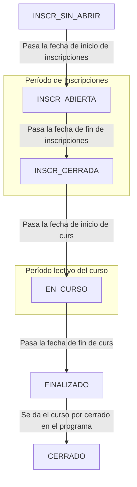

# Curso DTE

```mermaid
flowchart TD
  INSCR_SIN_ABRIR --Pasa la fecha de inicio de inscripciones--> INSCR_ABIERTA
  subgraph Período de Inscripciones
  INSCR_ABIERTA --Pasa la fecha de fin de inscripciones--> INSCR_CERRADA
  end
  subgraph Período lectivo del curso
  INSCR_CERRADA --Pasa la fecha de inicio de curso--> EN_CURSO
  end  
  EN_CURSO --Pasa la fecha de fin de curso--> FINALIZADO
  FINALIZADO --Se da el curso por cerrado en el programa--> CERRADO
  CERRADO
```
