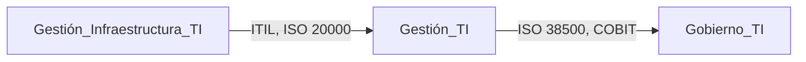

# 1. Introducción a la Gestión de servicios TI e ITIL v3
<% tp.file.creation_date() %> (YYYY-MM-DD) @ 16:09
Rodríguez López, Alejandro // UO281827

Tags:
	#showable
	Hecho en #EPI
	Sobre #GTI
	Para #Apuntes
	Otros:
	Refs:
 

## Gestión y Gobierno de TI

Cuestiones:
- Gobierno de TI.
- Gestión de TI.

Guías:
- Normas ISO 20000-1.
- Marcos de buenas prácticas ITIL, ISO 20000-1.

### Gestión de Servicios TI

**Funciones y procesos** para proporcionar valor a los clientes mediante servicios.
De forma que se alinée con los objetivos del negocio.
Asegurando un nivel de negocio adecuado (disponibilidad, rendimiento, capacidad ...).

#### Beneficios de la Gestión de TI

- Mejora la calidad del servicio.
- Proporciona una perspectiva clara de las capacidades (recursos) de TI.
- Alineamiento de TI con el negocio.
- Enriquece la información sobre los servicios (Beneficios,  calidad ...).
- Proporcionar mejor soporte a los usuarios.
## ITIL

- Conjunto de buenas prácticas en TI.
- Ayuda a mejorar la calidad de servicios.
- Descripción detallada de los procesos.
- Incluye roles y responsabilidades.
- Base para adaptarse a cada organización.

### Mejores prácticas

- Experiencias de aprendizaje y liderazgo de los mejores.

### Independiente del proveedor de servicios

- Aplicables a cualquier organización de TI.
- No basado en plataformas tecnológicas o tipo de industria en concreto (Genérico).

### No prescribe

- Prácticas robustas, maduras y probadas en el tiempo.
- Aplicables a todo tipo de organización de servicios.

### Beneficios ITIL

- Mejora la relación con el cliente.
- Idioma común.
- Mejora la comunicación interna.
- Mejora la capacidad de externalización.
## Conceptos de ITIL

- Buena práctica: Método que ha demostrado validez en la práctica.
- Servicio: Medio para entregar valor a los clientes, facilitando los resultados que quieren conseguir sin asumir costes o riesgos específicos.
- Utilidad: Funcionalidad para cumplir una necesidad.
- Garantía: Cumplimiento de los requisitos acordados.
- Valor: Cumplimiento de las expectativas del cliente.
- Proveedores: Responsables de entrega de bienes / servicios.
- Clientes: Aquellos que compran los bienes / servicios.
- Usuarios: Aquellos que utilizan los bienes / servicios.
- Servicio de TI: Prestado a clientes por un proveedor de TI.
- Servicios internos: Proporcionados y consumidos por la propia organización.
- Servicios externos: Proporcionados por una organización y consumidos por otra.

## Ciclo de vida de servicios en ITIL v3

## Elementos clave en ITIL v3
