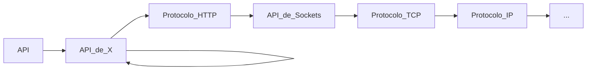

# 1. Servicios Básicos
<% tp.file.creation_date() %> (YYYY-MM-DD) @ 17:30
Rodríguez López, Alejandro // UO281827

Tags:
	#showable
	Hecho en #EPI
	Sobre #Ing_Svcs 
	Para #Apuntes
	Otros:
	Refs:
 
<hr>

## API Sockets de Python

```python
import socket

s = socket.socket()
s.connect(("server.name.org", port))
peticion = """comandohttp
""".encode("UTF-8")
s.send(peticion)
respuesta = s.recv(5000) # se esperan 5000 bytes
print(respuesta.decode("UTF-8"))
```

O lo que es lo mismo:

```python
import socket
def call_utf8_endpoint (servername: str, port: int, petition: str, reply_len: int) -> bytes:
	with soc as socket.socket():
		s.connect(servername, port)
		s.send(petition.encode("UTF-8")) # Will return the number of characters that have been sent
		return s.recv(reply_len)
	return
```

### Tipo de dato `bytes`

```python
my_text: str = "Hello World"
my_bytes: bytes = my_text.encode("UTF-8")
my_bytes_bis: bytes = b"Hello World" # aka a b-string. NOTE: This will return "Hello World".encode('ascii') which may not allow all characters
```

Podría suceder que la petición esté mal formada.

- No puede tener caracteres no ascii, deben ser sustituidos por `%...`, siendo `...` el código hex del caracter.
- No puede tener espacios, deben ser sustituidos por '+'.

Queda a decisión de la implementación del servidor la decisión de ignorar o no peticiones mal formadas.

Python ofrece:
```python
import urllib.request, urllib.parse, urllib.error
import socket
import json

def call_utf8_endpoint (servername: str, port: int, petition: str, reply_len: int) -> dict[str, str]: # NOTE: This always returns str as values
	with soc as socket.socket():
		s.connect(servername, port)
		s.send(urllib.parse.quote(petition).encode("UTF-8")) # Will return the number of characters that have been sent @see send_all
		return json.loads(s.recv(reply_len).decode("UTF-8"))
	return
```

## Otra librería distinta (externa)

`pip install requests`
`sudo apt install python3-requests`

```python
import requests

def call_endpoint (url: str, parameters: dict[str, str]) -> dict[str, str]:
	return requests.get(url, params=parameters).json()
```

<hr>

2023-10-07 (YYYY-MM-DD) @ 11:57

Hecho en #Ribadeo


Se utiliza una estructura de capas:



En cualquier momento se pueden saltar capas, pero eso indica tener que implementar lo que la capa omitida proporcionaba.


