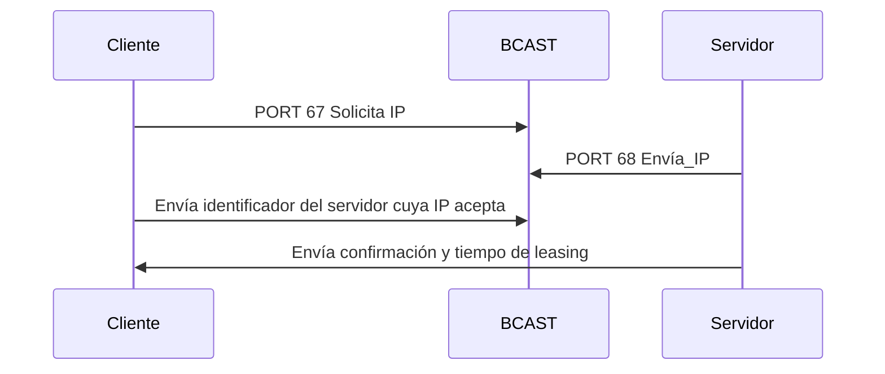

# 1.2. Servicios
<% tp.file.creation_date() %> (YYYY-MM-DD) @ 15:03
Rodríguez López, Alejandro // UO281827

Tags:
	#showable
	Hecho en #EPI
	Sobre #Ing_Svcs
	Para #Apuntes
	Otros:
	Refs:
 

Un servicio es proporcionado por la capa de aplicación y define su propio protocolo (estandarizado en un RFC).

Servicios orientados al usuario: Proporciona una funcionalidad que el usuario final utiliza (i.e. http).
Servicios no orientados al usuario: Proporciona una funcionalidad que el usuario final no utiliza, la utilizan los desarrolladores.

## Servicios básicos

- Red: DHCP, NAT, SNMP.
- Nombres: DNS, LDAP.
- Otros: NTP.

### DHCP

Dynamic Host Configuration Protocol
Cuatro fases:
- Discovery: El cliente envía un paquete a broadcast UDP al puerto 67.
- Offer: Un servidor envía una IP al cliente.
- Request: El cliente envía por broadcast el identificador del servidor que ofreció la IP que quiere.
- Acknowledgement: El servidor cuya oferta se aceptó da la IP por ocupada y envía un datagrama de reconocimiento al cliente.

### NAT

Network Address Translation

Consiste en la modificación de la IP de un paquete al pasar por un router.