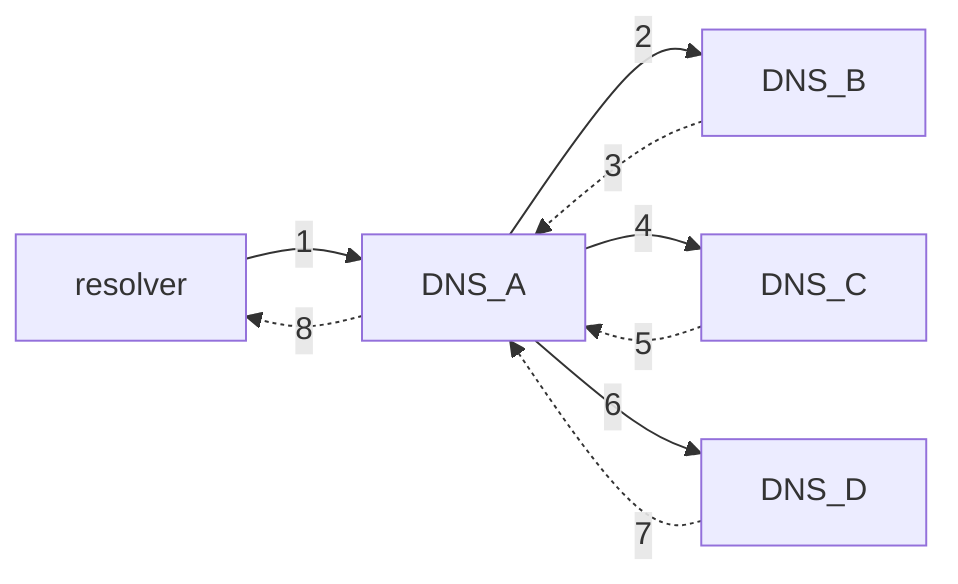

# 3. Nombrado, acceso y archivos
2023-10-11 (YYYY-MM-DD) @ 18:03
Rodríguez López, Alejandro // UO281827

Tags:
	#showable
	Hecho en #EPI
	Sobre #Ing_Svcs 
	Para #Apuntes
	Otros:
	Refs:
 

## Arquitectura básica

- Cliente: Resolver
- Servidor: Nameserver (aka ns).
- Espacio de nombres jerárquico (árbol).
- BBDD distribuida entre muchos servidores.
- Protocolos para cliente/servidor o entre servidores.

2023-10-17 (YYYY-MM-DD) @ 17:06

Hecho en #EPI

## Basic

El resolver hace una petición recursiva.
EL nameserver resuelve la petición de forma iterativa.

1. El cliente quiere resolver el nombre `contaofi.alexrl.com`. Consulta a su DNS (DNS_A).
2. El DNS_A desconoce este nombre, consulta a otro DNS (DNS_B).
3. El DNS_B desconoce este nombre, pero conoce el NS que conoce los dominios `.com` (DNS_C).
4. El DNS_C desconoce este nombre, pero conoce el NS que conoce los dominios `uniovi.com` (DNS_D).
5. El DNS_D conoce todos los subdominios del dominio `uniovi.com`, sabe resolver la petición y retorna la respuesta al DNS_A.
6. El DNS_A cachea la dirección y responde al cliente.

### Tipos de Registro

- SOA: Start of Authority. Información sobre la zona y el NS con autoridad para ella.
- NS: Name Server. NSs para este dominio.
- A: Address. IPv4 asociada a este nombre.
- AAAA: Address IPv6. IPv6 asociada a este nombre.
- CNAME: Canonical Name. Nombre oficial del dominio.
- PTR: Pointer. Nombre oficial del dominio.
- MX: Mail Exchange. Información para el protocolo SMTP.

### Resolución Inversa

Tengo la IP y quiero el nombre del dominio.

### Cacheado

