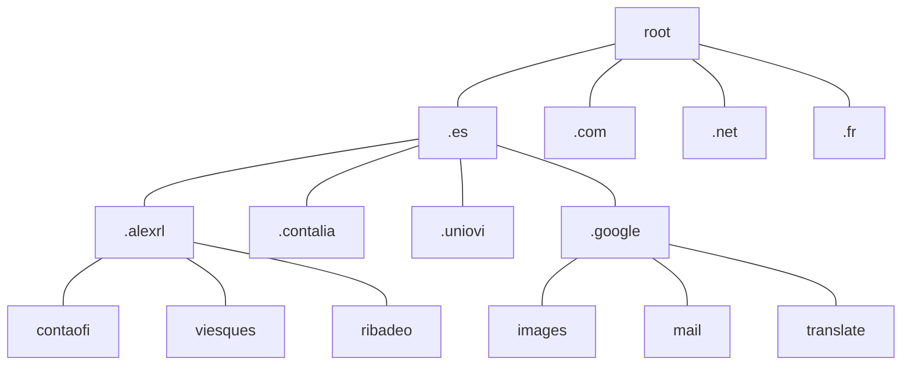
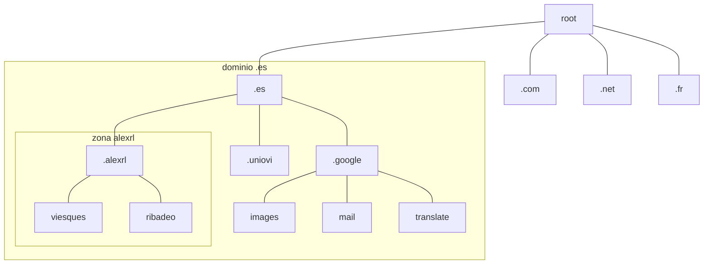
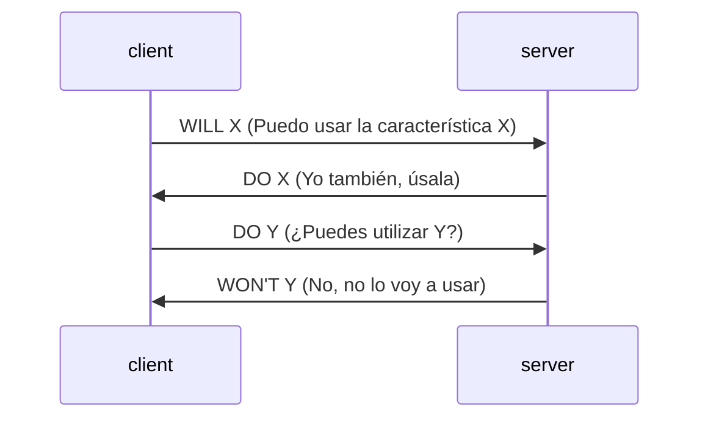
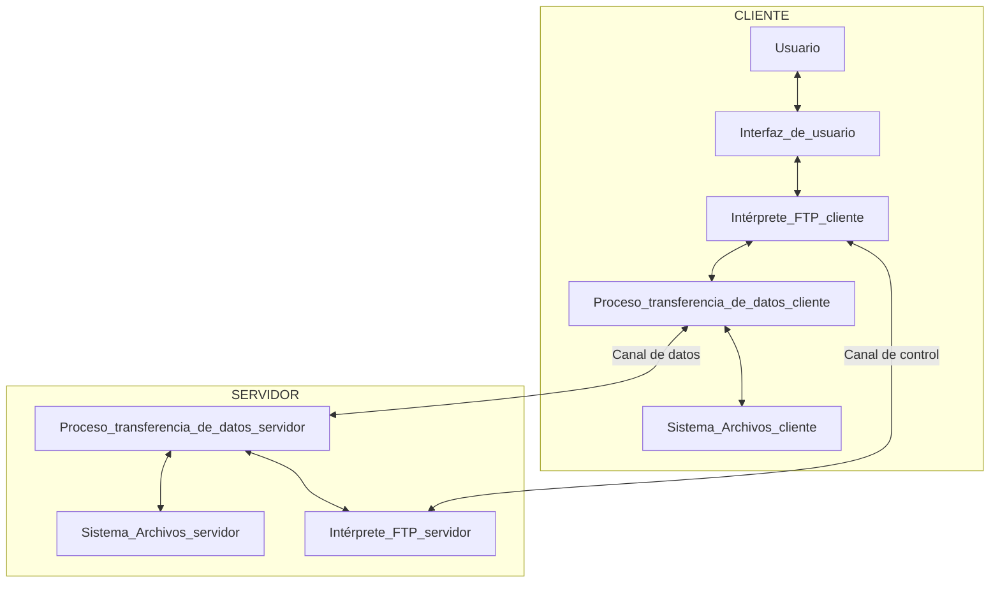

# 3. Nombrado, acceso y archivos
2023-10-11 (YYYY-MM-DD) @ 18:03
Rodríguez López, Alejandro // UO281827

Tags:
	#showable
	Hecho en #EPI
	Sobre #Ing_Svcs 
	Para #Apuntes
	Otros:
	Refs:
 

## Nombrado

El objetivo es obtener la dirección IP dado el nombre de la máquina.
- Opción 1: Almacenar todos los nombres de máquinas e IPs en un fichero y distribuirlo.
	- Colisiones por nombres repetidos.
	- Actualización manual.
- Opción 2: Almacenar todos los nombres de máquinas e IPs en una base de datos distribuida.

### Arquitectura básica

- Cliente: Resolver
- Servidor: Nameserver (aka ns).
- Espacio de nombres jerárquico (árbol).
- BBDD distribuida entre muchos servidores.
- Protocolos para cliente/servidor o entre servidores.

La BBDD almacena los nombres de dominios como claves, cuyos valores son un conjunto de datos:
- Si es un nodo final o una subzona.
- Si es un NS.
- La IP.
- Otros nombres para la misma máquina.
- Nombre canónico.
- Persona de contacto.
- etc.

#### Zonas

Una zona es una partición de nodos del árbol.
Una zona puede ser un subdominio completo o parte.
Una zona permite a esa organización almacenar los nombres de máquinas en su propio NS.

Al delegar nombres en un nuevo NS, el NS original elimina todos los nombres de su BBDD y almacena la dirección del nuevo NS.

#### Dominios de Nivel Superior (TLD)

Son los nodos hijos del nodo raíz.

- Geográficos: `.es`, `.fr`, .`ru`.
- gTLDs: `.com`, `.net`, `.info`, `.org`.

#### Implementación

DNS es la especificación, existen varias implementaciones.
BIND es la más utilizada.

##### Servidor NS

Un NS de una zona conoce las direcciones IP de esa zona.
Un NS de una zona tiene autoridad sobre las IPs de su zona.
Una zona puede tener varios NS para redundancia y/o equilibrado de carga.

##### Resolver

Un resolver es un cliente que busca resolver una IP dado un nombre.
Se comunica con uno o varios servidores NS hasta resolver la IP o descubrir que no existe la máquina.

##### Resolución

Es el proceso mediante el cual un resolver obtiene la IP de un nombre de máquina.
Como puede ser neceario realizar varias consultas, se pueden hacer:
- Recursivas: El NS consulta al siguiente NS que consulta al siguiente NS hasta encontrar la IP.
- Iterativas: El NS consulta al NS que retornó el NS consultado hasta encontrar la IP.

2023-10-17 (YYYY-MM-DD) @ 17:06

Hecho en #EPI

### BIND

El resolver hace una petición recursiva.
EL nameserver resuelve la petición de forma iterativa.

1. El cliente quiere resolver el nombre `atc.uniovi.es`. Consulta a su DNS (DNS_A).
2. El DNS_A desconoce este nombre, consulta a otro DNS (DNS_B).
3. El DNS_B desconoce este nombre, pero conoce el NS que conoce los dominios `.es` (DNS_C).
4. El DNS_C desconoce este nombre, pero conoce el NS que conoce los dominios `uniovi.es` (DNS_D).
5. El DNS_D conoce todos los subdominios del dominio `uniovi.es`, sabe resolver la petición y retorna la respuesta al DNS_A.
6. El DNS_A cachea la dirección y responde al cliente.

#### Tipos de Registro

- SOA: Start of Authority. Información sobre la zona y el NS con autoridad para ella.
- NS: Name Server. NSs para este dominio.
- A: Address. IPv4 asociada a este nombre.
- AAAA: Address IPv6. IPv6 asociada a este nombre.
- CNAME: Canonical Name. Nombre oficial del dominio.
- PTR: Pointer. Nombre oficial del dominio.
- MX: Mail Exchange. Información para el protocolo SMTP.

#### Resolución Inversa

Tengo la IP y quiero el nombre del dominio.

Los RR contienen un campo llamado `PTR`. El `PTR` es el nombre de dominio de esta IP (o sea, la clave).
La resolución inversa utiliza un dominio especial `in-addr.arpa`.
La subred `in-addr.arpa` contiene subredes formadas por las direcciones IP escritas al revés.
Estas subredes de direcciones IP escritas al revés son nombres de dominio.
Si se resuelve una de estos nombres, el campo `PTR` contendrá el nombre de dominio de la IP escrita en el nombre.

Las IP se escriben al revés para facilitar el procesamiento (los nombres de dominio se resuelven de derecha a izquierda).

#### Cacheado

Los NS almacenan en su caché consultas frecuentes.
Generalmente se almacenan las direcciones de otros NS como `.es` y `.com`.
Estas cachés tienen un timeout para que de haber algún cambio en la red DNS se pueda propagar.

## Acceso Remoto

2023-10-17 (YYYY-MM-DD) @ 17:05
Rodríguez López, Alejandro // UO281827

Tags:
	#showable
	Hecho en #EPI
	Sobre #Ing_Svcs 
	Para #Apuntes 
	Otros:
	Refs:
 

El objetivo es comunicar un servidor (Unix) con una o varias terminales de forma remota, a través de internet.

### Telnet

NO CIFRADO

- NVT (Network Virtual Terminal).
- Negociación de opciones.
- Simetría en extremos (tanto el cliente como servidor son una NVT).

#### NVT

La NVT es la terminal más básica posible.
Es el mínimo medio de comunicación necesario entre cliente y servidor.

#### Negociación de opciones

En la mayoría de casos, las terminales de cliente y servidor tendrán más capacidades que la NVT.
Al iniciar una conexión telnet, cliente y servidor comenzarán a negociar para obtener la NVT con mayores capacidades que puedan soportar los dos.

Ejemplo de negociacion:

#### Protocolo

El protocolo telnet es binario.
El protocolo telnet utiliza ASCII de 7 bits (se pueden negociar hasta de 8 bits).
El valor `0xFF (255)` tiene un valor especial, indica que el siguiente byte es un código de un comando telnet.

##### Comandos telnet

| Código | Hex  | Nombre | Significado                         |
| ------ | ---- | ------ | ----------------------------------- |
| 243    | 0xf3 | BRK    | Se ha pulsado la tecla break        |
| 244    | 0xf4 | IP     | Interrumpir Proceso                 |
| 247    | 0xf7 | EC     | Erase Character                     |
| 253    | 0xfd | DO     | Solicito utiliar una característica |
| 251    | 0xfb | WILL   | Acepto la característica            |
| ...    | ...  | ...    | ...                                 | 

### SSH

CIFRADO

Cliente y servidor se conectan mediante TCP.
Cliente y servidor se autentican mediante claves públicas.
Los paquetes van encriptados con algoritmos acordados en la fase de negociación.

1. Establecimiento de la conexión. (SSH-TRANS)
	1. Identificación del servidor.
	2. Negociación.
3. Autenticación entre el cliente. (SSH-USERAUTH))
4. Creación de canales ssh. (SSH-CONNECT)
5. Uso de canales ssh.
6. Cierre de la conexión.

#### Claves criptográficas utilizadas

- Clave de anfitrión (Pública/Privada).
	- Se utiliza para autenticar al servidor ante el cliente.
	- Almacenada en disco.
	- Es la misma en cada sesión.
- Clave de usuario (Pública/Privada).
	- Se utiliza para autenticar al cliente ante el servidor.
	- Almacenada en disco.
	- Es la misma en cada sesión.
- Clave de sesión (Simétrica).
	- Se utiliza para encriptar los mensajes de la comunicación entre cliente y servidor.
	- No se almacena en disco.
	- Cambia en cada sesión.

#### Procedimiento
 
##### SSH-TRANS

1. El cliente se conecta al puerto 22 del servidor.
2. Cliente y servidor anuncian qué versión de SSH soportan.
	- Compatibles => Conectan
	- No compatibles => Desconectan
3. Cada parte envía una lista de los algoritmos que soportan.
	- Intercambio de claves.
	- Firma por clave pública.
	- Cifrado simétrico.
	- Message Authentication Code.
	- Compresión.
4. Cliente y servidor acuerdan la clave de sesión.
	- Utilizan Diffie-Hellman.
5. De ahora en adelante todo se cifra con la clave de sesión simétrica.

##### SSH-USERAUTH

###### Contraseña

1. El cliente pide al usuario la contraseña.
2. El cliente envía la contraseña al servidor.
3. El servidor verifica la clave con `/etc/passwd`.

###### Clave pública

1. El cliente genera un par de claves pública y privada.
2. El cliente envía una copia de su clave pública.
3. El servidor compara la clave con la que tiene para ese usuario (en `~/.ssh/authorized_keys`).
4. El servidor cifra un reto con la clave pública y la envía al cliente.
5. El cliente recibe el reto, lo descifra con su clave privada.
6. El cliente envía el resultado al servidor.
7. El servidor compara lo que retorna el cliente con los datos originales.
8. Si coinciden, la autenticación es correcta.

###### SSH Agentes

Un agente es un proceso que almacena las claves privadas.
El agente puede descifrar los retos enviados por servidores al iniciar conexiones SSH.

##### SSH-CONNECT

1. Se elige un número de canal.
2. Se envía un mensaje solicitando la apertura del canal.
3. El otro extremo responde aceptando o denegando la apertura.
4. Cada paquete SSH contiene el ID del canal al que pertenece.
5. Todos van cifrados y opcionalmente comprimidos.

#### Túnel SSH

`ssh -L[IP-L:]puerto_L:IP_R:puerto_R [-p puerto_S] user@IP_S`

1. El cliente se conecta al `puerto_S` de `IP_S`.
2. El cliente y el servidor establece un tranporte entre `IP_L` y `IP_S`.
3. El cliente se autentica para el usuario `user`.
4. Se crea un canal de reenvio de puertos (Canal-R).
5. El cliente escucha en `IP_L` y `puerto_L`.
6. El servidor envía todo lo que llegue al Canal-R hacia `IP_R` por `puerto_R`.

## Transferencia de Archivos

- Con cliente específico
	- FTP
	- SCP
	- SFTP
	- FTPS
- Utilizando el sistema de archivos del cliente
	- NFS
	- SMB
	- SAMBA
	- SSHFS
- Sistemas de colaboración
	- SVN
	- GIT
	- WebDAV
	- Otros comerciales (Dropbox, OneDrive, GDrive...)

### FTP

- Anterior a HTTP.
- Soportado por navegadores (`ftp://`).
- Permite autenticación de usuarios.
- Requiere dos conexiones TCP.
- No cifrado => Inseguro.

#### Canales

##### Canal de Control

- Iniciado por el cliente conectándose al puerto 21 del servidor.
- Transporta comandos del cliente y respuestas del servidor.
- Activo durante toda la sesión.

##### Canal de Datos

- Iniciado por cliente ó servidor.
- Transporta los archivos.
- Se establece para cada transferencia.
- Puede establecerse entre dos servidores y el cliente los controla.

#### Modos

##### Modo Activo

En el modo activo, el cliente crea la conexión al puerto 21 del servidor.
El cliente crea un socket de escucha y le comunica al servidor el número de puerto.
Cuando hay que transferir un archivo, el servidor se conecta al cliente.

##### Modo Pasivo

En el modo pasivo, el cliente crea la conexión al puerto 21 del servidor.
El servidor crea un socket de escucha y le comunica al cliente el número de puerto.
Cuando hay que transferir un archivo, el cliente se conecta al servidor.

### SCP

Permite transferir ficheros entre un cliente y un servidor SSH.
La transferencia es siempre binaria.
Sólo sirve para transferir archivos, no se puede listar ni crear directorios nuevos.

### SFTP

Permite trasferir ficheros sobre SSH.
Permite listar.
Permite crear directorios.
Permite renombrar.

Utiliza un canal SSH.
Utiliza SSH2.

No es FTP sobre SSH.
