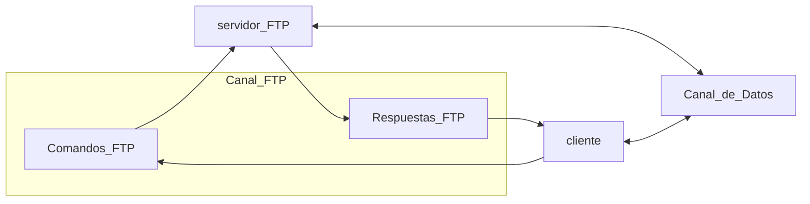
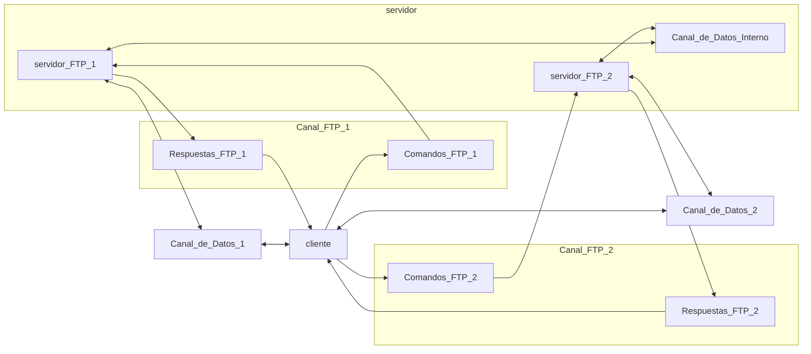

# 3.2. Acceso Remoto
2023-10-17 (YYYY-MM-DD) @ 17:05
Rodríguez López, Alejandro // UO281827

Tags:
	#showable
	Hecho en #EPI
	Sobre #Ing_Svcs 
	Para #Apuntes 
	Otros:
	Refs:
 

## El problema

Se tiene un serividor potente multiusuario.
Si hubiese varios terminales, se podrían conectar al servidor de forma remota?

2023-10-24 (YYYY-MM-DD) @ 17:06

Hecho en #EPI

## SSH

### SSH-TRANS

El Host mantiene la clave pública de cada cliente que inicia una conexión (_authorized keys_).
El cliente mantienen la clave pública de cada host con el que inicia una conexión (_known hosts_).

El objetivo de la lista del cliente es asegurarse de que el host al que se está conectando es el mismo de siempre.

1. El cliente se conecta al puerto 22 del servidor.
2. Cliente y servidor intercambian las versiones de ssh que soportan (utilzan cadenas ASCII sin cifrar).
	- Si no son compatibles, se desconectan.
	- Si son compatibles, se comunican utilizando paquetes binarios sin cifrar del formato: Longitud - Contenido.
3. Cada parte envía la lista de los algoritmos que soportan.
	- Intercambio de claves: `Diffie-Hellman`
	- Firma de clave pública: `RSA`
	- Cifrado simétrico: `AES-DES`
	- Message Authentication Code: `hmac-sha2`
	- Compresión: `zlib`
4. Cliente y servidor generan la clave compartida (aka Session-Key) utilizando Diffie-Hellman.

### SSH-USERAUTH

#### Contraseña

1. El cliente pide al usuario una contraseña y la envía al servidor en un canal ya cifrado.
2. El servidor delega en el operativo la verificación de la clave (/etc/passwd).

> [!note]
> PRO: No es necesaria configuración extra en el servidor y el usuario sigue usando su contraseña.
> Contra: La contraseña tiene que estar en el servidor y no se puede realizar una conexión sin el usuario (de forma desatendida).

#### Clave pública

1. El cliente genera una pareja de claves pública y privada con `ssh-keygen`, almacenadas en la carpeta `~/.ssh/`.
2. El servidor debe tener una copia de la clave pública generada en el cliente, almacenada en `~/.ssh/authorized_keys`.

El fichero está igualmente protegido por una contraseña, pero ahora, será necesario que el atacante sepa la contraseña y tenga el fichero de la pubkey.

El programa ssh-agent, permite evitar tener que introducir la contraseña de la key. `ssh-add keyfile`.

### SSH-CONNECT

### Utilidad de los canales

`ssh -L[IP_L:]puerto_L:IP_R:puerto_R [-p puerto_s] user@ip_s`

`ssh -L8888:otherip:8080 -p 2222 alex@myip` se conectará al puerto 8080 de otherip a traves del 2222 the myip desde un socket de mi ip con puerto 8888

Con esto es posible interactuar con un servicio de un servidor a través de una conexión ssh.
Esto es, toda la comunicación con ese servicio está cifrada por tener debajo una conexión ssh.

## FTP (File Transfer Protocol)

También es posible que un cliente se conecte a varios servidores al mismo tiempo.
A efectos del cliente, los servidores son como una sóla conexión.
Entre los dos servidores existe un canal de comunicación de datos.

> [!note] no examen
> Algunos comandos ftp

FTP permite indicar el tipo de los ficheros a enviar.
Se puede seleccionar binary para enviar los ficheros tal cual son en el servidor.
Se puede seleccionar ascii para enviar los ficheros corrigiendo los retornos de carro y otros caracteres para que coincida con aquellos de la máquina destino.

## SCP / SFTP

SCP permite transferir ficheros entre un cliente y un servidor con ssh.
SFTP permite transferir ficheros sobre ssh (No es ftp sobre ssh, es un protocolo nuevo).
