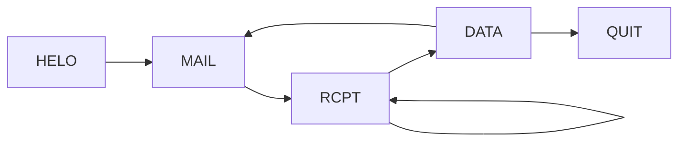
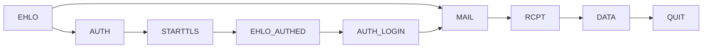

# 4. Correo Electrónico
2023-10-31 (YYYY-MM-DD) @ 17:05
Rodríguez López, Alejandro // UO281827

Tags:
	#showable
	Hecho en #EPI
	Sobre #Ing_Svcs 
	Para #Apuntes
	Otros:
	Refs:
 
<hr>

## SMTP

- La conexión puede ir cifrada con TLS.
- Los correos pueden estar cifrados en el tránsito entre MUA y MTA.
- Dentro de un MTA, el correo no está cifrado.
- Los correos no suelen ir cifrados en el tránsito entre MTAs.

- Protocolo orientado a líneas de texto.
	- Petición: Comando + Parámetros
	- Respuesta: Código + Descripción textual
	- Terminador de línea: CRLF `\r\n`.

### Comandos básicos

| Comando | Parámetros          | Significado                                                |
| ------- | ------------------- | ---------------------------------------------------------- |
| HELO    | nombre_nodo_origen  | Saludo del cliente                                         |
| MAIL    | FROM: remitente     | Solicita el envio de un correo desde el remitente indicado |
| RCPT    | TO: destinatario(s) | Indicia a quién debe enviar el mensaje                     |
| DATA    | --                  | Separa el helo, mail y rcpt del resto del mensaje          |
| QUIT    | --                  | Finaliza la conexión SMTP                                  |

> [!info] DATA
> El cuerpo que sigue a DATA contiene las cabeceras y el cuerpo del texto.
> Las cabeceras van separadas por un CRLF.
> Las cabeceras van separadas del cuerpo por una línea con un solo punto (`\r\n.\r\n`).



El cliente puede enviar varios correos en una misma conexión.
El cliente puede volver a enviar el comando `MAIL` con otro remitente para enviar otro correo.
El cliente puede enviar el mismo mensaje a varios destinatarios enviando varias veces el comando `RCPT`.
El cliente indica que no tiene más correos que enviar con el comando `QUIT`.

El sobre también tiene cabeceras `FROM` y `TO`.
Estas no tienen por qué estar relacionadas con las de SMTP.
Estas pueden tener informacion distinta.
Estas pueden ser utilizadas para implementar el campo Blind Carbon Copy.

### Extensiones de SMTP

Existen otros comandos SMTP como `AUTH`, pero para acceder a estos es necesario utilizar una versión moderna de SMTP.
Para utilizar esta versión, el cliente sustituye el comando `HELO` por `EHLO`.

Otros beneficios de la versión moderna:
- El cliente puede usar `STARTTLS` para iniciar comunicación cifrada.
- El cliente puede usar `AUTH {método}`
	- `LOGIN`: Nombre de usuario y contraseña en Base 64.
	- `PLAIN`: Nombre de usuario y contraseña en texto plano.

> [!info] Respuesta multilínea
> El servidor puede enviar una respuesta multilínea.
> La diferencia entre ésta y una normal es que la última línea de la respuesta tiene un espacio entre el código y la explicación.
> El resto de líneas del mensaje tienen el código y la explicación separados por un guión.
> ```
> 250-...
> 250-...
> 250-...
> 250 ... <-- Última línea
> ```



## POP3 (Post Office Protocol)

1. Conectarse al MTA que tiene el buzón de mensajes.
2. Consultar cuántos mensajes hay en el buzón.
3. Descargar mensajes seleccionados.
4. Borrar mensajes del buzón.

### Autorización

Inicialmente utilizaba:
- USER
- PASS

Posteriormente utilizó:
- APOP

> [!warning] Examen
> Paso del ejemplo APOP
> Paso de los estados de POP3
> Paso de todo hasta IMAP
