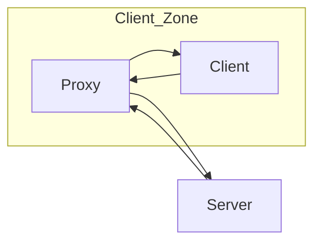
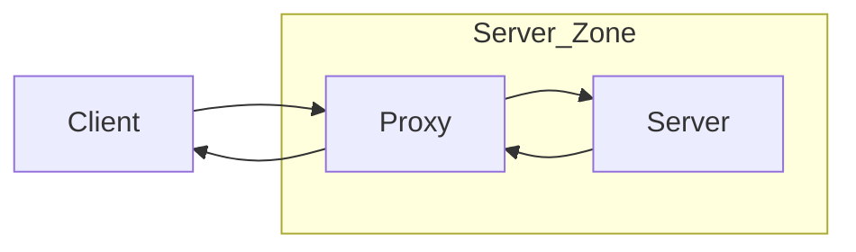
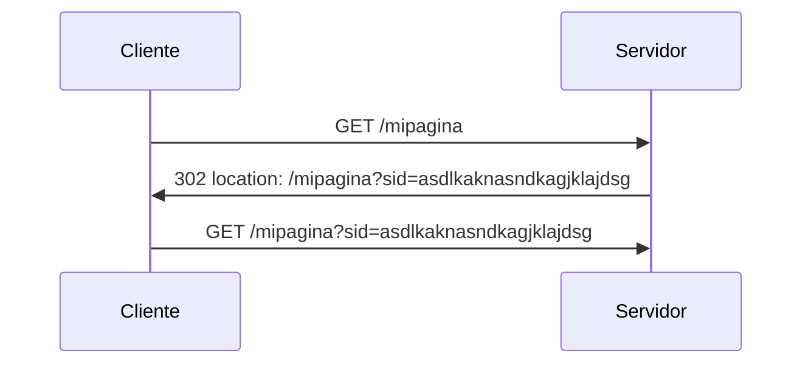
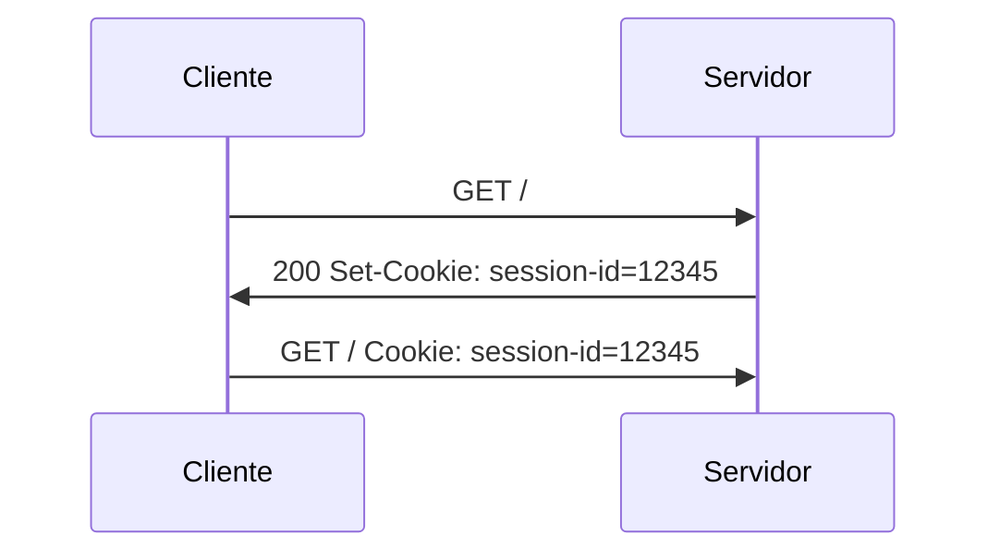
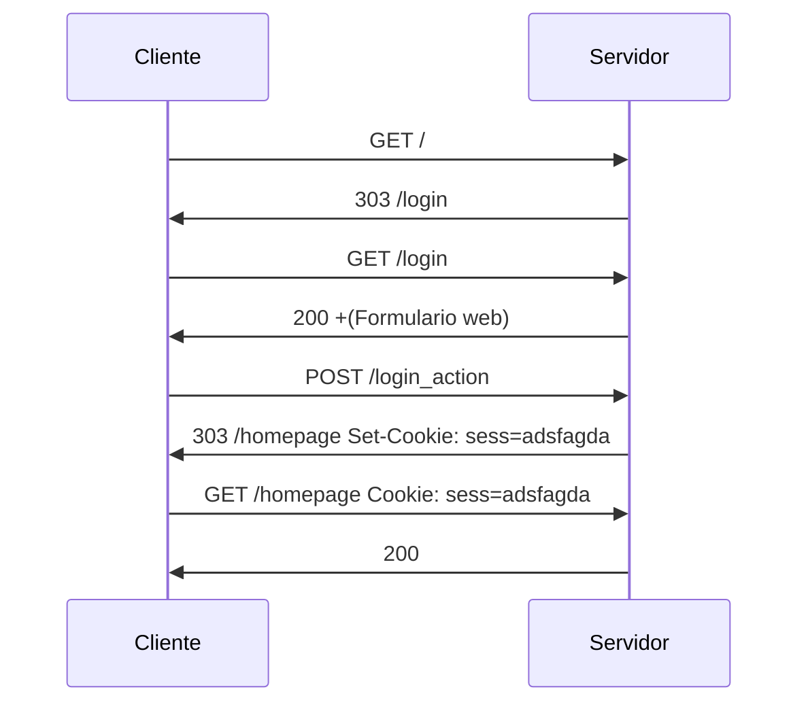

# 4. Proxies y Cachés
<% tp.file.creation_date() %> (YYYY-MM-DD) @ 15:37
Rodríguez López, Alejandro // UO281827

Tags:
	#showable
	Hecho en #EPI
	Sobre #Ing_Svcs
	Para #Apuntes
	Otros:
	Refs:
 

## Proxies

Cliente: Programa que solicita un recurso.
Servidor: Programa que suministra un recurso.

Proxies: Servidores intermedios entre el cliente y el servidor.
Existen 2 tipos de proxies:
- Directo: Sirve peticiones dirigidas a otros servidores.

- Inverso: Un servidor que obtiene sus recursos de otro servidor (O sea, que actúa de cliente de otro servidor).

## Cachés

Es un almacén cercano y rápido.

- Caché local: Almacenada en el navegador.
- Caché remota: Almacenada en proxies.

2023-10-04 (YYYY-MM-DD) @ 18:04

## Token de sesión HTTP

Es un identificador único para cada sesión.

- Lo genera el servidor en la primera interacción con el cliente.
- Se envía al cliente de alguna forma.
- El cliente lo debe proporcionar al servidor en cada petición.

Mecanismos de transmisión:

- URL (raro)
- Cookie (común)

### Token en la URL

Si el usuario comparte la URL (que contiene el token de sesión), otro usuario podría ser tratado como el usuario original que compartió la URL.

### Token en las Cookies

Las cookies son información enviada por el servidor al cliente en la cabecera `Set-Cookie`.
El cliente debe guardar la información de dicha cabecera en algún lado (RAM, disco).
El almacenamiento de cookies se denomina Cookie Jar.
Dependiendo de dónde se almacene la Cookie Jar (RAM, disco), los datos serán o no persistentes.
El cliente deberá enviar la cookie al servidor en cada comunicación, utilizando la cabecera `Cookie`.

#### Sintaxis de las Cookies

Servidor: 

`Set-Cookie:nombre=valor; atributos`.

- Nombre: Identificador alfanumérico.
- Valor: Secuencia de caracteres (excepto ';'), sin significado para el cliente.
- Atributos: Parejas `clave=valor;` que definen aspectos de la cookie.

Si la Cookie no tiene atributo de caducidad (`Expires`) se asume que no caduca.
Si la Cookie no tiene atributo de path se asume que es `/`.

Si el servidor quiere enviar varias cookies, puede enviar varias `Set-Cookie`.

Cliente:

`Cookie:nombre=valor;nombre=valor;...`

#### Tipos de Cookies

- Cookies de sesión: Se guardan en RAM y no tienen atributo de caducidad (`Expires`).
- Cookies persistentes: Se guardan en disco y tienen atributo de caducidad (`Expires`).

#### Cookies de terceros

Son cookies que se envian a servidores distintos del que aparece en la barra de navegación.

## Autenticación

El servidor puede configurar los recursos para que sean accesibles por cualquiera o por determinados usuarios registrados.

Mecanismos:

- Utilizando la cabecera Authentication
- En la URL
- En Cookies
- En el cuerpo de mensajes

### En HTTP

Al acceder a un recurso protegido sin incluir la cabecera Authentication, el servidor retorna un `401 Unauthorized` y el método de autenticación en `WWW-Authenticate`.

El cliente solicitará al usuario las credenciales y repetirá la petición con la cabecera `Authorization`.

Si las credenciales son correctas y el usuario indicado tiene permiso para acceder al recurso, el servidor retorna `200 Ok`.
Si las credenciales son correctas y el usuario indicado no tiene permiso para acceder al recurso, el servidor retorna `403 Forbidden`.
Si las credenciales no son correctas, el servidor retorna `401 Unauthorized`.

El nombre de usuario y contraseña son enviados al servidor separados por un ':' en base 64 para que los caracteres sean ASCII.

### En Aplicación

Al acceder, el servidor utiliza un `303 See Other` para redirigir al cliente a una pantalla de login.
El servidor retorna un formulario web.
El cliente envía el formulario relleno.
El servidor comprueba los datos recibidos y crea un token de sesión.

