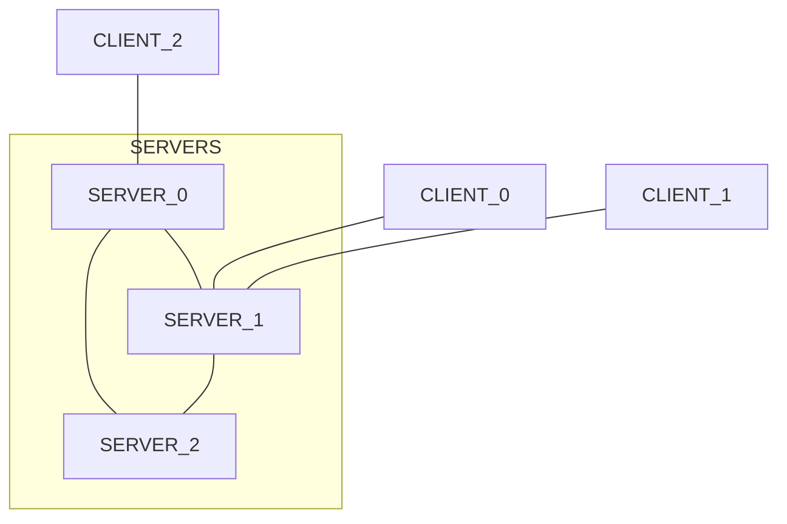

# 6. Mensajería Interactiva
2023-11-21 (YYYY-MM-DD) @ 17:04
Rodríguez López, Alejandro // UO281827

Tags:
	#showable
	Hecho en #EPI
	Sobre #Ing_Svcs 
	Para #Apuntes
	Otros:
	Refs:
 
<hr>

- Detección de Presencia
- Inicio de Sesión
- Transmisión de Datos

## SIP (Session Initiation Protocol)

- ASCII
- Permite TLS
- Utiliza TCP o UDP
- Admite SDP

## SIMPLE (Session Initiation Protocol for Instant Messaging and Presence Leaving Extensions)

- Extensión de SIP para implementar mensajería por texto
- Mecanismo subscribe/notify de presencia

## XMPP (eXtensible Messaging and Presence Protocol)
 
Incluye subprotocolos para:
- Presencia
- Inicio de Sesión
- Mensajería

Módulo principal para mensajería instantánea.
Conjunto de extensiones (XEPs) para añadir mayor funcionalidad:
- Notificación de actividad
- Salas de chat
- VoIP
- ...

### Asíncrono

XMPP es asíncrono.
- Mantiene una conexión TCP permanentemente con el servidor.
- Cliente y servidor envían mensajes por esa conexión simultáneamente.
- Mensajes XML.
- El servidor mantiene estado.
- El servidor notifica al cliente de cambios.

### Arquitectura

La red XMPP es federada.
Está compuesta por varios servidores conectados a los que se conectan los clientes.



Aunque la comunicación es siempre single-hop.
Esto implica que todos los servidores están conectados entre sí.
Por lo tanto, un mensaje sólo atravesará 2 servidores como máximo (el del emisor y receptor).
En el caso que emisor y receptor estén conectados al mismo servidor, sólo se atravesará ese.

### Jabber

Cada usuario tiene un identificador único.
manolo@miservidorjabber.com

> [!info] JID
> Un Jabber ID (JID) puede ser full.
> El full parece tener al final el dispositivo en el que se está conectado.

#### Roster

Sería la agenda de contactos de cada usuario.
Es una lista de JIDs de los que somos amigos :).

#### Protocolo

Está basado en XML.
Cada fragmento XML se denomina una _stanza_.
Hay 3 tipos de _stanza_:
- Presence: Señala la disponibilidad de un usuario.
- Message: Transporta un mensaje a un JID.
- Iq: Solicita o transporta la respuesta a otro iq. (Information Query, maneja el roster entre otras cosas).

```xml
<stream:stream>
	<presence /> <!-- param por defecto: type="available" -->
	<iq type="get">
		<query xmlns="jabber:iq:roster" /> <!-- Solicita roster -->
	</iq>
	<iq type="result">
		<query xmlns="jabber:iq:roster"> <!-- Respuesta -->
			<item jid="a@b.lit">
			<item jid="c@b.lit">
		</query>
	</iq>
	<message from"a@b.lit" to="c@b.lit"> <!-- A envía un mensaje a C -->
		<body>Off with his head!</body>
	</message>
	<presence type="unavailable" /> <!-- Cambia el estado de presencia -->
```

##### Presence

Las notificaciones de tipo Presence siguen el modelo Pub/Sub.
Un usuario está subscrito a las notificaciones de presencia de otro(s) usuario(s).
Cuando un usuario cambia su presencia, sus subscriptores reciben el cambio.

Cuando A se subscribe a las presence de B:
```xml
<presence from="A" to="B" type="subscribe" />
```

Cuando B acepta la subscripción de A:
```xml
<presence from="B" to="A" type="subscribed" />
```

###### Estados

- Chat: Disponible para chatear.
- Away: No disponible temporalmente.
- Xa: Extended Away.
- Dnd: Do not disturb.

###### Prioridades

`<presence>` puede incluir el tag `<priority>`, que puede ser un valor entre -127 y 128.
A mayor valor, mayor prioridad.
Un equipo con prioridad negativa no recibe mensajes.
No existe otra diferencia entre dos dispositivos de prioridad negativa.

###### Extensiones

`<presence>` puede incluir:

- Coordenadas GPS del contacto.
- Información sobre qué música está escuchando.
- etc.

##### Message

###### Atributos

- id: Identificador.
- from: Full JID de quien emite el mensaje.
- to: JID del destinatario.
- type: Tipo de mensaje emitido.
	- normal: Especie de SMS, si el dispositivo 'to' no está disponible, se le entrega más tarde.
	- chat: Conversación en tiempo real con un dispositivo conectado.
	- groupchat: Conversación a varios usuarios.
	- headline: Aviso que no admite respuesta.
	- error: Transporta un mensaje de error.

> [!warning] normal / chat
> Los mensajes de tipo normal se almacenan en el servidor por si el destinatario no está disponible.
> Los mensajes de tipo chat no se almacenan en el servidor porque es el tiempo real.

##### IQ (Info Query)

###### Atributos

- id: Identificador.
- from: JID de quien hace la consulta o quien la responde:
- to: JID de a quién va dirigida la consulta.
- type: Tipo de query.
	- get: Solicita información (HTTP GET).
	- set: Cambia información (HTTP PUT).
	- result: Contiene la respuesta a una iq previa.
	- error: Error relativo a una iq previa.

###### Query

El elemento `<query>` se inserta como hijo de un `<iq>`.
El elemento `<query>` contiene un atributo `xmlns` que contiene el nombre del recurso consultado.

> [!error] from
> Q: El `from` de la stanza `<message>` es full, lo es también el de `<iq>`?
