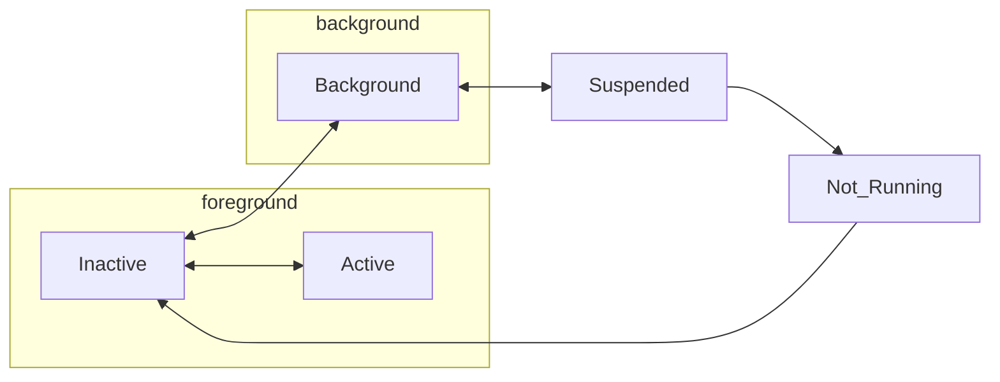
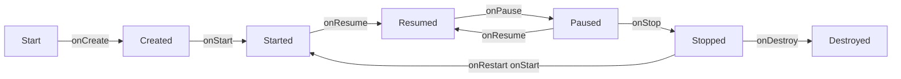
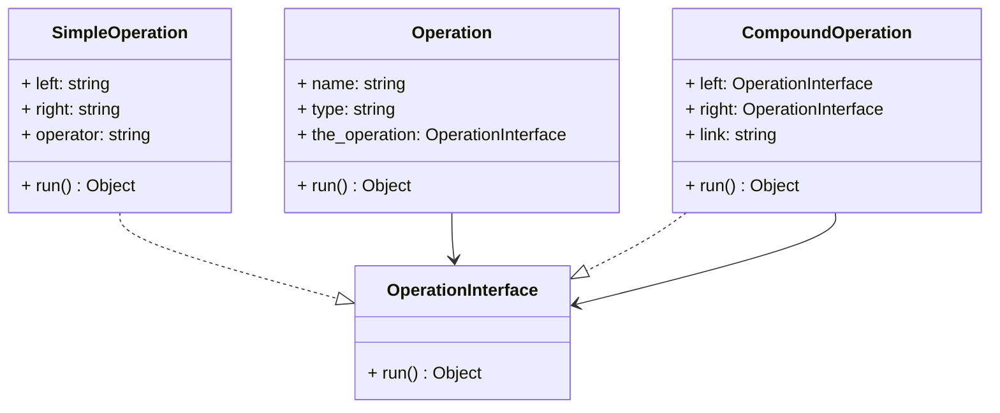

# 7. Servicios sobre móviles
2023-11-22 (YYYY-MM-DD) @ 18:05
Rodríguez López, Alejandro // UO281827

Tags:
	#showable
	Hecho en #EPI
	Sobre #Ing_Svcs 
	Para #Apuntes
	Otros:
	Refs:
 

Los servicios sobre móviles consisten en servicios cuyo cliente es un dispositivo móvil (smartphone, tablet, PDA).

## Cuestiones a tener en cuenta

A la hora de hacer un servicio para un dispositivo móvil, hay que tener en cuenta cuestiones que no se tendrían en cuenta en el desarrollo para escritorios.

- Uso de batería
- Uso de datos
- Redes inalámbricas con poco ancho de banda
- Uso de RAM (limitada)
- Uso de espacio de disco
- La IP cambia constántemente por NAT en diferentes redes

## Diferencias

### Sandboxing

Cada aplicación se ejecuta en un entorno aislado.

Android: Cada aplicación se ejecuta en una VM de Java.
IOS: El acceso al sistema de ficheros está muy restringido.

Compartir datos entre dos aplicaciones es complicado.

### Acceso al hardware

Cada aplicación declara de antemano el hardware que requiere.

### Planificación de tareas

La multitarea está limitada.

## Componentes

### Android

- Actividades: Pantallas que ve el usuario. Sólo puede haber una en cada momento.
- Servicios: Código que se puede ejecutar en segundo plano. No tiene pantalla. Se puede ejecutar mientras hay una Actividad.
- Content Providers: Permite compartir datos con otras aplicaciones.
- Broadcast Receivers: Recibe notificaciones del sistema.

## Ciclo de vida

Sólo existe una aplicación en primer plano en cada momento.
Una aplicación que pasa a segundo plano detiene su ejecución.

### IOS

### Android

1. Created: Se crea la aplicación.
2. Started: Comienza su ejecución.
3. Resumed: Aplicación en primer plano.
4. Paused: Visible pero no ejecuta código.
5. Stopped: Detenida. Otra aplicación pasó al primer plano.
6. Destroyed: Eliminada por el usuario o el operativo.

> [!warning] Stopped
> El operativo puede destruir aplicaciones en estado stopped si necesita memoria.

## Procesos

### Android

Cada aplicación utiliza un proceso.
Cada aplicación utiliza una JVM.

#### Eliminación

El operativo elimina procesos en el siguiente orden:

1. Procesos vacíos: No albergan componentes.
2. Procesos de background: Estado stopped.
3. Procesos de servicio: Procesos no enlazados a actividades.
4. Procesos visibles: Actividades en estado paused y sus servicios.
5. Procesos de foreground: Actividades visibles, sus servicios y receptores broadcast.

#### Hilos

Cada apliación utiliza un hilo para manejar eventos en la GUI.
Si la aplicación requiere utilizar la red, llama a otro hilo.
Android proporciona la clase `AsyncTask`  para crear hilos.

