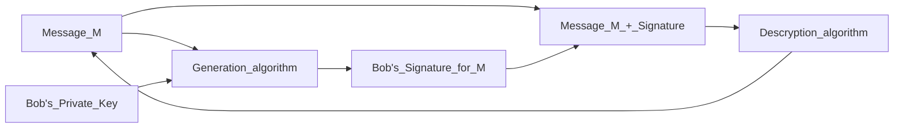
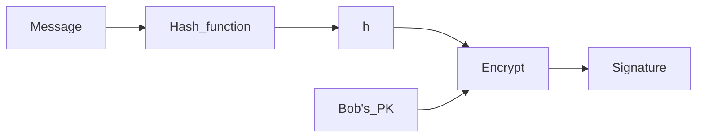
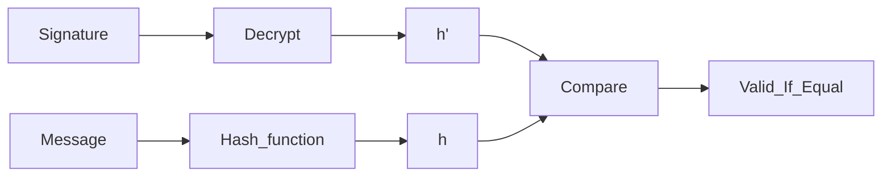

# 4.1. Firma Digital
<% tp.file.creation_date() %> (YYYY-MM-DD) @ 17:03
Rodríguez López, Alejandro // UO281827

Tags:
	#showable
	Hecho en #EPI
	Sobre #Seguridad
	Para #Apuntes
	Otros:
	Refs:
 

Problemas de autenticación:
1. Autenticidad del emisor: ¿Cómo sabe el destinatario que el emisor del mensaje es quién debe ser?
2. Autenticidad del mensaje: ¿Cómo sabe el destinatario que el mensaje recibido es el que debe ser?
3. (Otras 2 q no pillé)

Soluciones:
1. Autenticación mediante cifrado de mensajes con un algoritmo simétrico.
2. Autenticación meidante funciones hash.
3. Autenticación mediante MAC.
4. Autenticación mediante una firma digital.
5. Autenticación mediante firma digital.

## La firma digital

Secuencia de bits que se añade a un documento electrónico que permite autenticar al documento y a su autor.

Requisitos:

- La firma es única, sólo la puede generar su propietario.
- Irrevocable, el propietario no la puede rechazar.
- Es fácil de generar.
- Fácil uso por propietario y ususarios.
- Debe depender del documento y del autor.

Esquema con anexo: Requiere el mensaje original como entrada al algoritmo de verificación
Esquema con recuperación: No requiere el mensaje original. El mensaje se recupera de la propia firma.
Esquema Probabilista: Introduce información generada aleatoriamente. (La secuencia de bits varía cada vez que se utiliza).
Esquema Determinista: No introduce información generada aleatoriamente. (La secuencia de bits es siempre la misma).

Todos los esquemas se basan en los mismos 3 algoritmos:

- Firma
- asfd
- Recuperación

Con anexo:

Con Hash:

Emisor:

Receptor:

### RSA

Las firmas RSA tienen un apéndice y pueden ser deterministas (RSASSA-PKCS1) o probabilistas (RSASSA-PSS).

#### RSASSA-PCKS1

Generación:

1. Codificación
	1. Aplicar función hash para obtener H = Hash(M)
	2. Codificar el ID de la función Hash y el valor del hash como un tipo Digest info de ASN.1 (Llamado T).
	3. Generar un Padding String (PD).
	4. Construir la codificación del mensaje EM (0x00 || 0x01 || PS || 0x00 || T).
2. Cifrado de la codificación del mensaje
	1. Convertir la codificación del mensaje EM en un número m.
	2. Cifrar con RSA usando la clave privada (d, n) -> $s = m^d \mod n$
	3. Convertir el nnúmero $s$ a bytes para obtener la firma S

Verificación:

1. Descifrado de la firma
	1. Convertir la firma S en un número $s$.
	2. Descifrar con RSA usando la clave pública (e, n) -> $m = s^e \mod n$
	3. Convertir el número $m$ en una cadena de bytes (mensaje EM).
2. Verificación
	1. Método 1:
		1. Codificar el mensaje recibdo $M_r$.
		2. Comparar $EM' == EM'_r$
			1. Iguales ==> Firma verificada
			2. Distintos ==> Firma no verificada
	2. Método 2:
		1. Decodificar EM
		2. Extraer el Hash(M) = H'
		3. Calcular el hash del mensaje recibido $H'_r$
		4. Comparar $H' == H'_r$
			1. Iguales ==> Firma verificada
			2. Distintos ==> Firma no verificada

#### RSASSA-PSS

Generación

1. Codificación del mensaje:
	1. Generar el hash de M: mHash = Hash(M)
	2. Generar salt (cadena de bytes aleatoria): M' = padding_1 || mHash || salt
	3. Generar hash de M': H = Hash(M')
	4. Formar el datablock: DB = padding_2 || salt
	5. Calcular dbMask = MGF(H)
	6. Calcular maskedDB = DB xor dbMask
	7. Poner bits +Izda de maskedDB a 0
	8. EM = maskedDB || H || bc
2. Cifrado
	1. Lo mismo que en el anterior
3. Descifrado
	1. Lo mismo que en el anterior
4. Verificación
	1. Generar mHash = Hash(M)
	2. "Cosas que no tienen mucha importancia hasta el paso 6 sin incluir"
	3. Calcular dbMask = MGF(H)
	4. Calcular DB = maskedDB xor dbMask
	5. Poner bits +Izda de DB a 0
	6. Si no coinciden con el padding_2 => Inconsistencia; Stop;
	7. Salt = sLen bits +Dcha de DB
	8. Formar M' = padding_1 || mHash || salt (Padding_1 es constante determinista)
	9. Generar el Hash de M': H' = Hash(M')
	10. Comprobar si el hash H' coincide con hash H.
		1. Iguales ==> Firma verificada
		2. Distintos ==> Firma no verificada

> [!error] Examen
> Estos esquemas hay que saberlos

## Cálculo de Inversos Modulares (Out of nowhere)

El algoritmo de Euclides permite encontrar solución a la identidad de Bezout:
$$
	MCD (a, b) = a \cdot x + b \cdot y
$$
El inverso modular de un número a se obtiene como la solución de $a \cdot x = 1 (mod m)$
x es el númmero que multiplicado por a y calculado el módulo m del producto da 1
Por la definición de congruencia m es el divisor de ($a * x - 1$)

...

$MCD(a, b) = g,\ \forall a > b$
|  |  |  | Despejar el resto |
| --- | --- | --- | --- |
| K = 0 | a / b | a = q_0 \cdot b + r_0 | r_0 = a - q_0 \cdot b |
| K = 1 | b / r_0 | b = q_1 \cdot r_0 + r_1 |  |
// Repetir hasta llegar a un resto = 0. El algoritmo siempre converge.
// El último resto distinto de 0 es $g$.

El divisor en la siguiente iteración pasa a ser el dividendo, y el resto el divisor.

El último resto despejado:
se debe operar hasta obtener una operación de la forma: $1 = k \cdot e - j \cdot m$
