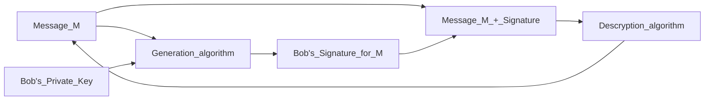
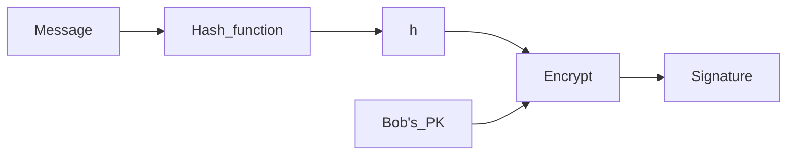
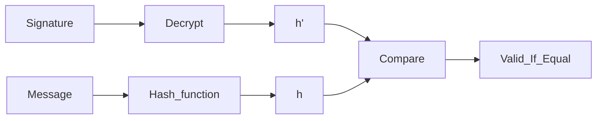
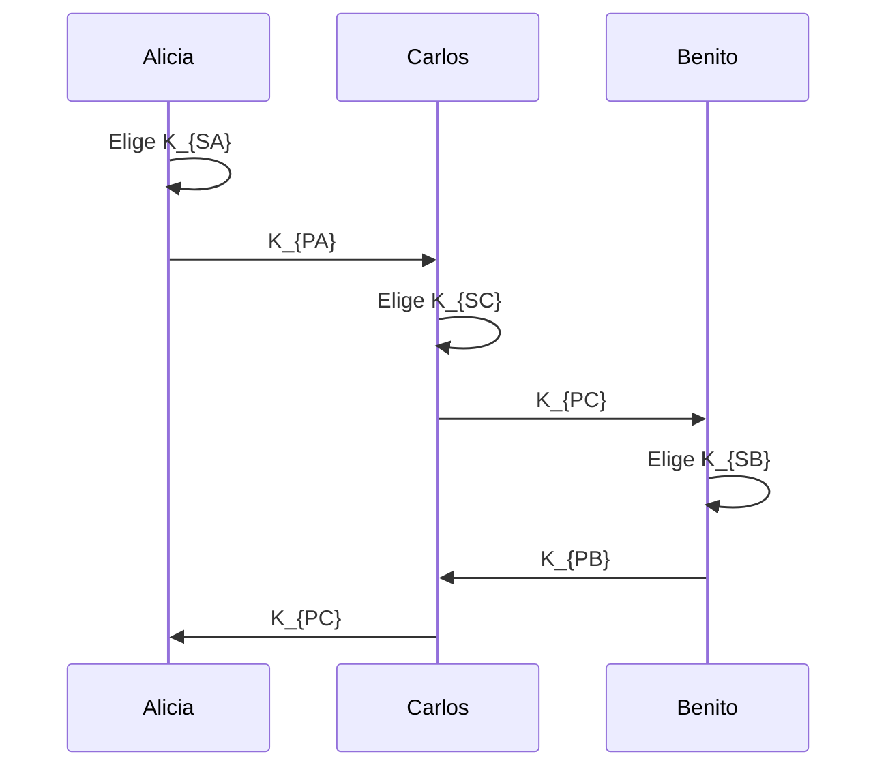

# 4.1. Firma Digital
<% tp.file.creation_date() %> (YYYY-MM-DD) @ 17:03
Rodríguez López, Alejandro // UO281827

Tags:
	#showable
	Hecho en #EPI
	Sobre #Seguridad
	Para #Apuntes
	Otros:
	Refs:
 

Problemas de autenticación:
1. Autenticidad del emisor: ¿Cómo sabe el destinatario que el emisor del mensaje es quién debe ser?
2. Autenticidad del mensaje: ¿Cómo sabe el destinatario que el mensaje recibido es el que debe ser?
3. (Otras 2 q no pillé)

Soluciones:
1. Autenticación mediante cifrado de mensajes con un algoritmo simétrico.
2. Autenticación meidante funciones hash.
3. Autenticación mediante MAC.
4. Autenticación mediante una firma digital.
5. Autenticación mediante firma digital.

## La firma digital

Secuencia de bits que se añade a un documento electrónico que permite autenticar al documento y a su autor.

Requisitos:

- La firma es única, sólo la puede generar su propietario.
- Irrevocable, el propietario no la puede rechazar.
- Es fácil de generar.
- Fácil uso por propietario y ususarios.
- Debe depender del documento y del autor.

Esquema con anexo: Requiere el mensaje original como entrada al algoritmo de verificación
Esquema con recuperación: No requiere el mensaje original. El mensaje se recupera de la propia firma.
Esquema Probabilista: Introduce información generada aleatoriamente. (La secuencia de bits varía cada vez que se utiliza).
Esquema Determinista: No introduce información generada aleatoriamente. (La secuencia de bits es siempre la misma).

Todos los esquemas se basan en los mismos 3 algoritmos:

- Firma
- asfd
- Recuperación

Con anexo:

Con Hash:

Emisor:

Receptor:

### RSA

Las firmas RSA tienen un apéndice y pueden ser deterministas (RSASSA-PKCS1) o probabilistas (RSASSA-PSS).

#### RSASSA-PCKS1

Generación:

1. Codificación
	1. Aplicar función hash para obtener H = Hash(M)
	2. Codificar el ID de la función Hash y el valor del hash como un tipo Digest info de ASN.1 (Llamado T).
	3. Generar un Padding String (PD).
	4. Construir la codificación del mensaje EM (0x00 || 0x01 || PS || 0x00 || T).
2. Cifrado de la codificación del mensaje
	1. Convertir la codificación del mensaje EM en un número m.
	2. Cifrar con RSA usando la clave privada (d, n) -> $s = m^d \mod n$
	3. Convertir el nnúmero $s$ a bytes para obtener la firma S

Verificación:

1. Descifrado de la firma
	1. Convertir la firma S en un número $s$.
	2. Descifrar con RSA usando la clave pública (e, n) -> $m = s^e \mod n$
	3. Convertir el número $m$ en una cadena de bytes (mensaje EM).
2. Verificación
	1. Método 1:
		1. Codificar el mensaje recibdo $M_r$.
		2. Comparar $EM' == EM'_r$
			1. Iguales ==> Firma verificada
			2. Distintos ==> Firma no verificada
	2. Método 2:
		1. Decodificar EM
		2. Extraer el Hash(M) = H'
		3. Calcular el hash del mensaje recibido $H'_r$
		4. Comparar $H' == H'_r$
			1. Iguales ==> Firma verificada
			2. Distintos ==> Firma no verificada

#### RSASSA-PSS

Generación

1. Codificación del mensaje:
	1. Generar el hash de M: mHash = Hash(M)
	2. Generar salt (cadena de bytes aleatoria): M' = padding_1 || mHash || salt
	3. Generar hash de M': H = Hash(M')
	4. Formar el datablock: DB = padding_2 || salt
	5. Calcular dbMask = MGF(H)
	6. Calcular maskedDB = DB xor dbMask
	7. Poner bits +Izda de maskedDB a 0
	8. EM = maskedDB || H || bc
2. Cifrado
	1. Lo mismo que en el anterior
3. Descifrado
	1. Lo mismo que en el anterior
4. Verificación
	1. Generar mHash = Hash(M)
	2. "Cosas que no tienen mucha importancia hasta el paso 6 sin incluir"
	3. Calcular dbMask = MGF(H)
	4. Calcular DB = maskedDB xor dbMask
	5. Poner bits +Izda de DB a 0
	6. Si no coinciden con el padding_2 => Inconsistencia; Stop;
	7. Salt = sLen bits +Dcha de DB
	8. Formar M' = padding_1 || mHash || salt (Padding_1 es constante determinista)
	9. Generar el Hash de M': H' = Hash(M')
	10. Comprobar si el hash H' coincide con hash H.
		1. Iguales ==> Firma verificada
		2. Distintos ==> Firma no verificada

> [!error] Examen
> Estos esquemas hay que saberlos

## Cálculo de Inversos Modulares (Out of nowhere)

El algoritmo de Euclides permite encontrar solución a la identidad de Bezout:
$$
	MCD (a, b) = a \cdot x + b \cdot y
$$
El inverso modular de un número a se obtiene como la solución de $a \cdot x = 1 (mod m)$
x es el númmero que multiplicado por a y calculado el módulo m del producto da 1
Por la definición de congruencia m es el divisor de ($a * x - 1$)

...

$MCD(a, b) = g,\ \forall a > b$

|  |  |  | Despejar el resto |
| --- | --- | --- | --- |
| K = 0 | a / b | a = q_0 \cdot b + r_0 | r_0 = a - q_0 \cdot b |
| K = 1 | b / r_0 | b = q_1 \cdot r_0 + r_1 |  |

// Repetir hasta llegar a un resto = 0. El algoritmo siempre converge.
// El último resto distinto de 0 es $g$.

El divisor en la siguiente iteración pasa a ser el dividendo, y el resto el divisor.

El último resto despejado:
se debe operar hasta obtener una operación de la forma: $1 = k \cdot e - j \cdot m$

## Diffie Hellman

Permite el intercambio de claves entre dos usuarios, utilizando un canal de comunicación inseguro y de forma anónima.

1. Seleccionar un módulo $p$ y un generador $g$.
2. Cada usuario elige su clave secreta ($k_{SA}$ y $k_{SB}$).
3. Cada usuario calcula la clave pública ($K_{PA} = g^{K_{SA}} \mod p$ y $K_{PB} = g^{K_{SB}} \mod p$) y la envía al otro usuario.
4. Cada usuario recibe la clave pública del otro usuario y calcula la clave secreta común ($K_{SC} = K_{PB}^{K_{SA}} \mod p$, y $K_{SC} = K_{PA}^{K_{SB}} \mod p$).

> [!note]
> En el paso 4, nótese que ambos usuarios obtienen el mismo $K_{SC}$.

### Seguridad

El objetivo de un atacante sería obtener las claves secretas ($K_{SA}$ y $K_{SB}$) de los usuarios, ya que $p$ y $g$ son conocidos.

Para encontrar una de las claves, se debe resolver el problema del logaritmo discreto (PLD).
Este problema es intratable si $p$, $g$, $K_{SA}$ y $K_{SB}$ han sido bien elegidos.

#### Elección correcta

El módulo $p$ debe ser un número primo grande (de la menos 1024 bits).
Interesa que el indicador de $Euler (p) = p-1$ tenga factores primos grandes (Además de incluir el factor 2).

El generador $g$ tiene que ser una raíz primitiva del módulo $p$.
Sólo $g^{p-1} \mod p = 1$, si $\exists x / g^x \mod p = 1$, el generador $g$ no es correcto (_El generador $g$ no es del grupo $p$_).

La clave secreta $K_S$ debe ser generada por un buen generador de números aleatorios del rango ($[1, p-1]$)

## Ejemplo de problema con RSA

El usuario B desea recibir un mensaje del usuario A cifrado con RSA.
B genera las claves usando $p = 17$, $q = 11$ y elige como exponente público $e = 7$.

### 1. Calcula los elementos de las claves de B

Calcular el módulo:
$$ n = p \cdot q = 17 \cdot 11 = 187 $$
Calcular $\phi(n)$:
$$ \phi(n) = (p-1) \cdot (q - 1) = 16 \cdot 10 = 160 $$
Comprobar que $e$ es coprimo con $\phi(n)$.
Se comprueba descomponiendo $n$ en factores, y comprobando si alguno de sus factores es $e$
$$ 160 = 2^5 \cdot 5	 $$

Determinar el exponente $d$ de la clave privada:
$$ 
	\begin{matrix}
		K = 0 & 160 \over 7 & 160 = 22 \cdot 7 + 6 & & 6 = 160 - 22 \cdot 7 \\
		K = 1 & 7 \over 6 & 1 = 7 - 1 \cdot 6 & & 1 = 7 - 1 \cdot 6 & & 1 = 7 - 1 \cdot (160 - 22 \cdot 7) \\
		K = 2 & 6 \over 1 & & & & & 1 = 7 - 1 \cdot 160 + 22 \cdot 7 \\
		& & & & & & 1 = 23 \cdot 7 - 1 \cdot 160 \\
	\end{matrix}
$$

Por lo que $d = 23$.

### 2. A Cifra el mensaje plano M = 88 y lo envía a B

$$
	C = M^e \mod n = 88^7 \mod 187 = (88^1 \cdot 88^2 \cdot 88^4) \mod 187 = 11
$$
Propiedad utilizada:
$$
	(A \mod n) \cdot (b \mod n) \mod n = (a \cdot b) \mod n
$$

### 3. B recibe el mensaje cifrado C y lo descifra. Indica la ecuación utilizada para descifrar y calcula el mensaje plano M

$$
	M = C^d \mod n = 11^23 \mod 187 = (11^1 \cdot 11^2 \cdot 11^4 \cdot 11^8) \mod 187 = 88
$$

### Ejercicio

Usuario B quiere recibir un mensaje cifrado con RSA proveniente del usuario A.
Calcula las claves.
p = 17
q = 31
e = 7

1. Calcular módulo $n$.
$n = p \cdot q = 17 \cdot 31 = 527$
2. Calcular $\phi(n)$.
$\phi(n) = 480$
3. Comprobar si $n$ es coprimo con $\phi(n)$.
480 | 2
240 | 2
120 | 2
60 | 2
30 | 2
15 | 3
5 | 5
NO ES COPRIMO

$$ 
	\begin{matrix}
		K = 0 & 480 \over 7 & 480 = 68 \cdot 7 + 4 \\
		K = 1 & 7 \over 4 & 7 = 1 \cdot 4 + 3 \\
		K = 2 & 4 \over 3 & 4 = 1 \cdot 3 + 1 \\
		K = 3 & 3 \over 1 & 3 = 1 \cdot 3 + 0 \\
	\end{matrix}
$$

$$ 
	\begin{matrix}
		K = 0 & 4 = 480 - 68 \cdot 7 \\
		K = 1 & 3 = 1 - 4 & 3 = 1 - (480 - 68 \cdot 7) = 68 \cdot 7 - 480 \\
		K = 2 & 1 = 4 - 3 & 1 = (480 - 68 \cdot 7) - (68 \cdot 7 - 480) \\
		K = 3 & & 1 = 2 \cdot 480 - 136 \cdot 7 \\
	\end{matrix}
$$
D sería -136, pero como no puede ser negativo, se incrementa en 480 para que sea positivo.
Por lo tanto, $d=-136+480=343$. (O es -137?)

> [!note]
> Es posible sumarle 480 porque el módulo se mantiene igual.

## Estándar de firma DSS

### Generación de claves DSA

Fase 1: Generación de parámetros. (Hecha por el administrador).

1. Elegir una función de hash $H$ aprobada para usar el estándar DSS.
2. Elegir la longitud de los parámetros $L$ (longitud del parámetro $p$) y $N$ (longitud del parámetro $q$).

| $L$ | $N$ |
| --- | --- |
| 1024 | 160 |
| 2048 | 224 |
| 2048 | 256 |
| 3072 | 256 |

3. Elegir parámetro $p$, primo de $L$ bits ($2^{L-1} < p < 2^L$).
4. Elegir parámetro $q$, primo de $N$ bits y divisor de $p-1$ ($2^{N-1} < q < 2^N$).
5. Elegir parámetro $g$, generador de orden $q$ del grupo $p$ ($1 < g < p$).
$$g = \beta^{(p-q) \over q} \mod p$$
Eligiendo un $\beta$ aleatorio tal que $1 < \beta < p-1$ hasta que $g \not = 1$.

Fase 2: Generación de claves. (Hecha por los usuarios).

1. Elegir una clave secreta $X$ ($1 <= X <= q-1$).
2. Calcular una clave pública $Y$.
$$Y = g^X \mod p$$
Fase 3: Firma de un mensaje.

1. Generar un número secreto $K$ para cada mensaje ($1 <= K <= q-1$).
2. Calcular $r = (g^K \mod p) \mod q$.
3. Calcular $s = (K^{-1} \cdot (z + X \cdot r)) \mod q$.
$z$ son los $n$ bits más significativos de $H(m)$.
4. Recalcular la firma en caso que $r = 0$ ó $s = 0$.

> [!warning] Examen
> En DSA la clave privada $X$ no se utiliza para cifrar, se utiliza para resolver una operación matemática.
> Por ello, DSA no permite cifrar, sólo firmar.

Fase 4: Verificar una firma.

Se deben obtener 4 datos públicos: $p$, $q$, $g$ e $Y$.

1. Comprobar que $0 < r' < q$ y $0 < s' < q$.
2. Calcular $w = s'^{-1} \mod q$.
3. Calcular $u1 = (z \cdot w) \mod q$ ($H(M') = z$).
4. Calcular $u2 = (r' \cdot w$ \mod w).
5. Calcular $v = ((g^{u1} \cdot Y^{u2}) \mod p) \mod q)$
Si $v = r'$ la firma es válida.
Si $v \not = r'$ la firma NO es válida.

> [!warning] Examen
> Una firma no es válida cuando se ha modificado la firma, el mensaje o ambas.

## Cálculo de claves DSA

Usuarios usand $p=53$ y $q=13$.
Usuairo A ha escogido $x=8$ y $k=6$.

### Calcular los elementos restantes para que A pueda firmar el hash.

$\beta = 31$.

1. Comprobar $p$ y $q$.
$p = 53$ es primo.
$q = 13$ es primo.
$p - 1 = 52 = 13 \cdot 2^2$ $q$ pertenece a los divisores de $p$.

2. Cálculo del generador ($\beta = 31$).
$$ g = \beta^{(p-1) \over q} \mod p = 49 $$
Como $49 \not = 1$ y $g^q \mod p = 1$, es válido.

3. Cálculo de la clave pública de A.
$$ Y = g^x \mod p = 49^8 \mod 53 = 28 $$

### Firma con DSA

H = 6
$$ r = (g^k \mod p) \mod q = 2 $$
$$ s = (k^{-1} \cdot (H + x \cdot r)) \mod q = 8 $$

### Verificación firma DSA

$$ w = s^{-1} \mod q = 5 $$
> [!note]
> En este caso no se está invirtiendo el valor $-3 \cdot 13$. Se busca siempre el valor que acompañe a $s$.

$$ u1 = (H \cdot w) \mod q = 4 $$
$$ u2 = (r \cdot w) \mod q = 10 $$
$$ v = ((g^{u1} \cdot Y^{u2}) \mod p) \mod q = 2$$

## Certificados Digitales

1. El emisor calcula un Hash del mensaje (HashE).
2. El emisor encripta el HashE con su clave privada, este hash encriptado se llama FIRMA DIGITAL.
3. El emisor envía el mensaje firmado al receptor.
4. El receptor calcula el Hash del mensaje (HashR).
5. El receptor desencripta la Firma Digital de Emisor.
6. El receptor compara la Firma Digital desencriptada con la clave pública del Emisor.

### ¿Cómo puede el receptor estar seguro de que la clave pública de A es real?

Una tercera parte establece una asociación entre la clave pública y la identidad de su propietario.
Estas partes se denominan Autoridades de Certificación (AC).

Un Certificado Digital está formado por (entre otras cosas):
- Nombre
- Emisor
- Clave Pública
- Firma

Un Certificado Digital entonces contiene:
- Descripción del propietario.
- Fechas de validez.
- Clave Pública del propietario.
- Firma Digital de la entidad certificadora.

Un Certificado Raíz (Autofirmado) es un certificado en el que el Emisor y el Sujeto son la misma entidad.

Clases de Certificado:
- Clase 1: Sólo verifican el nombre y dirección de correo del titular.
- Clase 2: Verifica el DNI, SSN y fecha de nacimiento.
- Clase 3: Verifica el crédito de la persona
- Clase 4:

Según la Finalidad para la que se emite el certificado

- Certificado SSL para cliente. Identifica a un cliente ante un servidor de comunicaciones basadas en SSL/TLS.
- Certificado SSL para servidor. Usados para identificar a un servidor ante un cliente en comunicaciones SSL/TLS.
- Certificado S/MIME. Usado para servicios de correo electrónico.
- Certificado para firmar programas. Identifica al autor de un programa.
- Certificado para AC. Usados por las AC.

### Uso elemental de un certificado

> [!warning] Examen
> Lo siguiente es esencial tanto para el examen de teoría como de PL.

La $AC$ genera un certificado de $A$, $C_A$. $C_A$ contiene:
- Nombre de $A$.
- Clave pública de $A$.
- Firma de $AC$.

El usuario $A$ envía a $B$ un mensaje $M_A$ con su certificado $C_A$.

El usuario $B$ tiene que usar la clave pública de $A$ para verificar la firma de $M_A$, esta clave está en $C_A$.
El usuario $B$ obtiene la clave pública de $A$ del $C_{AC}$, y con ello, verifica que la firma de la $AC$ en $C_A$ es correcta.

### Estados de un certificado

- Revocar:
	- La PK ha sido comprometida
	- Los datos han cambiado
- Suspensión:
	- Es una revocación temporal

### Descripción de un certificado

La $AC$ debe mantener una CRL (Certificate Revocation List), incluyendo referencias a todos los certificados revocados.
Un certificado X.509 se puede describir utilizando ASN.1.

ASN.1 es una notación para describir información independientemente de lenguaje de implementación y representación física.
- Proporciona tipos primitivos.
- Proporciona tipos construidos.

ASN.1 sólo cubre los aspectos estructurales de la información. ASN.1 NO es un lenguaje de programación.

### Codificación de certificados

- Formato BER
Type || Length || Value || End-Of-Contents

El campo Length puede ser:
- Definido (Codifica la longitud en bytes)
- Indefinido (Se utiliza una marca de fin en EOC)

- Formato CER

Usa la forma indefinite de BER

- Formato DER

Usa la forma definida de BER

- Base64

Consiste en codificar los bits del certificado en un sistema base 64.
Se codifican grupos de 6 bits (números 0-63) en los caracteres ASCII (A-Z a-z 0-9 + /).
El símbolo '=' se utiliza como un sufijo especial.

> [!note]
> En realidad, la codificación Base64, es una transformación de una codificación de tipo BER.

- Estándar PKCS#7 / CMS (Cryptographic Message Syntax)

> [!warning] Examen
> Es obligatorio conocer estos estándares

El CMS se va a utilizar para almacenar firmas digitales junto con el mensaje.

- Estándar PKCS#12

### Almacenamiento de certificados en ficheros

#### Sin clave privada

DER -> .cer .der ó .crt
PKCS#7 -> .p7b
BASE64 -> .cer ó .pem

#### Con clave privada

PKCS#12 -> .pfx ó .p12
