# 6. Protocolos de Seguridad SSL TLS
2023-10-26 (YYYY-MM-DD) @ 16:03
Rodríguez López, Alejandro // UO281827

Tags:
	#showable
	Hecho en #EPI
	Sobre #Seguridad 
	Para #Apuntes 
	Otros:
	Refs:
 

## Protocolos de Seguridad

Protocolo de seguridad: Secuencia de funciones para garantizar protección usando algoritmos criptográficos.
- Establecer claves.
- Cifrar información.
- Autenticar entidades.
- Autenticar mensajes.

Enfoques básicos para proporcionar seguridad a las comunicaciones
- Usar un protocolo separado.
- Integrar seguridad en el protocolo de aplicación.
- Integrar seguridad en el protocolo de transporte o red.
- Usar un protocolo de seguridad paralelo.

### Protocolo de Seguridad Separado

Insertar un protocolo intermedio entre aplicación (HTTP) y transporte (TCP/IP).
Ejemplo: SSL/TLS

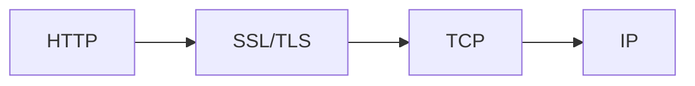

SSL Puede proporcionar seguridad a cualquier protocolo de aplicación, no sólo HTTP.

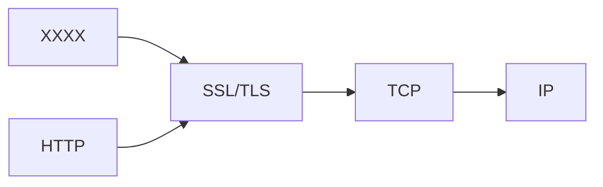

Debido a las diferencias entre TCP y SSL, se modifica el protocolo HTTP para que permita el uso de SSL, esta modificación es HTTPS.

> [!warning] Examen
> HTTPS por sí sólo o proporciona seguridad.
> HTTPS permite el uso de SSL, que sí proporciona seguridad.

### Integrar la seguridad en la capa de aplicación

Consiste en añadir funciones a HTTP para formar SHTTP (Secure HTTP).
Esto implica diseñar un protocolo distinto para cada aplicación.

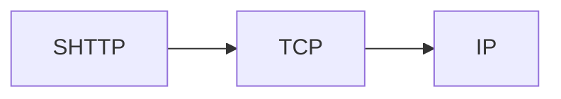

Esta opción tuvo menos empuje que HTTPS, por lo que no se utiliza.

### Integrar la seguridad en el protocolo transporte / red

Ejemplo: IPsec (IP Security).
Es una capa IP que incluye funciones de seguridad.
Es transparente a efectos de aplicación.

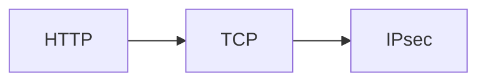

### Protocolo de seguridad paralelo

Ejemplo: Kerberos

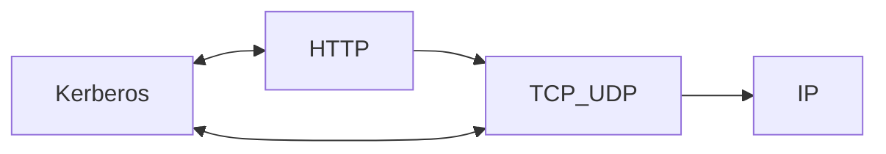

## SSL/TLS (TLS 1.2)

> [!warning] Examen
> Objetivos:
> - Establecer un canal de comunicación cifrado entre un cliente y un servidor.
> - Autenticar el servidor ante el cliente.
> - Autenticar el cliente ante el servidor.

SSL y TLS son equivalentes, no funcionan en conjunto. (SSL hasta 1996, TLS desde 1999).

### Handshake
#### Sólo comunicaciones cifradas

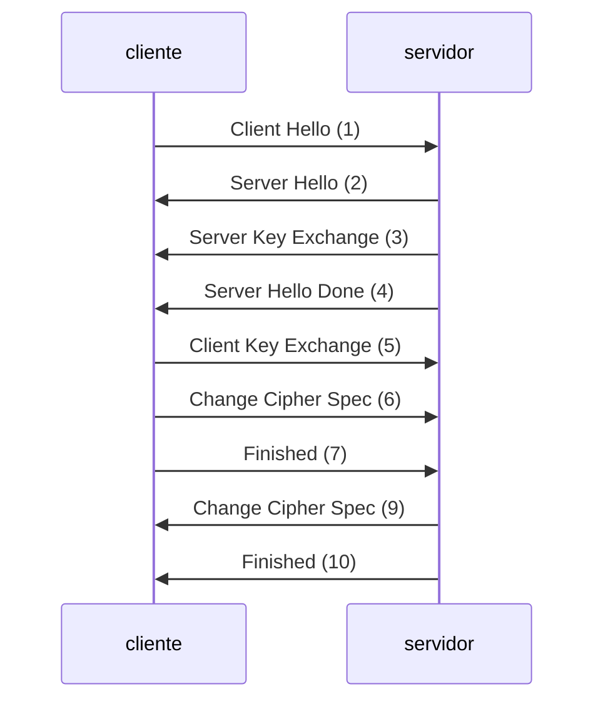

1. El cliente le envía al servidor una serie de **opciones** Algoritmos de cifrado, Algoritmos de autenticación, Algoritmos de compresión, longitudes de las claves, Id de sesión, semilla de números aleatorios, y más cosas.
2. El servidor elige una opción de cada algoritmo, longitutes de clave y las devuelve al cliente, otro ID y otra semilla de números aleatorios.
3. El servidor envía su clave pública (generalmente RSA).
4. El servidor le pasa el testigo al cliente.
5. El cliente envía una clave simétrica (generalmente AES) que van a compartir cliente y servidor, se envía cifrada con la clave pública del paso 3.
6. El cliente indica al servidor que cambie a cifrado (con la clave AES del paso 5) según especificaciones acordadas en 1-2 (De aquí en adelante, todo va cifrado con la clave AES del paso 5).
7. El cliente envía un hash de cierta información intercambiada previamente por ambos (por lo tanto, ambos la conocen).
8. El servidor descifra el mensaje y recalcula el hash con la misma información, compara ambos.
	1. Si coincide: La comunicación no ha sido intervenida, y los datos no han sido modificados.
9. Igual que el paso 6, pero desde el servidor.
10. Igual que el paso 7, pero desde el servidor (Este hash no tiene por qué ser el mismo del paso 7, puede incluir información de los pasos 8 y 9).
11. Igual que el paso 8, pero desde el cliente.

##### Estados del protocolo SSL/TLS

Los estados se utilizan para que cada equipo sepa si tiene que enviar los datos codificados o no.

Estados:
- Write
- Read
- Pending
- Active

Cliente y servidor mantienen una tabla de estados:

|          | Write  | Write   | Read   | Read    |
| -------- | ------ | ------- | ------ | ------- |
|          | Active | Pending | Active | Pending |
| Encoding | Null   | ?       | Null   | ?       |
| MAC      | Null   | ?       | Null   | ?       |
| Key      | Null   | ?       | Null   | ?       |

> [!note] Diagrama
> Ver esto en la traspa 14, porque no voy a copiarlo todo aquí.

Cada equipo anota en la tabla el algoritmo / clave que debe utilizar tanto para leer como para escribir en función de lo acordado en los pasos 1-5.
Al recibir información de las opciones, se anota en Pending.
En el momento en que uno de los equipos envía Change Cipher Spec (paso 6 para cliente y 9 en el servidor), los datos pasan de Pending a Active.
	Primero el cliente pasa los Write a Active.
	Segundo el servidor pasa los Read a Active.
	Tercero el cliente pasa los Read a Active
	FInalmente el servidor para los Write a Active.

#### Comunicaciones cifradas + Autenticación del servidor

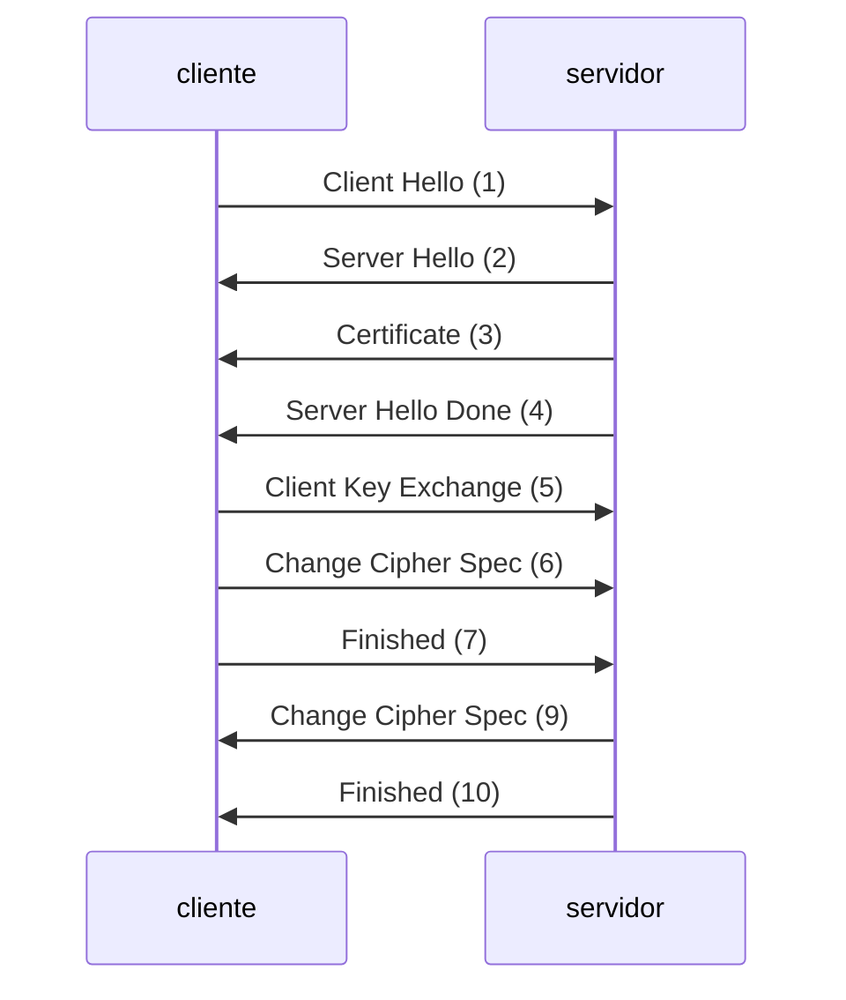

En el paso 3, el servidor envía su certificado.
Con el certificado, el cliente puede autenticar que el servidor es quién dice ser.

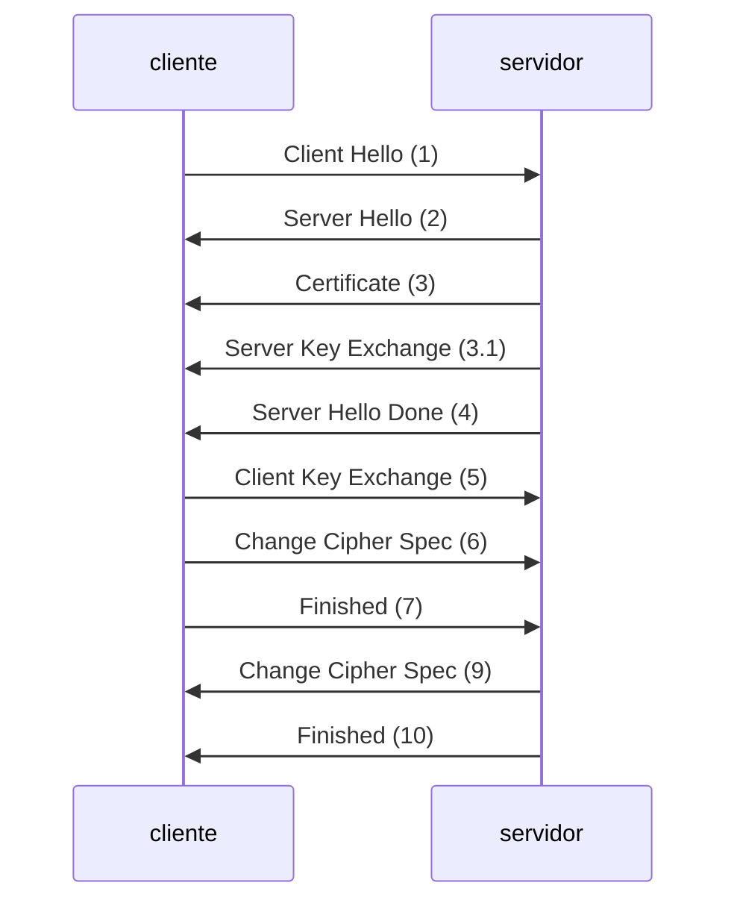

3.1. El servidor envía una clave pública DSA.

#### Comunicaciones cifradas, Autentica servidor y cliente

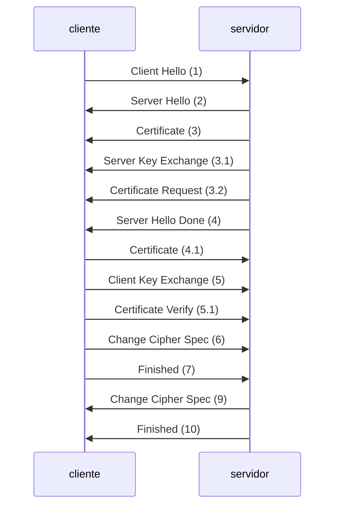

3.2. El servidor pide al cliente su certificado.
4.1. El cliente envía su certificado.
5.1. El cliente hace una firma digital con datos que ambos equipos conocen.
El servidor utiliza el certificado del paso 4.1. para descifrar la firma del 5.1. y comprueba si la información ha sido modificada.

### Intercambio seguro de datos

1. Generación de MAC
2. Cifrado de datos + el Hash + posible relleno necesario

### Finalización de una sesión

No hay.
Los equipos pueden enviar un mensaje de ClosureAlert para evitar ataques por truncación.
Destruye todos los ficheros si no hablo contigo mañana.

### Reutilización de sesiones

Crear un canal es costoso, es interesante reutilizar sesiones SSL.

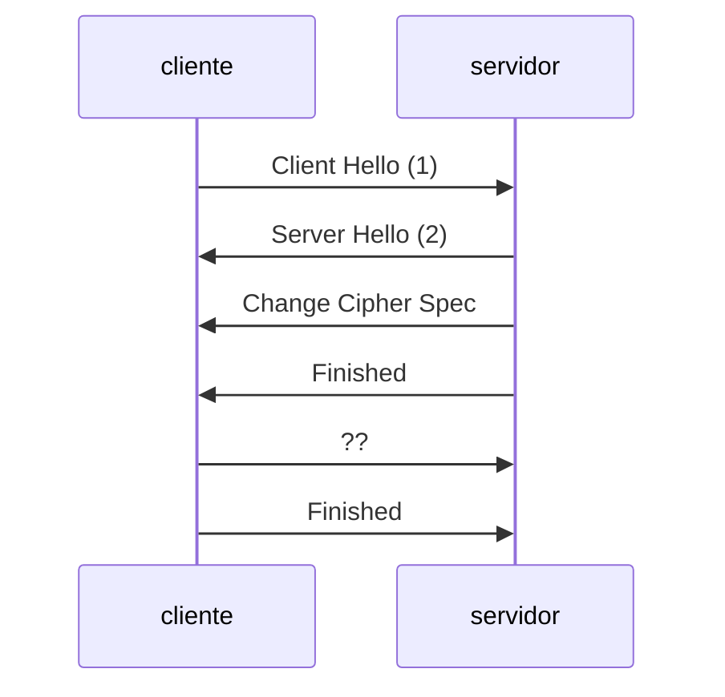

1. Contiene el SessionID de una sesión previa. Si la conexión es nueva, este campo va vacío.
2. El servidor decide aceptar o denegar. Para aceptar retorna el mismo SessionID, si no, retorna un nuevo SessionID y se comienza una negociación completa.

#### Caché SSL

El funcionamiento anterior es posible gracias a una caché SSL, que mantiene los parámetros de sesiones anteriores.

## TLS 1.3 Handshake

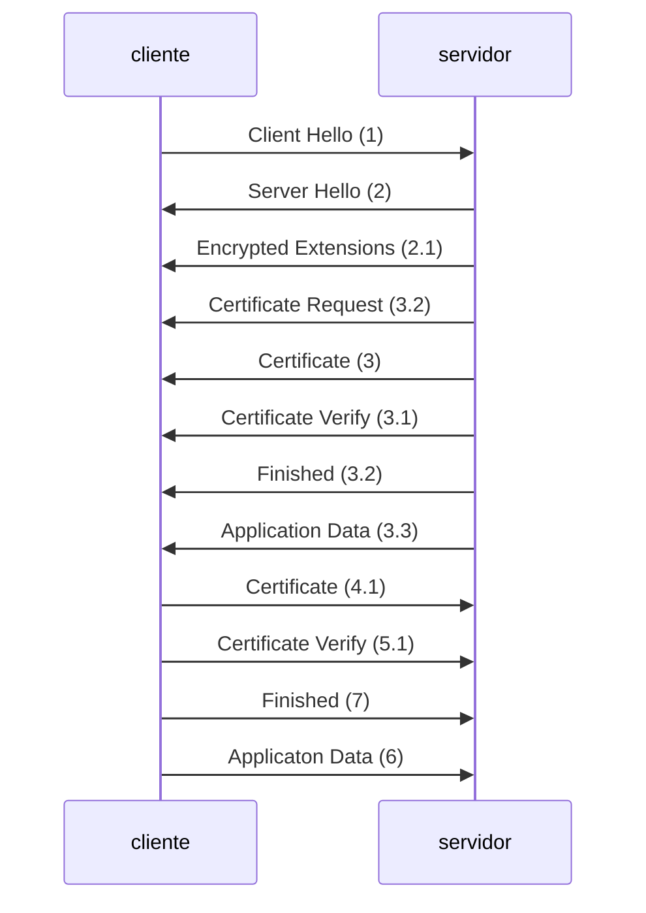

En el paso 1 y 2 se envían entre cliente y servidor todas las claves que necesitan para comunicarse y ya se hace todo cifrado a partir de aquí.

Los mensajes Encrypted Extensions hasta Application Data van todos en un sólo paquete físico (pero son n paquetes lógicos).
Los mensajes Certificate hasta Application Data del cliente también son un sólo paquete físico (pero son n paquetes lógicos).

En el resto de protocolos cada mensaje lógico es un paquete físico.
