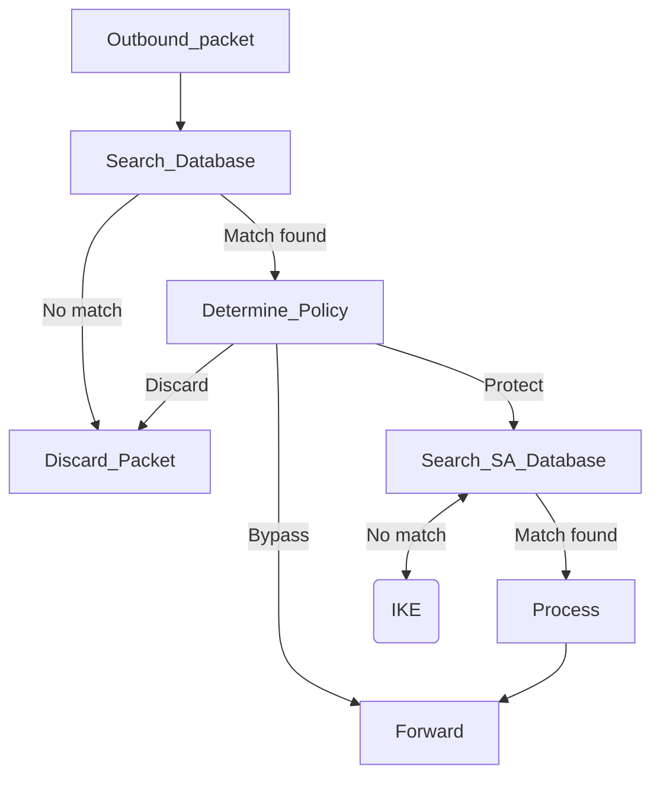
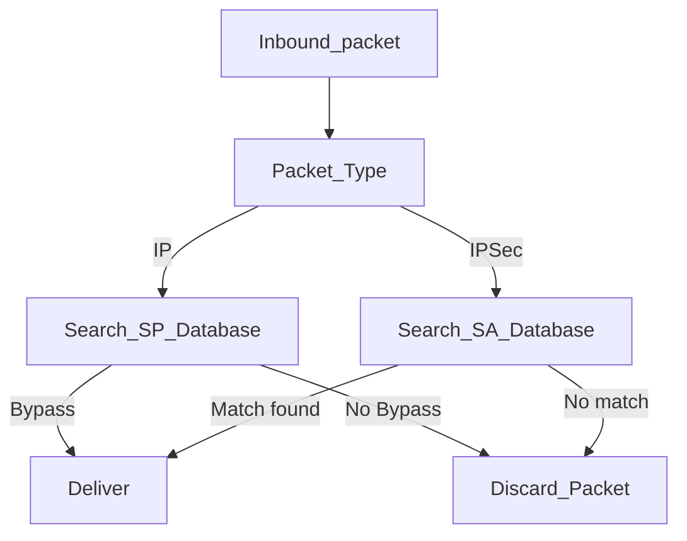

# 6.1. IPSec
2023-10-27 (YYYY-MM-DD) @ 17:05
Rodríguez López, Alejandro // UO281827

Tags:
	#showable
	Hecho en #EPI
	Sobre #Seguridad
	Para #Apuntes
	Otros:
	Refs:
 

## Protocolos de seguridad

### AH (Authentication Header)

- Integridad.
- Autenticación.
- No repudio.

### ESP (Encapsulating Security Payload)

- Confidencialidad.
- Integridad (Opcional).
- Autenticación (Opcional).

> [!note]
> Todas las implementaciones deben implementar ESP.
> Opcionalmente pueden implementar AH.

Ambos protocolos pueden funcionar en modo transporte o túnel

### Transporte

Sólo se cifra y/o autentica la carga útil del paquete IP (la cabecera no se toca).
El enrutamiento no es modificado por lo que es posible.

### Túnel

Se cifra cifra y/o autentica todo el paquete IP (cabecera + datos).
El enrutamiento es modificado ya que la cabecera está cifrada, por lo que no es posible enrutarlo.
Es necesario encapsular el paquete IP en otro paquete IP que sí sea enrutable.

## Asociación de Seguridad

Es una conexión lógica unidireccional entre un emisor y un receptor (por lo que serán necesarias 2 AS para comunicar 2 equipos en ambas direcciones).

La AS se identifica por:
- Índice de Parámetros de Seguridad (SPI, un `int`).
- Dirección IP de destino
- Otra cosa

## Base de datos de Políticas de Seguridad

Permite relacionar cada SA con los paquetes IP.

### Selectores

- Direcciones IP local y remota
- Protocolo de la capa siguiente
- Otra cosa

### BBDD (Gráfico)

Las reglas se aplican en orden. Ejecutando y saliendo en la primera que cumpla (ejemplo):

- BYPASS: Cuando el puerto orígen es el mismo puerto destino.
- BYPASS: Cuando el protocolo es ICMP.
- PROTECT: Cuando el destino es de la misma subred que el origen.
- BYPASS: Cuando el destino es al protocolo HTTPS (443).
- DISCARD: Cuando el destino es la red local (i.e. 1.2.3.0/24).
- BYPASS: Cuando el destino es cualquier IP y puerto.

## Procesamiento del tráfico

### Outbound

### Inbound

## ESP (Encapsulating Security Payload)

> [!warning] Examen
> _...Porque de aquí salen los ejercicios..._

### Modo transporte

1. Se inserta una cabecera ESP entre la cabecera IP y los datos TCP.
	1. Contiene el algoritmo de cifrado utilizado.
	2. Contiene el algoritmo del paso 4.
2. Se inserta un ESP trailer para completar el tamaño necesario del algoritmo de cifrado a utilizar.
3. Se cifra desde el fin de la cabecera ESP hasta el final del trailer.
4. Se calcula con un algoritmo dado una función mac/hash que cubre desde el inicio de la cabecera ESP hasta el final del trailer, el valor se coloca detrás del fin del trailer (ESP authenticator).
	1. Sólo si la cabecera indica que el paquete contiene autenticación.

### Modo túnel

1. Se inserta por delante de la cabecera IP, una cabecera ESP.
2. Se inserta el ESP trailer.
3. Se cifra.
4. Se añade la ESP auth si es necesaria.
5. Se crea una nueva cabecera IP por delante de la cabecera ESP.

## AH (Authentication Header)

Proporciona autenticación.
Contiene un ICV (Integrity Check Value).

### Modo transporte

1. Se inserta la cabecera AH entre la cabecera IP y la cabecera TCP.
2. La autenticación es sobre todo excepto sobre los campos que deben modificar los rotuers para el enrutamiento.

### Modo túnel

1. Se añade la cabecera AH delante de la cabecera IP.
2. Se añade una nueva cabecera IP delante de la AH.
3. La autenticación es sobre todo lo añadido excepto sobre los campos que deben modificar los router para el enrutamiento.

## Protocolo IKE (Internet Key Exchange)

IPSec necesita un estado compartido entre el productor y el consumidor de datagramas IP.
IKE se utiliza para establecer y gestionar el estado compartido.

- Servicios a proveer a los datagramas.
- Algoritmos criptográficos que necesitan los servicios.
- Claves que necesitan los algoritmos criptográficos.

2023-11-02 (YYYY-MM-DD) @ 16:00

Hecho en #EPI

## Combinaciones de Asociaciones de Seguridad (SA aka Security As.)

Servicios proporcionados por:
- Hosts
- Routers

Combinaciones de Asociaciones de Seguridad, es una serie de SAs, a través del cual se procesa un flujo de tráfico.

Formas de realizar la combinación
- Adyacencia de transporte: Más de un protocolo al mismo paquete IP.
- Tunelado iterativo: Múltiples protocolos aplicados en modo túnel.

> [!note] Transporte / Túnel
> Un paquete en modo transporte es enrutable sin añadir una cabecera IP extra (Cabecera XXX entre cabecera IP y carga IP).
> Un paquete en modo túnel necesita una cabecera IP extra (Cabecera XXX delante de la cabecera IP).

### ESP con autenticación (Confidencialidad y Autenticación)

#### No protegiendo cabecera IP

1. Cifrar carga IP
2. Autentica cabecera ESP y carga IP

La cabecera IP no se cifra ni se autentica.

#### Protegiendo cabecera IP

1. Cifrar cabecera y carga IP
2. Autentica cabecera ESP, cabecera y carga IP

La cabecera IP se cifra y se autentica.

### Adyacencia de Transporte (Confidencialidad y Autenticación)

1. SA Interna: ESP Transporte sin autenticación. Cifra carga IP.
2. SA Externa: AH Transporte. Autentica cabecera ESP y cabecera IP.

No se autentican los campos modificables por el enrutamiento.

![[6.1. IPSec 2023-11-02 16.01.10.excalidraw|1900]]

![[6.1. IPSec 2023-11-02 16.21.35.excalidraw|1900]]

Que se cifre la autenticación o se autentique el cifrado, no implica que una opción sea mejor que otra.
Son estrategias distintas de las que se deberá escoger una en función del caso que se quiera comunicar.

> [!warning] Examen
> Cuáles son los beneficios de X estrategia frente a Y estrategia?

![[6.1. IPSec 2023-11-02 16.32.06.excalidraw|1900]]

> [!note]
> Los datos proporcionados por el modo túnel suelen ser tratados por el router.
> Los datos proporcionados por el modo transporte suelen estar tratados por el host.

![[6.1. IPSec 2023-11-02 16.45.53.excalidraw|1900]]
