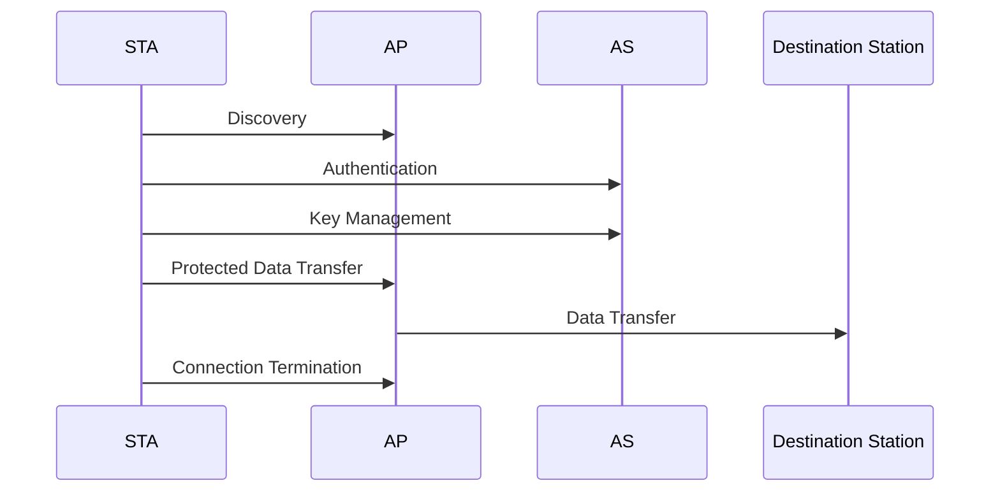
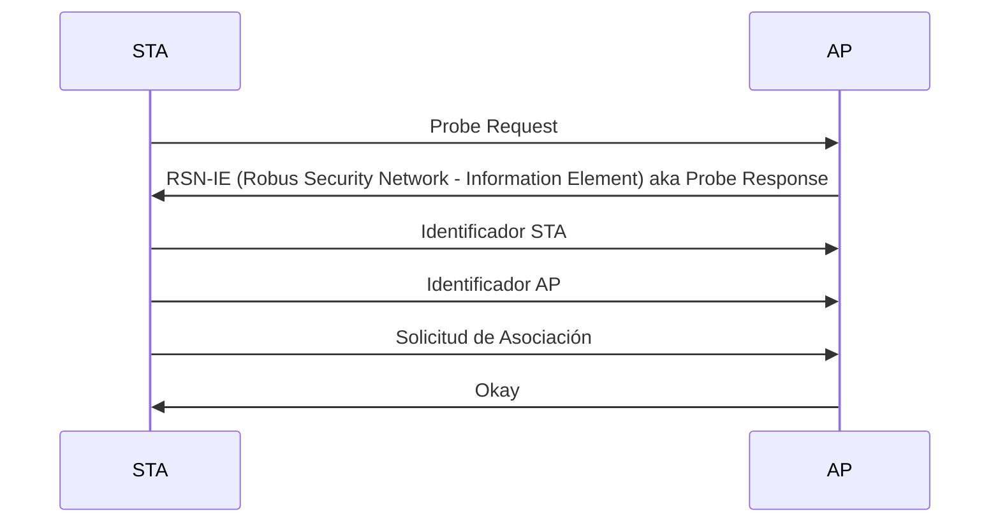
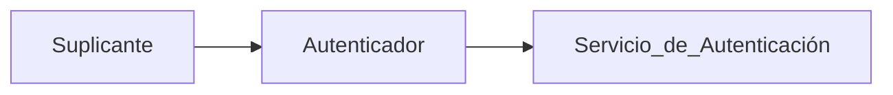
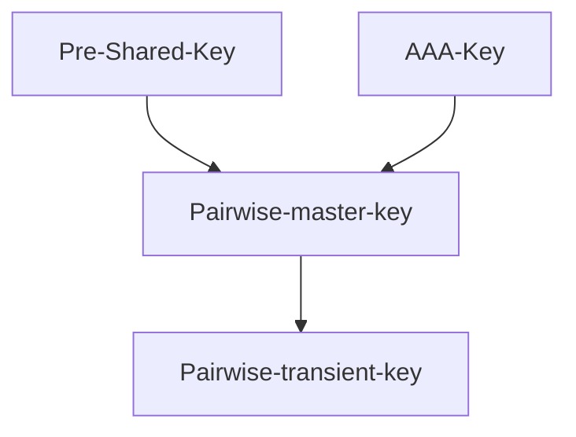

# 6.2. Seguridad Wi-Fi
2023-11-30 (YYYY-MM-DD) @ 15:04
Rodríguez López, Alejandro // UO281827

Tags:
	#showable
	Hecho en #EPI
	Sobre #Seguridad 
	Para #Apuntes
	Otros:
	Refs:
 

Las redes inalámbricas se basan en el estándar IEE802.11.

## Servicios

### Servicios de Transferencia de Datos

- Distribution Service: Utilizado por una estación BSS para enviar datos a otra BSS utilizando el DS de un mismo ESS.
- Integration Service: Transfiere datos de una 802.11 a una 802.XX.
- MSU Delivery: Servicio básico para enviar datos.

### Servicios relacionados con Asociaciones

Antes de que un servicio de distribución pueda enviar datos, la estación tiene que estar asociada.
- Sin Transición: La estación permanece en el mismo BSS.
- Transición BSS: La estación se transfiere de un BSS a otro del mismo ESS.
- Transición ESS: La estación se transfiere de un BSS a otro de distinto ESS.

- Servicio de Asociación: Se encarga de hacer una asociación inicial entre una estación y un punto de acceso.
- Servicio de Reasociación: Sirve para soportar transiciones BSS.
- Servicio de Desasociación: Sirve para notificar que una asociación previamente existente es eliminada.
	- Causas:
		- Porque un STA abandona la red.
		- Un AP ya no proporciona servicio.
	- La desasociación es una notificación, no una solicitud, no es rechazable.

## Fases de operación de una RSN

#### Fase 1: Discovery

##### EAP

El protocolo EAP proporciona un servicio de transporte.

##### Protocolo IEE 802.1X

Antes de que el suplicante sea autenticado, el autenticador pasa mensajes de autenticación y control entre el suplicante y el AS.

Después de que el suplicante sea autenticado, el autenticador pasa mensajes de datos entre el suplicante y equipos de la red.

##### Paquetes EAPOL (EAP Over LAN)

| Nombre       | Descripción                                                                                        |
| ------------ | -------------------------------------------------------------------------------------------------- |
| EAPOL-EAP    | Contiene un paquete EAP Encapsulado                                                                |
| EAPOL-Start  | Un suplicante envia este paquete en vez de enviar un challenge al autenticador                     |
| EAPOL-Logoff | Usado para devolver el estado del puerto a no autorizado cuando el sluplicante deja de usar la red |
| EAPOL-Key    | Usado para intercambiar claves criptorgráficas                                                     |

### Fase 2: Autenticación

### Fase 3: Gestión de claves

1. El AP está bloqueado contra el tráfico.
2. Tras el 4-Way Handshake, el puerto AP se desbloquea.

#### Claves de Parejas

Comunicación enter STA y AP.

#### Claves de Grupos

Comunicación multicast.
Cada AP tiene una clave de grupo maestra, que se deriva en una temporal enviada a las parejas ya existentes.

### Fase 4: Transferencia de datos protegida

#### TKIP (Temporal Key Integrity Protocol)

@Deprecated.

#### CCMP (Counter Mode-CBC MAC Protocol)

Integridad: Se calcula un MAC utilizando AES escandenando cifradores con modo CBC.
Confidencialidad: Se utiliza AES para cifrar.

#### GCMP (Galois Counter Mode)

Integridad: GHASH.
Confidencialidad: GCTR.
