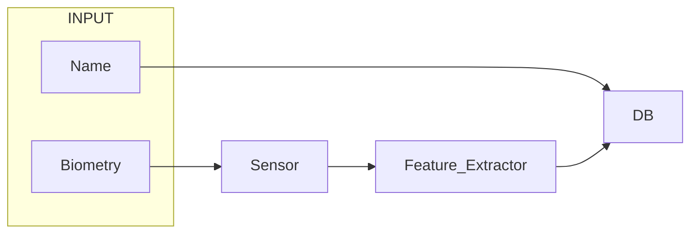
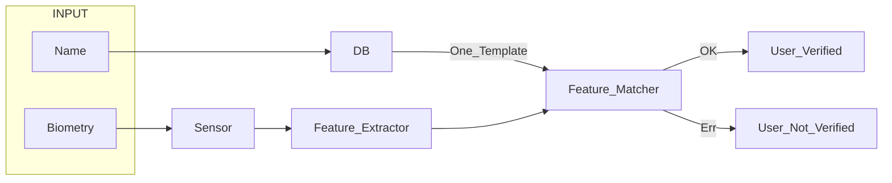
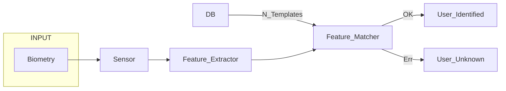
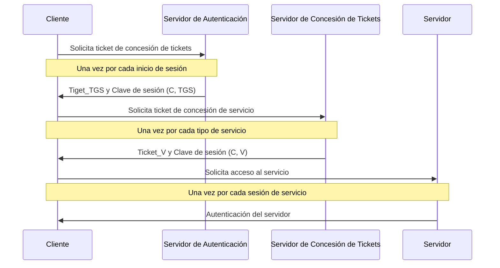
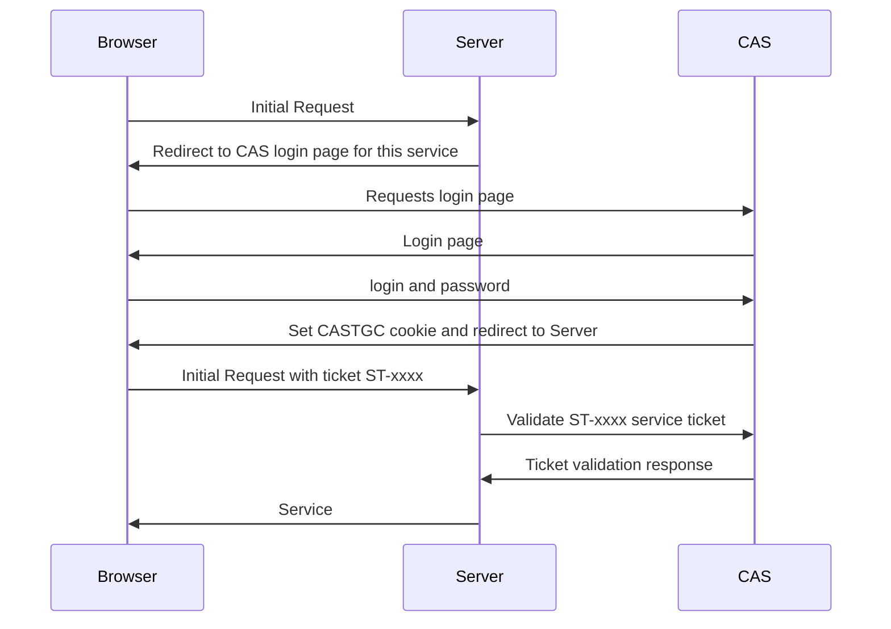
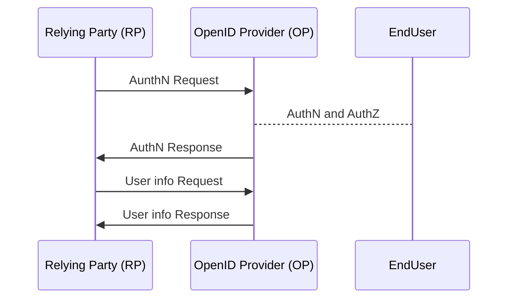
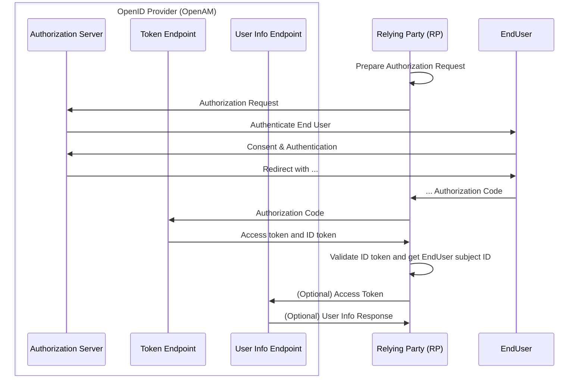
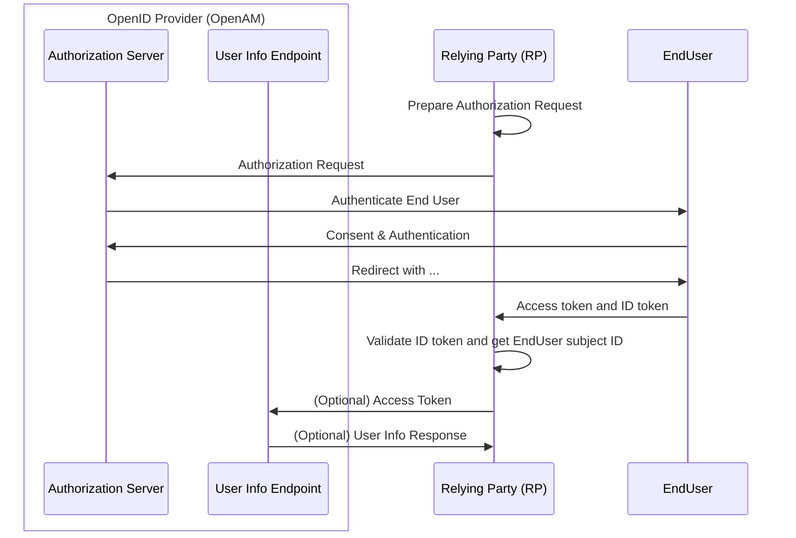

# 7. Autenticación de Usuario
2023-11-03 (YYYY-MM-DD) @ 17:08
Rodríguez López, Alejandro // UO281827

Tags:
	#showable
	Hecho en #EPI
	Sobre #Seguridad 
	Para #Apuntes 
	Otros:
	Refs:
 

- Proceso de verificaciónd de una identidad reclamado por una entidad.

1. Fase de Identificación.
2. Fase de Verificación.

En la fase de verificación se aporta:
- Algo que el usuario conoce (contraseña). Puede que el usuario se olvide, puede que se robe el conocimiento.
- Algo que el usuario posee (tarjeta). Puede que ser robe la posesión.
- Algo que el usuario es (huella dactilar).
- Algo que el usuario hace (voz, firma manuscrita).

## Autenticación basada en contraseñas

1. Sistema pide identificador y contraseña.
2. Sistema compara contraseña con la almacenada.

### Almacenamiento de la contraseña

La contraseña no se almacena en texto plano, se almacena hasheada.
El hash se calcula con la contraseña y un número aleatorio (sal).
La función de hash que recibe la contraseña y la sal se conoce como _slow hash function_.
Una vez calculado el hash, se almacena en una tabla (registro) donde se asocia el identificador de usuario con la sal y el hash resultante.

### Verificación de la contraseña

El sistema recibe el identificador de usuario y una posible contraseña correcta.
El sistema recoge del registro la sal y el hash correspondiente al identificador de usuario proporcionado.
El sistema utiliza la sal del registro y la posible contraseña correcta para calcular el hash en la _slow hash function_.
Si el resultado del hash coincide con el hash almacenado, la contraseña es correcta y se da por verificada.

### Objetivo de la sal

Si no se utiliza la sal, y dos usuarios proporcionan la misma contraseña, el hash de ambos usuarios sería el mismo.
Obtener la contraseña de uno, implicaría conocer la del otro.

Si se utiliza la sal, y dos usuarios proporcionan la misma contraseña, los hash de ambos usuarios sería distinto.
Obtener la contraseña de uno, no implicaría conocer la del otro.

### Ataque de Diccionario

Consiste en obtener el registro de identificadores, sales y hashes.
Se utiliza un programa para obtener dos líneas donde el hash sea el mismo.

Si se utilizan sales, será necesario resumir cada contraseña del registro para cada usuario.

### Ataques a contraseñas

- Ataque a una cuenta específica (probar varias contraseñas para un usuario).
- Ataque utilizando una contraseña popular (qwerty).
- Ataque a un usuario específico (conocer información del usuario).
- Explotar errores de usuarios (peeping).

## Autenticación basada en Token

## Autenticación Biométrica

- Características estáticas.
- Características dinámicas.

### 1. Fase de Inscripción

### 2A. Fase de Verificación

### 2B. Fase de Identificación

El problema de la biometría es la precisión.
Los Feature_Matcher no darán Ok o Err en todos los casos.
Lo más común será que retorne un porcentaje de acierto.
Será tarea nuestra decidir el umbral tras el cual un porcentaje no se puede dar por válido.

2023-11-09 (YYYY-MM-DD) @ 16:04

Hecho en #EPI

## Autenticación de Usuarios (red)

### Kerberos

Es un protocolo de autenticación.
Implementa una estrategia centralizada.
Kerberos está formado por dos servidores:
- Servidor de Autenticación.
- Servidor de Concesión de Tickets.

> [!info] Claves
> Este sistema utiliza clave simétricas.

### Single Sign On (SSO)

Permite que un usuario se autentique en varias aplicaciones utilizando una única autenticación.

> [!info] Single Sign Off
> El Single Sign Off también se suele encontrar en sistemas que implementan Single Sign On.
> El Signel Sign Off permite cerrar la sesión en varias aplicaciones utilizando un único cierre de sesión.

### Web SSO

El usuario se autentica en un servidor que le proporciona una cookie (token).
Poseer el token le permitirá al usuario acceder a diferentes servicios.

Web SSO es el mismo concepto que Single Sign On, pero aplicado a aplicaciones web.

#### CAS

## OAuth

## OpenID Connect

Basada en OAtuh 2.0

### Authorization Code Flow

### Implicit Flow

