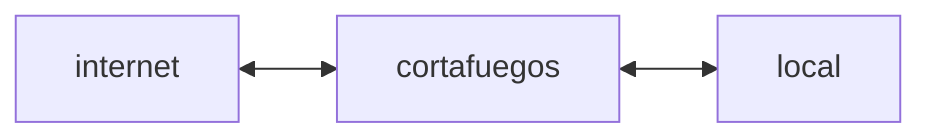

# 8. Seguridad Perimetral
2023-11-10 (YYYY-MM-DD) @ 17:28
Rodríguez López, Alejandro // UO281827

Tags:
	#showable
	Hecho en #EPI
	Sobre #Seguridad 
	Para #Apuntes
	Otros:
	Refs:
 

Un cortafuegos es un elemento de control ubicado entre la red local e internet.

## Filtro de Paquetes

Las reglas de filtrado se basan en información contenida en la cabecera del paquete:
- IP
- Puerto
- Interfaces de origen y destino

Si no se puede aplicar ninguna regla a un paquete, se aplica una regla por defecto:
- Descartas (prohibir)
- Reenviar (permitir)

Los filtros de paquetes actúan a nivel:
- Transporte (Puertos)
- Internet (IPs)
- Enlace (MACs)

Pero no protegen de ataques hacia la aplicación.

#### Con inspección de estados

Sólo permite el tráfico entrante a puertos altos que se encuentren en la lista de conexiones TCP salientes.
La lista de conexiones TCP salientes tiene una entrada para cada puerto alto.
