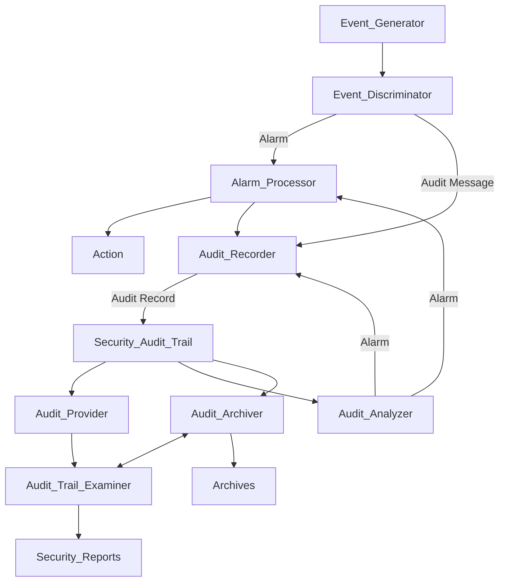
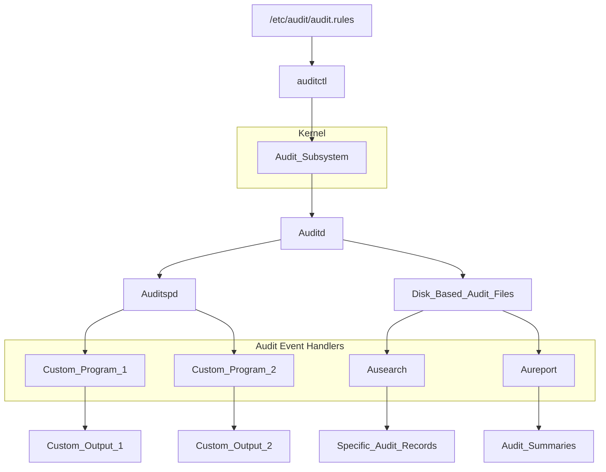
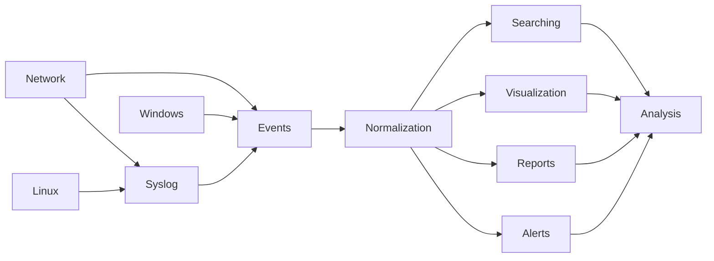

# 9. Auditoría de Seguridad
2023-11-23 (YYYY-MM-DD) @ 15:05
Rodríguez López, Alejandro // UO281827

Tags:
	#showable
	Hecho en #EPI
	Sobre #Apuntes
	Para #Seguridad 
	Otros:
	Refs:
 

Revisión y examen de los registros de las actividades de un sistema.
RAS: Registro de auditorías de seguridad.

Objetivo:
- Generar y grabar RAS.
- Revisar y analizar RAS.

## Eventos

## Common Criteria

Conjunto de criterios para especificar productos de seguridad.
Asegura que los productos son interoperables a nivel mundial.

## Registros

### Requisitos de datos

La cantidad es una función del rango de áreas de interés y la granularidad de la captura.
La cantidad debe ser un compromiso entre cantidad y eficiencia.
- Registros con alta cantidad:
	- Degradan los sistemas en mayor grado
	- Sobrecargan el análisis
	- Tienden a generar muchos datos

### Selección de datos

- Eventos
	- Del software de auditoría
	- Relacionados con los mecanismos de seguridad
	- Generados por mecanismos de seguridad
	- Relacionados con la gestión y el funcionamiento del sistema
- Accesos
	- Al sistema operativo
	- A aplicaciones seleccionadas
	- Remotos

#### Sugerencias del ISO 27002

- Accesos autorizados
- Operaciones realizadas utilizando privilegios
- Accesos no autorizados
- Alertas por fallos
- Cambios e intentos de cambio en configuraciones del sistema

### Eventos

#### Tipos

- A nivel del sistema (`dmesg`).
- A nivel de aplicación (`logs`).
- A nivel de usuario (`history`).

En cualquier caso, los registros que se tomen deben estar seguros para asegurar la CIA (Confidentiality, Integrity, Availability).

#### Propiedades de Eventos

- Origen (Programa que genera el evento)
- Identificador
- Nivel
	- Registro de Aplicación y Sistema
		- Información
		- Advertencia
		- Error
		- Crítico
	- Registro de Seguridad
		- Auditoría de Aciertos
		- Audit
- Usuario
- Código operativo
- Registro
- Categoría de tarea
- Palabras clave
- Equipo
- Fecha y hora

#### Windows

Se utiliza el `event viewer` para observar los eventos de windows.

Existen 2 categorías de servicios:

- Registros de windows.
	- Aplicación (deprecated, ahora se utilizan los Registros de Aplicaciones y Servicios)
	- Seguridad
	- Instalación
	- Sistema
	- Eventos reenviados
- Registros de Aplicaciones y Servicios.
- Vistas personalizadas.
	- Permite almacenar un filtro (conjunto de reglas).
	- Mostrará los eventos que cumplan el filtro.
- Suscripciones.
	- Permite recopilar datos de eventos de varios equipos remotos.

#### Unix

En UNIX se utiliza el proceso `syslogd` para administrar los logs.

Cada paquete de `syslog` consiste de 3 partes:
- Prioridad = $Prioridad = 8 * Facility + Severity$
- Cabecera
- Mensaje

### Cuándo se analiza el registro

- Tras el evento.
- Análisis periódico.
	- Se buscan patrones de eventos que muestren un problema de seguridad.
	- Desarrollar un perfil de comportamiento normal y buscar comportamientos anómalos.
	- Desarrollar un perfil para cada usuario / rol individual.
- Análisis en tiempo real.
	- Se realiza de forma automatizada para detectar intrusiones.

## SIEM

Un SIEM es un Security Information and Event Management.

