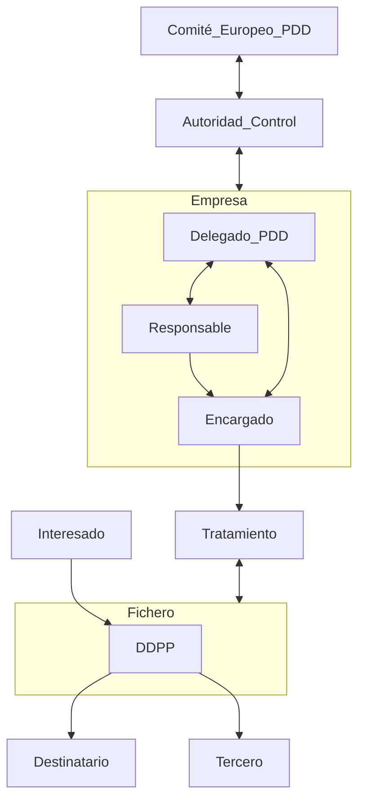
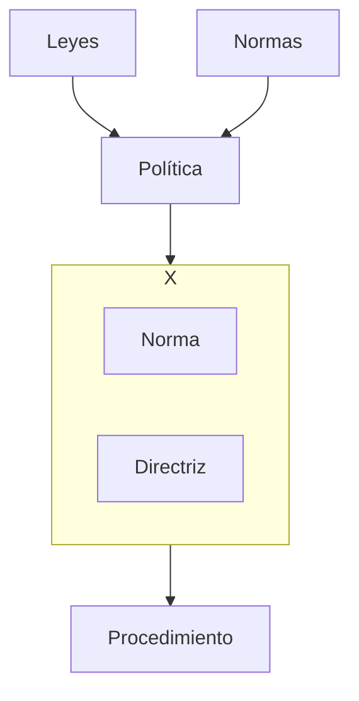
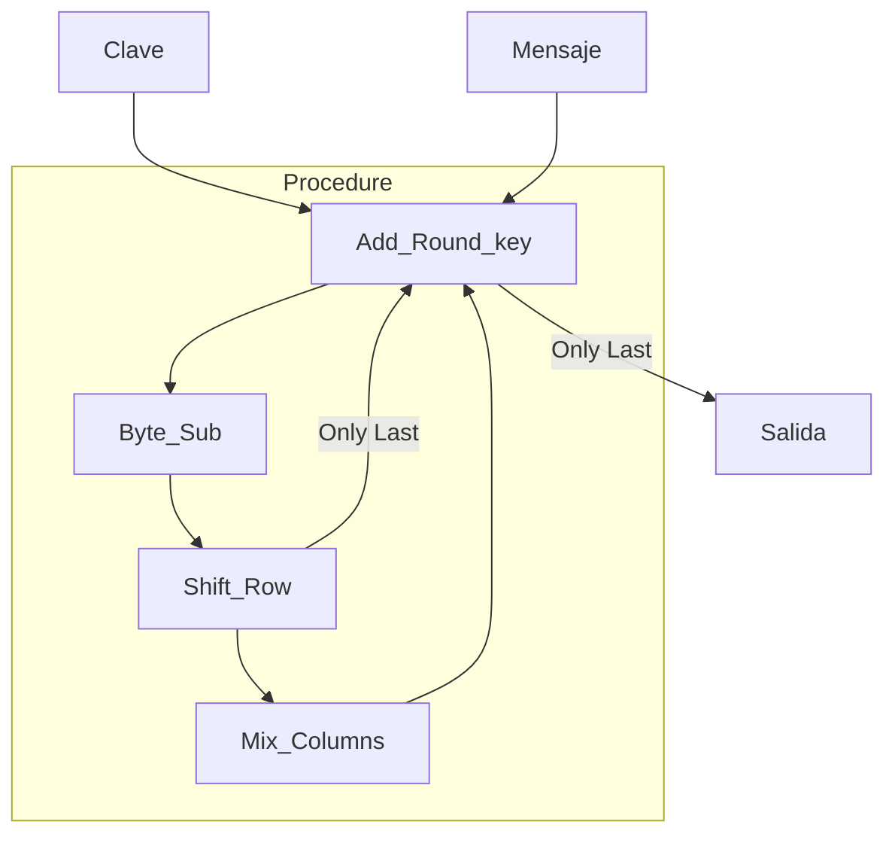
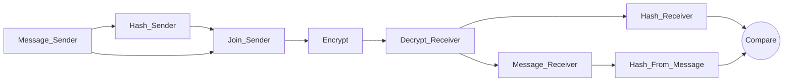

# Examen 1
2023-10-14 (YYYY-MM-DD) @ 13:36
Rodríguez López, Alejandro // UO281827

Tags:
	#showable
	Hecho en #Viesques
	Sobre #Seguridad
	Para #Apuntes
	Otros:
	Refs:
 
<hr>

## 1. Introducción

### Definición de Seguridad

La seguridad trata de mantener la CIA:

#### Confidentiality

La información está ocultada para aquellos sin autorización.
Se sigue el principio _Need to know_ (Cada usuario sólo puede acceder a la información que necesita).
En algunos casos se requiere que la existencia de la información sea confidencia, no sólo la información en sí.

Para proporcionar confidencialidad se utilizan Mecanismos de Control de Acceso:
- Contraseñas.
- Cifrados.

#### Integrity

La información no es alterada sin autorización.
La información tiene 2 aspectos que deben ser íntegros para que la información lo sea:
- Datos (El contenido).
- Origen (La fuente).

Para proporcionar integridad se utilizan mecanismos de:
- Prevención.
	- Bloquean el acceso no autorizado a la modificación de datos.
- Detección.
	- Indican que la información ha sido modificada sin autorización y no es íntegra.

#### Availability

La información está disponible cuando se desea utilizar.
Se deben evitar acciones que tengan el objetivo de denegar el acceso a la información o servicios (DoS).

Para proporcionar disponibilidad se utilizan mecanismos que detecten los ataques.

### Amenazas a la seguridad

Una amenaza es una causa potencial de una brecha de seguridad.
Existen varios tipos de amenazas:
- Reveleación no autorizada de información (_snooping)_.
- Engaño al usar datos falsos (_mitm_).
- Perturbación o interrupción del sistema (_DoS_).
- Usurpación del sistema informático.

### Objetivos de la seguridad

1. Detectar amenazas de seguridad.
2. Minimar riesgos de seguridad.
3. Garantizar correcta utilización de recursos.
4. En caso de incidente:
	1. Limitar pérdidas.
	2. Recuperarse adecuadamente.
5. Cumplir legislación y requisitos contractuales.

Para cumplir los objetivos, se implanta un SGSI (Sistema de Gestión de la Seguridad de la Información).

> [!info] Visión más amplia
> Gobernanza. Desarrollar una estrategia para implementar la gobernanza de la seguridad de la información.
> Trabaja a un nivel más alto que SGSI.
> Integra los procesos de gestión de seguridad con otros procesos de gestión.

### SGSI (Sistema de Gestión de la Seguridad de la Información)

#### Servicios proporcionados por un SGSI

- Confidencialidad (Confidentiality).
- Integridad (Integrity).
- Disponibilidad (Availability).
- Autenticación (Demuestra que el remitente de un mensaje es correcto).
- No repudio
	- De origen (Demuestra autoría y envío de un mensaje).
	- De destino (Demuestra recepción de un mensaje).
- Autorización (Control del acceso a recursos).
- Auditoría (Monitoriza el uso de recursos por los usuarios).
- Reclamación de propiedad (Demuestra que un contenido pertenece a un usuario).
- Reclamación de origen (Demuestra quién ha sido el creador de un contenido).
- Anonimato (Garantiza el anonimato de los usuarios).
- Protección contra réplicas (Impide ataques basados en replicación de operaciones).
- Confirmación de operaciones (Confirma la realización de una operación y sus intervinientes).
- Certificación de fecha y hora (Certifica la fecha y hora de una operación).
- Certificación mediante terceros de confianza (Se utiliza a un tercero para certificar identidad, realización y contenido de transacción).

#### Técnicas y mecanismos de seguridad

- Copias de seguridad y centros de respaldo.
- Protocolos criptográficos:
	- Cifrado.
	- Firmas electrónicas.
- Identificación de usuarios y Control de acceso a recursos.
- Huella digital de mensajes y Sellado temporal de mensajes.
- Antivirus y Sistemas de detección de intrusiones.
- Análisis y filtrado de tráfico (cortafuegos) y Servidores proxy.

#### Principio de defensa en profundidad

La seguridad de un sistema informático está implantada en varios niveles:

```merm
flowchart TD
	subgraph Seguridad Perimetral Cortafuegos, Proxys
		subgraph Separación de redes LAN, VLAN
			subgraph Configuración robusta de equipos
				subgraph Gestión de usuarios
					subgraph Cifrado de datos
					end 
				end 
			end 
		end 
	end
```

#### Implantación de un SGSI

1. Formalizar la gestión de la seguridad de la información.
2. Analizar y gestionar los riesgos de seguridad.
3. Establecer los procesos de gestión de seguridad (PDCA).
4. Certificar la gestión de la seguridad.

```merm
---
title: PDCA
---
flowchart LR
	PLAN --> DO
	DO --> CHECK
	CHECK --> ACT
	ACT --> PLAN
```

> [!info] PDCA
> PLAN: Establecer el SGSI.
> DO: Implementar y operar el SGSI.
> CHECK: Monitorizar y revisar el SGSI.
> ACT: Mantener y mejorar el SGSI.

#### Niveles de madurez

1. Implantación de medidas básicas.
2. Adaptación al marco legal y las exigencias de clientes.
3. Gestión integral de la seguridad de la información.
4. Certificación de la gestión de la seguridad de la información.

## Legislación

### RGPD (Reglamento General Protección Datos)

#### Objetivo

- Establece las normas relativas a la protección de las personas en relación con el tratamiento de los datos personales.
- Aplicado al tratamiento automatizado* de datos personales.
- Ámbito territorial: Toda la UE.

\* Y al no automatizado de datos personales que serán incluídos en ficheros.

#### Entidades

- Responsable del tratamiento: Persona que determina los fines y medios del tratamiento.
- Encargado del tratamiento: Persona que trata los datos.
- Delegado de Protección de Datos: Profesional con conocimientos especializados en derecho y en PDD.
	- Asesora al Responsable y al Encargado.
	- Supervisa el cumplimiento del RGPD.
	- Atiende a los interesados y coopera con la Autoridad de Control.

> [!info] Delegado de PDD
> - Designación OBLIGATORIA por Responsable y Encargado cuando el tratamiento:
> 	- Lo hace un organismo público.
> 	- Requiere observación habitual y sistemática de interesados a gran escala.
> 	- Es a gran escala de categorías especiales de datos personales.




#### Principios

##### Relativos al tratamiento

- Tratados de manera lícita, leal y transparente.
- Recogidos con fines determinados, explícitos y legítimos.
- Adecuados, pertinentes y limitados a lo necesario.
- Exactos y, si fuera necesario, actualizados.
- Mantenidos para permitir la identificación de los interesados durante el tiempo necesario.
- Tratados de tal manera que se garantice una seguridad adecuada.

##### Licitud del tratamiento

- Consentimiento del interesado.
- Cumplimiento un contrato/obligación legal.
- Proteger intereses vitales.

##### Tratamiento de categorías especiales de datos personales

Prohibida tratación de datos que revelen origen étnico, política, religión, etc.
Salvo excepciones (i.e. El interesado da su consentimiento).

##### Tratamiento de datos penales

Sólo bajo la supervisión de autoridades públicas.

#### Derechos del interesado

- Información: El responsable informa al interesado.
- Acceso: El interesado puede acceder a los datos e información sobre el tratamiento.
- Rectificación: El interesado puede corregir sus datos.
- Supresión: El interesado puede suprimir sus datos en algunas circunstancias.
- Limitación del tratamiento: El interesado debe autorizar cada tratamiento.
- Portabilidad: El interesado puede transferir sus datos de un responsable a otro.
- Oposición: El interesado puede oponerse al tratamiento de sus datos.
- No ser objeto de decisiones individuales automatizadas: El interesado no debe ser objeto de decisiones tomadas automáticamente con efectos jurídicos.

#### Actividades a realizar

- Registro de las actividades de tratamiento.
- Seguridad de los DDPP.
- Notificar violaciones de seguridad a la Autoridad de Control.
- Comunicar violaciones de seguridad al interesado.
- Evaluación del impacto relativa a la PDD.

### ENS (Esquema Nacional de Seguridad)

Establece requisitos para gestionar seguridad de la información en Administraciones públicas.
Categoriza los SIs en dimensiones:
- Confidencialidad
- Integridad
- Trazabilidad
- Autenticidad
- Disponibilidad
Cada dimensión tiene un nivel (Bajo, Medio o Alto).

### LISI (Ley de Impulso de la Sociedad de la Información)

Conjunto de medidas orientadas a impulsar la Sociedad de Información en el sector privado.

### LPIC (Ley de Protección de Infraestructuras Críticas)

Establece el catálogo nacional de infraestructuras críticas:
- Servicios Esenciales: Aquellos necesarios para que la población tenga acceso a los servicios básicos.
- Sectores Estratégicos: Aquellos que dan servicio a los servicios esenciales.
- Infraestructuras Críticas: Fundamental dentro de un sector estratégico para ofrecer un servicio esencial.
- Estructuras Críticas: Aquellas que no tienen sustitución.
- Estructuras Críticas Europeas: Aquellas que afectan a más de un pais Europeo.

### LOPDP (Ley Orgánica Protección Datos Personales)

#### Objetivo

- Adaptar el ordenamiento jurídico español.
- Garantizar los derechos digitales de la ciudadanía conforme al mandato establecido en el artículo 18.4 de la Constitución.

> [!info]
> El RGPD permite que sus directrices sean especificadas por cada estado miembro.
> En España, la LOPDP es el reglamento que especifica las directrices del RGPD.

## Política de Seguridad

### Definiciones

Política de seguridad: Es una declaración de lo que está y no está permitido.
Mecanismo de seguridad: Es un método, herramienta o proceso para cumplir una política de seguridad.
Norma: <font color=green>Colección de requisitos</font> que se deben cumplir obligatoriamente (Proporcionan soporte a las políticas).
Directriz: <font color=green>Colección de sugerencias</font> para alcanzar las mejores práctiacas.
Procedimiento: <font color=green>Secuencia obligatoria</font> de acciones para completar con éxito una tarea.

### Relaciones



### Estructura de una política

- Resumen
- Introducción
- Alcance
- Objetivos
- Principios
- Responsabilidades
- Resultados
- Políticas relacionadas

### Aplicación de políticas

1. Identificar activos a proteger.
2. Determinar al responsable del activo.
3. Evaluar requisitos CIA del activo.
4. Determinar amenazas al activo.
5. Seleccionar controles y mecanismos de seguridad.

### Tipos de políticas de Seguridad

- Política de Confidencialidad: Sólo considera la confidencialidad
- Política de Integridad: Sólo considera la integridad.
- Política Militar o Gubernamental: Desarrollada **PRINCIPALMENTE** para proporcionar confidencialidad.
- Política Comercial: Desarrollada **PRINCIPALMENTE** para proporcionar integridad.

## Análisis y Gestión de Riesgos

### Identificación de objetivos y restricciones

#### Identificación de objetivos

1. Identificar lo que se espera del plan de seguridad.
2. Analizar los objetivos estratégicos definidos en la Política de Seguridad.
3. Establecer objetivos específicos cualitativos y cuantitativos referentes a un activo o grupo de activos.
4. Definirse objetivos en relación a los niveles de CIA necesarios.
5. Identificarse fases limitando el alcance teniendo en cuenta las restricciones.

#### Identificación de restricciones

- Técnicas: Es preferible implantar medidas en diseño que en explotación.
- Financieras: El coste de las medidas debe ser menor que de los activos que protegen.
- Temporales: El tiempo para gestionar un riesgo debe ser aceptable.
- Sociológicas: (Costumbres, culturas y mentalización del personal). Si se niegan, las medidas no son operativas.
- Ambientales: Superficie y espacio disponible.
- Legales: Legislaciones informáticas y otras.

### Inventariado y valoración de activos

#### Inventariado de activos

- Hardware.
- Software.
- Equipos de comunicaciones.
- Locales y oficinas.
- Personas.
- Información.
- Documentación.
- Imagen y reputación.
- Confianza de los clientes.

#### Valoración de activos

El valor no sólo es monetario.
El valor describe también cómo de crítico es el activo, y cómo de complicado es reemplazarlo.

### Identificación y valoración de las amenazas

#### Identificación de amenazas

- Desastres naturales.
- Fallos en infraestructuras (Cortes de electricidad).
- Accidentes (Incendios).
- Averías y fallos del SI.
- Agentes externos (Sabotaje).
- Agentes internos (Errores en el uso).

#### Valoración de amenazas

1. Identificar el origen.
2. Identificar el blanco.
3. Identificar la probabilidad.
4. Identificar el impacto y consecuencias.
5. Clasificar en 3 ó 5 niveles.

### Identificación de las medidas de seguridad existentes

#### Acciones a realizar

1. Identificar las medidas de seguridad existentes.
2. Conocer su grado de efectividad.
3. Identificar a los activos a los que se aplican.
4. Clasificar las medidas existentes.
	- Organizativas.
	- De seguridad física.
	- De seguridad lógica (tecnológicas).
	- Legales.
5. Estimar la criticidad de las medidas.
6. Estimar el estado de las medidas.
	- Bueno
	- Malo
	- Mejorable

### Identificación y valoración de vulnerabilidades

#### Identificación de vulnerabilidades

- Vulnerabilidad: Cualquier debilidad que pueda ser explotada por amenazas para causar daños y pérdidas.
1. Identificar vulnerabilidades generales.
2. Identificar vulnerabilidades específicas para cada activo.
3. Clasificar en 3 ó 5 grupos.

#### Valoración de vulnerabilidades

- Evaluar la importancia de la vulnerabilidad.
	- Identificar si existe una medida de protección.
	- Evaluar la eficacia de las medidas de protección.
- Pruebas.
	- Tests de intrusión interno y externo.
	- Ingeniería social.
- Valoración cualitativa.
	- 3 ó 5 grupos.

### Determinar el impacto

El impacto es la medición de las consecuencias.
Daños:
- Tangibles.
- Intangibles (Información).

#### Clasificación

- Alto
	- Pérdida de activos no reparables.
	- Interrupción de proceso de negocio.
	- Robo de información estratégica y confidencial.
	- Daños en la imagen y reputación.
- Medio
	- Pérdida de activos con respaldo.
	- Caída notable del rendimiento.
	- Robo de información no estratégica.
- Bajo
	- Pérdida de activos secundarios.
	- Disminución moderada de rendimiento.
	- Robo de información interna.

### Determinar el riesgo

Riesgo: Posibilidad de que una amenaza aproveche una vulnerabilidad.
- Amenaza sin vulnerabilidad no implica riesgo.
- Amenaza con vulnerabilidad sin impacto implica que no es necesario mejorar las medidas de seguridad.

#### Tipos de estimaciones de riesgo

- Inherente: Estimado sin tener en cuenta las medidas de protección existentes.
- Actual: Estimado teniendo en cuenta las medidas de protección existentes.
- Residual: Estimado teniendo en cuenta las medidas de protección existentes y planificadas.

#### Clasificación cualitativa de las probabilidades

##### Para amenazas naturales

- Alta: 1/1 año.
- Media: 1/5 años.
- Baja: 1/10 años.
- Muy baja: 1/20 años.

##### Para amenazas accidentales o intencionadas

- Extremadamente Frecuente: 1 por día.
- Muy Frecuente: 1 por semana.
- Frecuente: 1 por mes.
- Frecuencia Normal: 1 por trimestre.
- Poco Frecuente: 1 por año.

### Identificación y selección de las medidas de protección

Medida de seguridad: Medio empleado para eliminar o reducir un riesgo.

#### Objetivos

- Reducir las vulnerabilidades.
- Reducir la probabilidad de ocurrencia.
- Reducir el impacto.

#### Clasificación

- Activas: Reducir el riesgo.
	- Prevención: Antes del incidente.
	- Detección: Durante el incidente.
- Pasivas: Reducir el impacto.
	- Corrección: Después del incidente.

#### Análisis

$$
	\begin{matrix}
		Impacto & = & Valor & \cdot & Degradación & \cdot & (1 - EficaciaRI) \\
		Riesgo & = & Impacto & \cdot & Frecuencia & \cdot & (1 - EficaciaRF)
	\end{matrix}
$$

## Cifrado con algoritmos Simétricos

Utilizan la misma clave para cifrar y descifrar.

### De Flujo

Combina los dígitos de texto plano con una serie pseudoaleatoria de dígitos de cifrado.
La operación se hace a nivel de bit o byte. Ejemplo con bit:

```python
def randomBit():
	return random() % 2 # Returns 0 or 1

def cifra(texto):
	for idx, bit in enumerate(texto):
		texto[idx] = xor(bit, randomBit())
	return texto
```

#### Síncronos

La secuencia de dígitos de cifrado se genera independientemente del texto plano y cifrado.
- Si se añaden o eliminan dígitos del texto durante la transmisión, no se descrifrará correctamente.
- Si se corrompe un dígito durante la transmisión, sólo afectará a un dígito, no se propagará.

#### Auto-Sincronizados

Usan varios dígitos del texto cifrado para generar la serie de dígitos de cifrado.

### De Bloque

Se trabaja con bloques de bits de longitud fija (bloques).
El cifrado de cada bloque puede ser (o no) independiente para cada bloque.

#### Modos de funcionamiento

![[Examen 1 2023-10-20 10.11.01.excalidraw|1900]]

##### ECB

Cada bloque se cifra con la clave de forma independiente a otros bloques.

##### CBC

A cada bloque de texto plano, se le realiza una operación XOR con el bloque anterior.
Al primer bloque se le hace la operación XOR con un vector de inicialización.
Un cambio en un bit de un bloque afecta a todos los bloques siguientes.

##### CFB

Igual que un Cifrador Auto Sincronizable, pero utilizando bloques.

##### OFB

Igual que un Cifrador Síncrono, pero utilizando bloques.

### AES (Advanced Encryption Standard)

AES utiliza como entrada una clave inicial y el texto plano.
Ambos se representan en una matriz:

1. Add_Round_key

$$
	\begin{bmatrix}
		A & C \\
		T & K \\
		T &   \\
		A 
	\end{bmatrix} xor
	\begin{bmatrix}
		M & E \\
		Y & Y \\
		  &   \\
		K 
	\end{bmatrix} =
	\begin{bmatrix}
		A\ xor\ M & C\ xor\ E \\
		T\ xor\ Y & K\ xor\ Y \\
		T\ xor\ 0 & 0\ xor\ 0 \\
		A\ xor\ K
	\end{bmatrix}	
$$

2. Byte_Sub

Se sustituye cada byte por otro extraido de una tabla.

3. Shift_Row

Cada fila del mensaje es desplazada B bytes a la izquierda (en un círculo).

4. Mix_Columns

Los bytes de cada columna se combinan utilizando una función.



Para desencriptar, se realiza la inversa de cada operación en orden inverso.

## Cifrado con algoritmos Asimétricos

Utiliza dos claves.
Lo que una cifra, la otra descifra.

### RSA

#### Generación de claves

1. Elegir dos números primos distintos $p$ y $q$.
2. Calcular $n$, el módulo de las claves $n = p \cdot q$.
3. Calcular la función de Euler $\phi(n) = (p-1) \cdot (q-1)$.
4. Elegir $e$, el exponente de la clave pública ($1 \le e \lt \phi(n)$ y coprimo con $\phi(n)$).
5. Determinar $d$, el exponente de la clave privada ($(d\cdot e-1) \% \phi(n) = 0$).

#### Ataques

Se conoce la clave pública ($n, e$).
Se desconoce el exponente ($d$) de la clave secreta ($n, d$).

##### Obvio no usado

1. Cifrar un mensaje $C = M^e \mod n$
2. Descifrar el mensaje $M' = C^d \mod n$.
3. Probar valores de $d$ hasta que $M' = M$.

Con $M$, $C$ y $n$ grandes, encontrar $d$ es casi imposible.

##### Estándar

1. Como se conoce $n$, se factoriza en primos para averiguar $p$ y $q$ ($n = p \cdot q$).
2. Calcular $\phi(n) = (p - 1) \cdot (q - 1)$.
3. Resolver ecuación $d \cdot e = (1 \mod \phi(n))$ para obtener $d$.

El problema del paso 1 (factorizar $n$) es intratable.

## Funciones de resumen (Hash)

Una función Hash genera un resumen de tamaño fijo a partir de un mensaje de tamaño variable.

### Características de funciones Hash

#### Básicas

- Bajo coste computacional.
- Determinista (Para una entrada, una salida).
- Uniforme (Proyecta valores del rango de salida de forma uniforme).

#### Adicionales

- Unidireccionalidad (Para cada salida sólo existe una entrada).
- Difusión (Si cambia un bit de la entrada, cambian más de la mitad de los bits de la salida).
- Resistencia Débil a colisiones (Dado $M$, no se podrá encontrar $M'$ tal que $H(M) = H(M')$).
- Resistencia Fuerte a colisiones (Es difícil encontrar $(M, M')$ tal que $H(M) = H(M')$).

### Cifrado / Autenticación

Todos los esquemas siguen una variación de:



### SHA-1

Utiliza bloques de 512 bits y genera un resumen de 160 bits.
Si fuese necesario rellenar el mensaje, se utilizan los siguientes bits al final: `10...011000`.
El relleno es un `1` seguido por tantos `0` sean necesarios, y terminado en el caracter `L` codificado en ASCII (`11000`).

## Autenticación de mensajes

Procedimiento para verificar que un mensaje proviene de un remitente concreto y que no ha sido modificado.

### Cifrado del mensaje

El cifrado de un mensaje puede aportar autenticación.
En cifrado simétrico, sólo el emisor y el receptor conocen la clave, por lo que si se puede descifrar, está autenticado.
Esta opción sólo sirve si el mensaje tiene una sintaxis definida, si es una cadena de bytes, no se puede diferenciar de un mensaje modificado.
Se puede calcular un Checksum del mensaje, de forma que el receptor pueda calcular el checksum de nuevo y comprobar si ambos coinciden. (El checksum puede (o no) estar encriptado)

### Función Hash

| Cifrado con                                               | Confidencialidad | Autenticación |
| --------------------------------------------------------- | ---------------- | ------------- |
| Clave pública del destinatario                            | Sí               | No            |
| Clave privada del emisor                                  | No               | Sí            |
| Clave privada del emisor + Clave pública del destinatario | Sí               | Sí            |

#### Autenticación mediante MAC

Consiste en utilizar una función $MAC = C(K, M)$, siendo $K$ una clave secreta conocida por receptor y emisor.
El resultado de calcular $C(K, M)$ se junta con el mensaje y se envía para que el receptor pueda comprobarlo.

### Código de autenticación del mensaje

## Firma digital

## Certificados digitales

## Infraestructura de clave pública

## Esencial

> [!info] Fran:
> 1. Principio de defensa en profundidad
> 2. RD esquema nacional de seguridad - Principios o requisitos minimos
> 3. Diffie Hellman
> 4. Cadena de certificados
> 5. Problema RSA
> 6. Anidacion de niveles de las firmas CAdES
> 7. Algoritmo RSA: esquemas de relleno OAEP (dibujo con los pasos descritos)
> 8. AES vista general del proceso de cifrado
> 9. Encadenamiento de cifradores simetros CBC
> 10. Tipos de respuesta en el protocolo OCSP

> [!warning] Examen
> > Leyes sobre la seguridad informática
> - Reglamento General de Protección de Datos (RGPD)
> - Reglamento de Identificación y Firma Electrónica (eIDAS)
> - Ley de Servicios para la Sociedad de la Informacion y Comercio Electrónico (LSSI-CE)
> - Ley del Procedimiento Administrativo Común de las Administraciones Públicas (LPACAP)
> - Ley de Medidas de Impulso para la Sociedad de la Informacion (LISI)
> - Ley de Protección de las Infraestructuras Críticas (LPIC)
> - RDL de Seguridad de las Redes y Sistemas de Información (SRSI)

> [!warning] Examen
> > Lista los principios relativos al tratamiento de los datos personales
> - Tratados de manera lícita, leal y transparente para el interesado.
> - Recogidos con fines determinados, explícitos y legítimos.
> - Adecuados, pertinentes y limitados a lo necesario.
> - Exactos y, si fuera nececesario, actualizados.
> - Mantenidos para permitir la identificación de los interesados durante justo el tiempo necesario.
> - Tratados de tal manera que se garantice una seguridad adecuada.

> [!warning] Examen
> > Listar los derechos del interesado
> - Acceso: El interesado podrá acceder a sus datos e información sobre el tratamiento.
> - Rectificaición: El interesado podrá corregir sus datos personales.
> - Supresión: El interesado podrá solicitar la supresión de sus datos en algunas circunstancias.
> - Oposición: El interesado puede oponerse al tratamiento de sus datos (Existen excepciones).
> - Información: Al recabar información, el responsable debe informar al interesado.
> - Limitación al tratamiento: El interesado debe autorizar cada tratamiento.
> - Portabilidad: El interesado puede transferir sus datos de un responsable a otro.
> - No ser objeto de decicisiones individuales automatizadas: El interesado no deberá ser objeto de decisiones individuales automatizadas que tengan efectos jurídicos.

> [!warning] Examen
> > Lístense 4 principios básicos de ENS.
> - Seguridad como proceso integral.
> - Gestión basada en los riesgos.
> - Prevención, detección, respuesta y conservación.
> - Líneas de defensa.
> - Vigilancia continua.
> - Reevaluación periódica.
> - Diferenciación de responsabilidades.

> [!warning] Examen
> > Lístense 4 políticas de seguridad y requisitos mínimos de seguridad.
> - Organización e implantación del proceso de seguridad.
> - Análisis y gestión de los riesgos.
> - Gestión de personal.
> - Profesionalidad.
> - Autorización y control de los accesos.
> - Protección de las instalaciones.
> - Adquisición de productos de seguridad.
> - Mínimo privilegio.
> - Integridad y actualización del sistema.
> - Protección de la información almacenada y en tránsito.
> - Prevención ante otros sistemas de información interconectados.
> - Registro de actividad y detección de código dañino.
> - Incidentes de seguridad.
> - Continuidad de la actividad.
> - Mejora continua del proceso de seguridad.

> [!warning] Examen
> > Qué dice el estándar ISO 27XXX?
> > Cuál es el propósito del estándar ISO 27XXX?
> # 27000
> - Glosario de términos y definiciones.
> - Introducción a SGSI.
> - Visión general de la familia de estándares 27k.
> # 27001
> - Requisitos del SGSI.
> - Cubre el establecimiento, implementación, operación, monitorización, revisión y mejora del SGSI.
> - Indica requisitos de documentación.
> - Establece responsabilidades de gestión.
> Es el único estándar certificable de la serie 27k.
> # 27002
> - Guía de buenas prácticas para garantizar la seguridad de la información.
> # 27003
> - Guía para la implementación de un SGSI.
> # 27004
> - Guía para usar métricas y técnicas de medida de la eficacia de un SGSI.
> # 27005
> - Directrices para gestionar riesgos de seguridad.
> # 27006
> - Requisitos para la acreditación de los organismos que auditan y certifican SGSIs.
> # 27007
> - Guía de auditoría de los controles seleccionados en la implantación de un SGSI.

## Ejercicio RSA

![[Examen 1 2023-10-20 10.35.38.excalidraw|1900]]