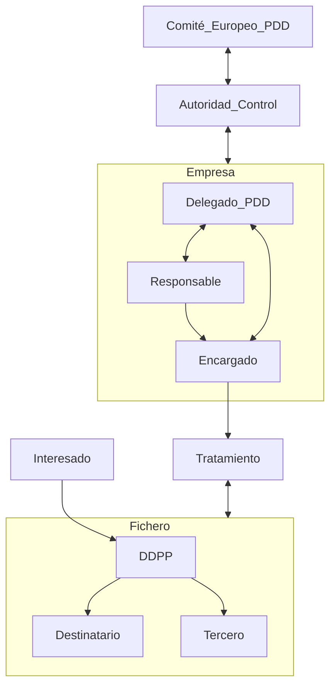

# Examen 1
2023-10-14 (YYYY-MM-DD) @ 13:36
Rodríguez López, Alejandro // UO281827

Tags:
	#showable
	Hecho en #Viesques
	Sobre #Seguridad
	Para #Apuntes
	Otros:
	Refs:
 
<hr>

## 1. Introducción

### Definición de Seguridad

La seguridad trata de mantener la CIA:

#### Confidentiality

La información está ocultada para aquellos sin autorización.
Se sigue el principio _Need to know_ (Cada usuario sólo puede acceder a la información que necesita).
En algunos casos se requiere que la existencia de la información sea confidencia, no sólo la información en sí.

Para proporcionar confidencialidad se utilizan Mecanismos de Control de Acceso:
- Contraseñas.
- Cifrados.

#### Integrity

La información no es alterada sin autorización.
La información tiene 2 aspectos que deben ser íntegros para que la información lo sea:
- Datos (El contenido).
- Origen (La fuente).

Para proporcionar integridad se utilizan mecanismos de:
- Prevención.
	- Bloquean el acceso no autorizado a la modificación de datos.
- Detección.
	- Indican que la información ha sido modificada sin autorización y no es íntegra.

#### Availability

La información está disponible cuando se desea utilizar.
Se deben evitar acciones que tengan el objetivo de denegar el acceso a la información o servicios (DoS).

Para proporcionar disponibilidad se utilizan mecanismos que detecten los ataques.

### Amenazas a la seguridad

Una amenaza es una causa potencial de una brecha de seguridad.
Existen varios tipos de amenazas:
- Reveleación no autorizada de información (_snooping)_.
- Engaño al usar datos falsos (_mitm_).
- Perturbación o interrupción del sistema (_DoS_).
- Usurpación del sistema informático.

### Objetivos de la seguridad

1. Detectar amenazas de seguridad.
2. Minimar riesgos de seguridad.
3. Garantizar correcta utilización de recursos.
4. En caso de incidente:
	1. Limitar pérdidas.
	2. Recuperarse adecuadamente.
5. Cumplir legislación y requisitos contractuales.

Para cumplir los objetivos, se implanta un SGSI (Sistema de Gestión de la Seguridad de la Información).

> [!info] Visión más amplia
> Gobernanza. Desarrollar una estrategia para implementar la gobernanza de la seguridad de la información.
> Trabaja a un nivel más alto que SGSI.
> Integra los procesos de gestión de seguridad con otros procesos de gestión.

### SGSI (Sistema de Gestión de la Seguridad de la Información)

#### Servicios proporcionados por un SGSI

- Confidencialidad (Confidentiality).
- Integridad (Integrity).
- Disponibilidad (Availability).
- Autenticación (Demuestra que el remitente de un mensaje es correcto).
- No repudio
	- De origen (Demuestra autoría y envío de un mensaje).
	- De destino (Demuestra recepción de un mensaje).
- Autorización (Control del acceso a recursos).
- Auditoría (Monitoriza el uso de recursos por los usuarios).
- Reclamación de propiedad (Demuestra que un contenido pertenece a un usuario).
- Reclamación de origen (Demuestra quién ha sido el creador de un contenido).
- Anonimato (Garantiza el anonimato de los usuarios).
- Protección contra réplicas (Impide ataques basados en replicación de operaciones).
- Confirmación de operaciones (Confirma la realización de una operación y sus intervinientes).
- Certificación de fecha y hora (Certifica la fecha y hora de una operación).
- Certificación mediante terceros de confianza (Se utiliza a un tercero para certificar identidad, realización y contenido de transacción).

#### Técnicas y mecanismos de seguridad

- Copias de seguridad y centros de respaldo.
- Protocolos criptográficos:
	- Cifrado.
	- Firmas electrónicas.
- Identificación de usuarios y Control de acceso a recursos.
- Huella digital de mensajes y Sellado temporal de mensajes.
- Antivirus y Sistemas de detección de intrusiones.
- Análisis y filtrado de tráfico (cortafuegos) y Servidores proxy.

#### Principio de defensa en profundidad

La seguridad de un sistema informático está implantada en varios niveles:

```merm
flowchart TD
	subgraph Seguridad Perimetral Cortafuegos, Proxys
		subgraph Separación de redes LAN, VLAN
			subgraph Configuración robusta de equipos
				subgraph Gestión de usuarios
					subgraph Cifrado de datos
					end 
				end 
			end 
		end 
	end
```

#### Implantación de un SGSI

1. Formalizar la gestión de la seguridad de la información.
2. Analizar y gestionar los riesgos de seguridad.
3. Establecer los procesos de gestión de seguridad (PDCA).
4. Certificar la gestión de la seguridad.

```merm
---
title: PDCA
---
flowchart LR
	PLAN --> DO
	DO --> CHECK
	CHECK --> ACT
	ACT --> PLAN
```

> [!info] PDCA
> PLAN: Establecer el SGSI.
> DO: Implementar y operar el SGSI.
> CHECK: Monitorizar y revisar el SGSI.
> ACT: Mantener y mejorar el SGSI.

#### Niveles de madurez

1. Implantación de medidas básicas.
2. Adaptación al marco legal y las exigencias de clientes.
3. Gestión integral de la seguridad de la información.
4. Certificación de la gestión de la seguridad de la información.

## Legislación

### RGPD (Reglamento General Protección Datos)

#### Objetivo

- Establece las normas relativas a la protección de las personas en relación con el tratamiento de los datos personales.
- Aplicado al tratamiento automatizado* de datos personales.
- Ámbito territorial: Toda la UE.

\* Y al no automatizado de datos personales que serán incluídos en ficheros.

#### Entidades

- Responsable del tratamiento: Persona que determina los fines y medios del tratamiento.
- Encargado del tratamiento: Persona que trata los datos.
- Delegado de Protección de Datos: Profesional con conocimientos especializados en derecho y en PDD.
	- Asesora al Responsable y al Encargado.
	- Supervisa el cumplimiento del RGPD.
	- Atiende a los interesados y coopera con la Autoridad de Control.

> [!info] Delegado de PDD
> - Designación OBLIGATORIA por Responsable y Encargado cuando el tratamiento:
> 	- Lo hace un organismo público.
> 	- Requiere observación habitual y sistemática de interesados a gran escala.
> 	- Es a gran escala de categorías especiales de datos personales.




#### Principios

##### Relativos al tratamiento

- Tratados de manera lícita, leal y transparente.
- Recogidos con fines determinados, explícitos y legítimos.
- Adecuados, pertinentes y limitados a lo necesario.
- Exactos y, si fuera necesario, actualizados.
- Mantenidos para permitir la identificación de los interesados durante el tiempo necesario.
- Tratados de tal manera que se garantice una seguridad adecuada.

##### Licitud del tratamiento

- Consentimiento del interesado.
- Cumplimiento un contrato/obligación legal.
- Proteger intereses vitales.

##### Tratamiento de categorías especiales de datos personales

Prohibida tratación de datos que revelen origen étnico, política, religión, etc.
Salvo excepciones (i.e. El interesado da su consentimiento).

##### Tratamiento de datos penales

Sólo bajo la supervisión de autoridades públicas.

#### Derechos del interesado

- Información: El responsable informa al interesado.
- Acceso: El interesado puede acceder a los datos e información sobre el tratamiento.
- Rectificación: El interesado puede corregir sus datos.
- Supresión: El interesado puede suprimir sus datos en algunas circunstancias.
- Limitación del tratamiento: El interesado debe autorizar cada tratamiento.
- Portabilidad: El interesado puede transferir sus datos de un responsable a otro.
- Oposición: El interesado puede oponerse al tratamiento de sus datos.
- No ser objeto de decisiones individuales automatizadas: El interesado no debe ser objeto de decisiones tomadas automáticamente con efectos jurídicos.

#### Actividades a realizar

- Registro de las actividades de tratamiento.
- Seguridad de los DDPP.
- Notificar violaciones de seguridad a la Autoridad de Control.

### LOPDP (Ley Orgánica Protección Datos Personales)

#### Objetivo

- Adaptar el ordenamiento jurídico español.
- Garantizar los derechos digitales de la ciudadanía conforme al mandato establecido en el artículo 18.4 de la Constitución.

> [!info]
> El RGPD permite que sus directrices sean especificadas por cada estado miembro.
> En España, la LOPDP es el reglamento que especifica las directrices del RGPD.
