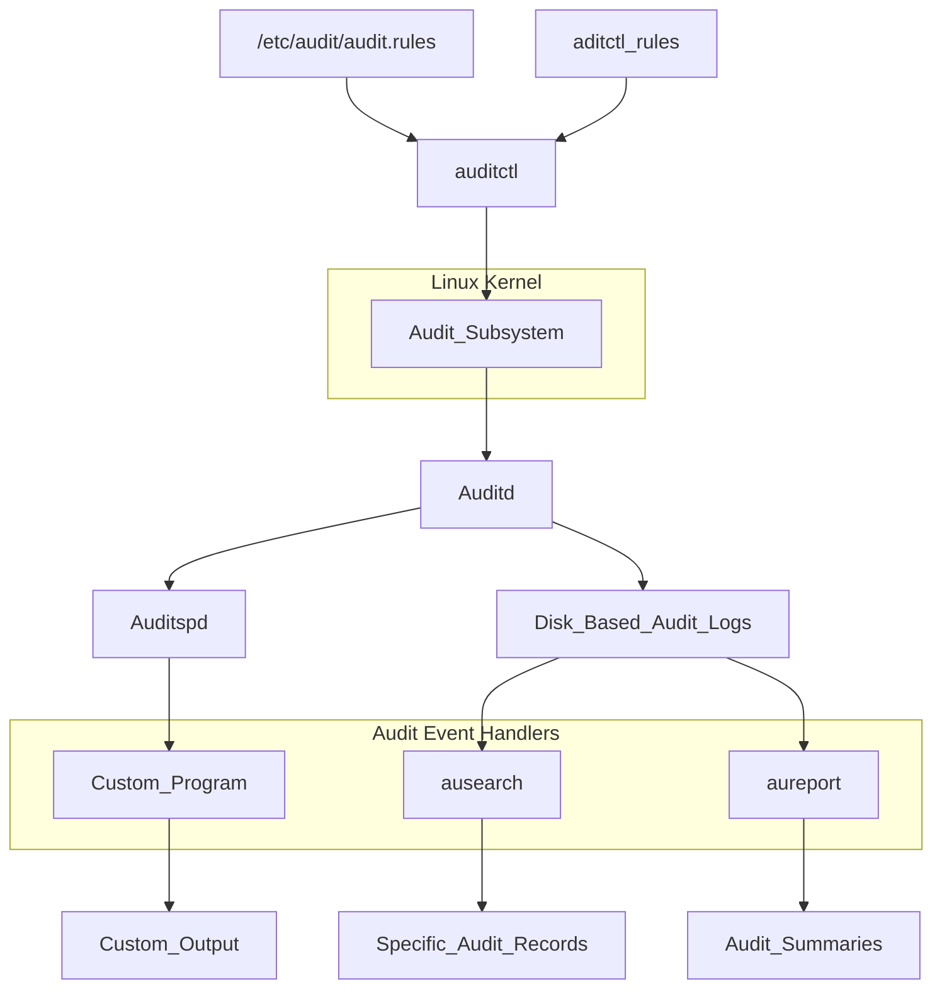
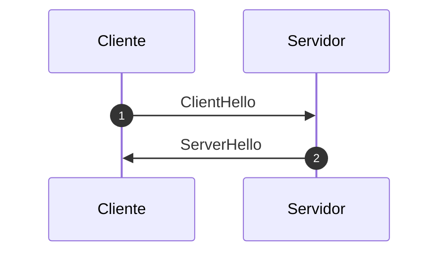
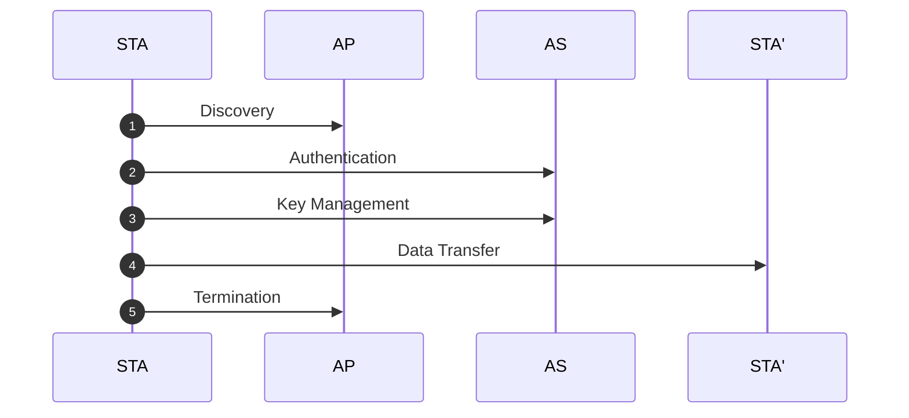
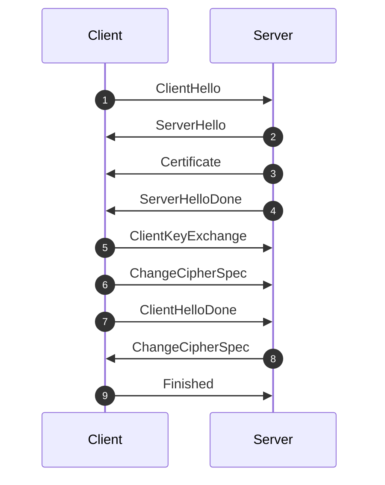
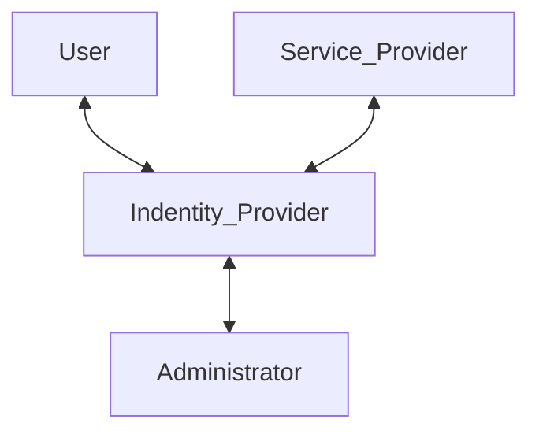

# ExamenesBackup2
2023-12-15 (YYYY-MM-DD) @ 07:39
Rodríguez López, Alejandro // UO281827

Tags:
	#showable
	Hecho en #Viesques
	Sobre #Seguridad
	Para #Apuntes
	Otros:
	Refs:
 

# 2018

## Razones que justifican el uso de dos claves distintas en SSL/TLS.

- El algoritmo de autenticación sólo permite firmar.
- Se pueden utilizar claves largas para autenticar y cortas para cifrar.

## Ejercicio IPSec

1. AH Transporte
2. ESP Transporte
3. AH Túnel

![[ExamenesBackup2 2023-12-15 09.46.38.excalidraw|1900]]

## 4 Medios básicos para verificar la identidad de un usuario.

- Algo que el usuario tiene.
- Algo que el usuario es.
- Algo que el usuario conoce.
- Algo que el usuario hace.

## 802.1X

### Qué es un puerto

Canal lógico de comunicación que se mapea a una conexión física

### Qué tipos de puertos hay y qué caracteriza a cada tipo

1. Puerto no controlado: Permite el intercambio de PDUs independientemente del estado de autenticación del suplicante.
2. Puerto controlado: Permite el intercambio de PDUs sólo si el suplicante está autenticado.

### Cómo se utilizan para proteger las transmisiones de una red WiFi

Primero se utiliza un puerto no controlado (canal de control) para realizar la autenticación.
Una vez autenticado, se utiliza un puerto controlado (canal de datos) para enviar mensajes de datos.

## OpenID / Connect

### Para qué se usa

Se utiliza para autenticar usuarios.

### A quién proporciona ventajas y cuáles son 

Proporciona ventajas a quien quiere implementar la autenticación de usuaros.
OpenID Connect permite utilizar un Servidor de Autorizaciones externo (de terceros) para autenticar a los usuarios.
De esta forma, no es necesario realizar una implementación completa de un sistema de autenticación.

### Es centralizado o descentralizado. Por qué?

Se trata de un sistema centralizado ya que utiliza un servidor de autorizaciones para realizar la autenticación.

### Indica las entidades que considera el protocolo y su rol

| Entidad         | Rol                                              |
| --------------- | ------------------------------------------------ |
| Relaying Party  | Cliente, solicita la autenticación               |
| OpenId Provider | Servidor de Autorizaciones, autentica al usuario |
| End User        | Usuario, proporciona datos para la autenticación |
|                 |                                                  |

## Explica qué es un tobogán NOP y por qué es necesario

El tobogán NOP se utiliza al tratar de desbordar un búfer.
El objetivo de desbordar un búfer suele ser hacer que el programa ejecute un shellcode.
Para ello, se pueden insertar operaciones NOP antes del shellcode.
Al añadir operaciones NOP, la probabilidad de que el programa termine ejecutando el shellcode incrementa.
No obstante, es necesario no excederse con las operaciones NOP para evitar reescribir otros valores que sean necesarios.

## Diferencias entre filtro de paquetes con estado y sin estado.

Un filtro de paquetes sin estado aplicará las reglas sólo en la dirección en la que se establecen, no tiene en cuenta las respuestas a las peticiones.
Por lo que si se quiere enviar y recibir tráfico, será necesario implementar 2 reglas: Una para enviar y otra para recibir.

Un filtro de paquete con estado aplicará las reglas para envíos y para respuestas, por lo que en el ejemplo anterior, sólo sería necesario implementar una regla.

### Qué vulnerabilidad elimina la integración del estado

Si se utiliza un filtro de paquetes sin estado, es necesario añadir una regla que permita el tráfico de respuesta.
Esta regla se puede explotar, porque el cortafuegos permitiría tráfico entrante aunque no sean respuestas.

El filtro de paquetes con estado, no aceptaría respuestas a peticiones que no se han realizado.
O sea, que la regla que permite el retorno de las respuestas esta activa sólo cuando ha habido una petición previamente.

## Ejercicio filtro de paquetes

## Completar 2 características del malware y tipos de malware, para cada tipo indicar si tiene o no cada característica

| Malware        | Característica 1                   | Característica 2 |
| -------------- | ---------------------------------- | ---------------- |
|                | Requiere al usuario para activarse | Se autoreplica   |
| Virus          | Sí                                 | Sí               |
| Gusano         | No                                 | Sí               |
| Troyano        | Si                                 | No               |
| Bomba lógica   | No                                 | No               |
| Spyware        | No                                 | No               |
| Adware         | No                                 | No               |
| Stealware      | No                                 | No               |
| Puerta trasera | No                                 | No               |

## Dibujar un esquema del sistema de auditoría de Linux

# 2017

## Dibuja mensajes y explica como en SSL/TLS, un cliente puede reutilizar la sesión SSL establecida previamente.

1. El cliente envía un ClientHello, en él puede enviar un SESSION_ID en el que indica el identificador de la sesión SSL previa que querría reutilizar.
2. El servidor puede aceptar o denegar la reutilización de la sesión SSL.
	1. Si ACEPTA la reutilización: Envía en el ServerHello el mismo SESSION_ID que envió el cliente (el de la sesión reutilizada).
	2. Si DENIEGA la reutilización: Envía en el ServerHello otro SESSION_ID que corresponde al de la sesión que se creará.

## Indica la razón para reutilizar sesiones SSL/TLS.

Reducir el overhead de crear sesiones SSL.
Crear una sesión SSL implica enviar opciones, concertar algoritmos de cifrado, opcionalmente autenticar, crear claves simétricas...

## Dibuja estructura de un paquete IPSec para proteger al máximo el paquete.

### Modo Transporte

### Modo Túnel

## Explica en qué consiste un ataque de diccionario

Consiste en utilizar contraseñas frecuentemente utilizadas para obtener acceso a cuentas de usuario.

### Qué defensa proporciona el salt contra este ataque

Con el salt se obliga al atacante a recalcular el hash de la contraseña utilizando el nuevo salt de cada usuario.

## Dibuja una comunicación segura en WLAN

### Mecanismos para protegerse del stack overflow

### Stackguard

### Stackshield & Return Address Defender

## Ejercicio de filtro IP

## Características típicas de cada generación de AV

### Generación 1

Escáneres sencillos.
Utilizan firmas generadas a partir de programas infectados para conocer si un programa está infectado.

### Generación 2

Escáneres heurísticos.
Analizan bloques de código que puedan estar relacionados con el comportamiento de un virus.

### Generación 3

Monitores de actividades.
Monitorizan la actividad del sistema en busca de comportamientos típicos de un virus.

### Generación 4

Combinaciones.
Consiste en una combinación de las 3 generaciones anteriores.

## Dibuja el esquema del sistema de registro de eventos syslog. Explica los componentes.

# 2015

## Dibuja el conjunto de mensajes SSL donde sólo se autentica al servidor usando la misma clave pública para autenticar y cifrar la clave de sesión.

## Ejercicio IPSec

## Dibuja un diagrama con las 4 entidades involucradas en la gestión de la federación de entidades

## Enumera y explica las fases de operación de un virus

1. Latente: El virus se encuentra inactivo
2. Propagación: El virus se copia en otros programas
3. Activación: El virus se activa para realizar su función (instante)
4. Ejecución: El virus realiza su función

## Ejercicio de filtro IP

![[ExamenesBackup2 2023-12-15 10.35.45.excalidraw|1900]]