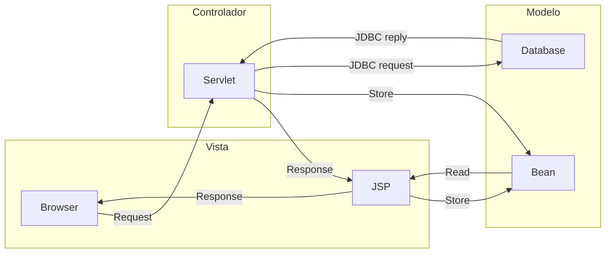

# 3. Diseño y Arquitectura
<% tp.file.creation_date() %> (YYYY-MM-DD) @ 15:11
Rodríguez López, Alejandro // UO281827

Tags:
	#showable
	Hecho en #EPI
	Sobre #Tec_Web
	Para #Apuntes
	Otros:
	Refs:
 
<hr>

## Modelo-Vista-Controlador (MVC)



<hr>

2023-09-26 (YYYY-MM-DD) @ 17:08

## Inyección de Bean

En algunos casos será necesario tener un Bean como atributo de otro Bean.
Se utiliza la anotación `@ManagedProperty`.

```java
// com.tea.cuck.InternalBean.java

public class InternalBean {
	private String name;

	public String getName() { return this.name; }
	public void setName(String name) { this.name = name; }
}

// com.tea.cuck.OuterBean.java
public class OuterBean {
	@ManagedProperty(value="#{name}")
	private InternalBean name;

	public InternalBean getName() { return this.name; }
	public void setName(InternalBean name) { this.name = name; }

}
```

```xhtml
<--! WebContent/index.xhtml -->
<... ="#{myOuterBean.name.name}" />
```

<hr>

2023-09-27 (YYYY-MM-DD) @ 15:10

## Internacionalización y Localización

La internacionalización se encarga de traducir texto.
La localización se encarga de traducir textos y fechas, medidas, dineros...

### Internacionalización (I18n)

> I18N porque empieza por I, acaba por N y tiene 18 letras en medio.
> ~ Enol, 2023

Originalmente, se duplicaba todo el proyecto y se traducían todas las strings.
La intención de la internacionalización (o mejor dicho, traducción) actual es que sólo exista un proyecto y que las cadenas de texto se carguen de forma dinámica en función del idioma.

- MiPrograma.java
	- TextoES.blablabla
	- TextoEN.blablabla
	- TextoRU.blablabla
	- TextoCN.blablabla
### Localización (L10N)

> L10N porque empieza por L, acaba por N y tiene 10 letras en medio.
> ~ Enol, 2023

Existen diferencias entre paises a parte del idioma.
En España se utilizan euros, kilómetros y Celsius.
En Estados Unidos se utilizan dólares, millas y Fahrenheit.

#### Calendario

El calendario más común es el Gregoriano (12 meses, 30/31/28-29 días en cada mes).
Existen otros calendarios de otros paises, aunque la mayoría de ellos están ya casi extintos.

Aún así, existen diferencias dentro de un mismo calendario:

- MM/DD/YYYY (EEUU)
- YYYY/MM/DD (ISO)
- DD/MM/YYYY (El resto del mundo)

#### Hora

Existen diferencias en las horas también:

- 15:00
- 1500
- 15,00
- 3:00 pm

#### Otros

Existen otros factores:
- Moneda
- Distancia
- Temperatura
- Tamaño de papel (DIN-A4 o *letter*?)
- Direcciones (Nombre de calle + Número en Europa o Número + Nombre de calle en EEUU)
- Colores (En Japón los semáforos son azules en lugar de verdes)
- Escalares (1.000.000.000.000 es 1 billón en Europa pero 1 trillón en EEUU)

> Enol procede a hacer un sponsor de [Don't make me think](https://medium.com/@bonny.bakshi/dont-make-me-think-revisited-by-steve-krug-book-review-53dee1ee6d7f)

### Proyecto

En el proyecto, será obligatorio internacionalizar, la localización será opcional.

Para hacer la internacionalización, se utilizarán ficheros messages.properties, que son pares de clave=valor:

```
// messages_EN.properties
bienvenida = "Welcome to my website"
saludo = "I'm Alex"
```

```
// messages_ES.properties
bienvenida = "Bienvenido a mi sitio web"
saludo = "Soy Alex"
```

El fichero no tiene por qué contener sólo texto, también puede contener rutas para mostrar una imagen distinta para cada pais.

Entonces, se utilizará un `bean` que contendrá los mensajes del idioma cargado actualmente.

Se puede utilizar también el siguiente sistema: `{idioma}_{pais}_{variante}` (es_es_es, es_mx_es...)
El sistema buscará primero un `messages_es_es_es.properties`.
Si no lo encuentra, buscará un `messages_es_es.properties`.
Si no lo encuentra, buscará un `messages_es.properties`.

[Documentación java.util.Locale](https://docs.oracle.com/javase/8/docs/api/java/util/Locale.html)
