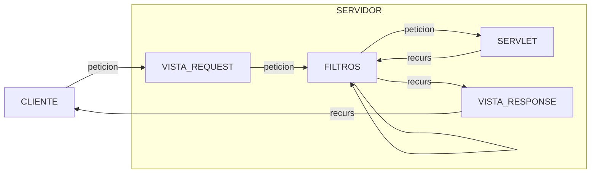

# 4. Seguridad
2023-10-10 (YYYY-MM-DD) @ 16:16
Rodríguez López, Alejandro // UO281827

Tags:
	#showable
	Hecho en #EPI
	Sobre #Tec_Web 
	Para #Apuntes
	Otros: #Seguridad
	Refs:
 

- Autenticación: Asegurar la identidad de un usuario.
- Autorización: Verificar que tenga permiso para acceder al recurso que solicita.
- Auditoría: Registrar los accesos de usuarios a recursos.

## Autenticación

Necesario para la autenticación:
- Algo que el usuario sabe (Contraseña).
- Algo que el usuario tiene (e-mail, teléfono).
- Algo que el usuario es (huella dactilar).
- Algo que el usuario hace (port knocking).

Utilizar varios métodos de los anteirores es la autenticación multifactor (MFA).
A mayor número de factores, mayor seguridad y menor usabilidad.

### HTTP 1.0

En HTTP 1.0, se podía utilizar la cabecera `Authentication` para enviar el nombre de usuario y contraseña utilizando BASIC y codificación en base 64.

### HTTP 1.1

En HTTP 1.1, se puede utilizar la cabecera `Authentication` para enviar el nombre de usuario, contraseña y timestamp utilizando DIGEST Y codificación base 64.

## Autorización

Se utilizan filtros a la hora de perimtir (o no) el paso tanto de peticiones como de recursos.

## Legislación

### LSSI-CE (Ley de Servicios para la Sociedad Información)

Afecta a todo tipo de actividad económica en internet.

### RGPD (Reglamento General Protección de Datos)

