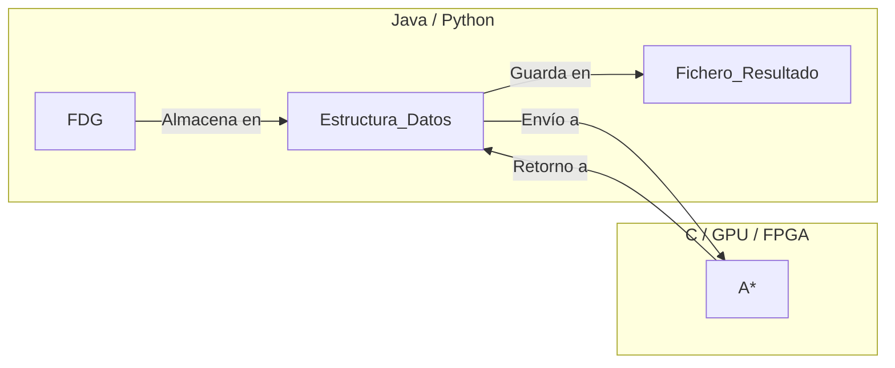

# Anotaciones
2024-02-29 (YYYY-MM-DD) @ 10:03
Rodríguez López, Alejandro // UO281827

Tags:
	#showable
	Hecho en #Viesques 
	Sobre #TFG
	Para #Apuntes
	Otros:
	Refs:
 
<hr>

## Introducción

El proyecto consiste en un programa capaz de calcular un camino desde un nodo inicial hasta un nodo final dado un grafo cuyos vértices tienen pesos.

Qué es un heurístico?
La función h(a, b)

Enrutamiento de vehiculos
Multiples furgonetas a entregar $N$ productos en $K$ localizaciones

Scheduling distintas maquinas para distintos productos
los distintos productos requieren utilizar distintas maquinas

Averiguar los compromisos necesarios para obtener un rendimiento similar en una FPGA y CPU/GPU
En qué puntos hay que dejar de utilizar una FPGA para obtener rendimiento similar a una CPU

El programa recibe entradas:
- Fichero descriptor del grafo
- Nodo inicial
- Nodo final

El programa:
1. Lee el grafo del fichero
2. Guarda el grafo en una estructura de datos
3. Halla el camino desde el nodo inicial al nodo final utilizando un algoritmo
	- [Wikipedia - A*](https://en.wikipedia.org/wiki/A*_search_algorithm#Pseudocode)
4. Presenta la solución:
	- Por pantalla
	- En un fichero
5. Muestra el tiempo utilizado en el paso 3

## Fichero Descriptor del Grafo

> [!note] Fichero Descriptor de Grafo
> De ahora en adelante abreviado como FDG.

El FDG puede ser un [GraphML](https://en.wikipedia.org/wiki/GraphML#Overview), un fichero XML para representar nodos y vértices que los conectan.
Este es un ejemplo de [GraphML - Basic Concepts](http://graphml.graphdrawing.org/primer/graphml-primer.html#BC):
```XML
<?xml version="1.0" encoding="UTF-8"?>
<graphml
	xmlns="http://graphml.graphdrawing.org/xmlns"  
    xmlns:xsi="http://www.w3.org/2001/XMLSchema-instance"
    xsi:schemaLocation="http://graphml.graphdrawing.org/xmlns
	    http://graphml.graphdrawing.org/xmlns/1.0/graphml.xsd"
>
	<graph id="g" edgedefault="directed">
		<key id="d0" for="node" attr.name="color" attr.type="string">
		    <default>yellow</default>
		</key>
		<key id="d1" for="edge" attr.name="weight" attr.type="double"/>
		<node id="n0"/>
		<node id="n1">
			<data key="d0">NOMBRE_NODO</data>
		</node>
	    <edge id="e0" source="n0" target="n1">
	    </edge>
	    <edge id="e1" source="n1" target="n0">
	      <data key="d1">PESO_VÉRTICE</data>
	    </edge>
	</graph>
</graphml>
```

### Lectura del FDG

Para no tener que meterse en un parser de XML para C, sería interesante extraer los datos desde otro lenguaje que soporte librerías externas más fácilmente.
- Java
- Python

Estos lenguajes tienen a su vez librerías para llamar funciones C (alojadas en un fichero .so/.dll).

#### Librerías

Es necesario encontrar una librería que permita leer los datos del FDG para meterlos en una ED.

##### Leer ficheros XML

##### Llamar funciones C

Java: [GitHub - JNI](https://github.com/mkowsiak/jnicookbook/tree/master)
Python: [GitHub - PCP](https://github.com/alexZeLoCO/PCP/tree/master/04)

#### Estructura de Datos

Es necesario encontrar una estructura que permita almacenar los datos leidos del FDG.
Requisitos:
- Almacena los nodos con sus ID y Nombres
- Almacena los vértices con sus ID y Pesos
- Almacena qué nodos une cada vértice
- Es serializable en un diccionario/json para enviar como primitivos a C

##### Nodo raíz con vértices a otros nodos

```java
public class Node {
	private int id;
	private String name;
	private List<Edge> edges;
}

public class Edge {
	private int id;
	private int weight;
	private Node target;
}
```

> [!check] PROS
> Recursiva

> [!fail] CONTRAS
> Recursiva
> Serialización fea. Lo más inteligente sería serializarlo como si fuese [[Anotaciones#Dos listas]].

##### Dos listas

```java
public class Graph {
	private Set<Node> nodes;
	private Set<Edge> edges;
}

public class Node {
	private int id;
	private String name;
}

public class Edge {
	private int id;
	private int weight;
	private Node source;
	private Node target;
}
```

> [!check] PROS
> Fácil de implementar

> [!fail] CONTRAS
> Coste de obtener los vecinos de un nodo O(n)
> ```java
> myCoolGraph.getEdges().stream()
>	.filter((edge) -> edge.getSource().equals(myCoolNode))
> 	.collect(Collectors.toList());
> ```

##### Dos listas Vértices Ordenados

```java
public class Graph {
	private Set<Node> nodes;
	private SortedSet<Edge> edges; // Ordenados de menor a mayor utilizando el id de los nodos source
	private Set<Integer> paddings;
}

public class Node {
	private int id;
	private String name;
}

public class Edge {
	private int id;
	private int weight;
	private Node source;
	private Node target;
}
```

El `Set<Integer> paddings` contiene tantas entradas como nodos haya.
`paddings.get(n)` contiene el índice del conjunto `edges` donde empiezan los vértices cuyo nodo `source` tiene `id = n`.
De esta forma, `edges.get(paddings.get(2))` retorna el primer vértice cuyo `source` tiene `id = 2`.

> [!check] PROS
> Fácil de implementar

> [!fail] CONTRAS
> Acceso a vecinos de un nodo en `log(n)` (binary search)

##### Dos listas Vértices Indexados

```java
public class Graph {
	private Set<Node> nodes;
	private Set<Set<Edge>> edges;
}

public class Node {
	private int id;
	private String name;
}

public class Edge {
	private int id;
	private int weight;
	private Node source;
	private Node target;
}
```

El `Set<Set<Edge>> edges` es un conjunto de conjuntos de vértices.
`edges.get(n)` contiene el conjunto de vértices cuyo nodo `source` tiene `id = n`.
De esta forma, `edges.get(2)` retorna el conjunto de vértices cuyo `source` tiene `id = 2`.

> [!check] PROS
> Fácil de implementar
> Acceso a vecinos en O(1)

> [!fail] CONTRAS
> Al enviar esta ED a C, se formaría un `Edge**`, cuyos datos no están localizados de forma consecutiva en memoria

## Algoritmo



### A*

```
// A* finds a path from start to goal.
// h is the heuristic function. h(n) estimates the cost to reach goal from node n.
function A_Star(start, goal, h)
    // The set of discovered nodes that may need to be (re-)expanded.
    // Initially, only the start node is known.
    // This is usually implemented as a min-heap or priority queue rather than a hash-set.
    openSet := {start}

    // For node n, cameFrom[n] is the node immediately preceding it on the cheapest path from the start
    // to n currently known.
    cameFrom := an empty map

    // For node n, gScore[n] is the cost of the cheapest path from start to n currently known.
    gScore := map with default value of Infinity
    gScore[start] := 0

    // For node n, fScore[n] := gScore[n] + h(n). fScore[n] represents our current best guess as to
    // how cheap a path could be from start to finish if it goes through n.
    fScore := map with default value of Infinity
    fScore[start] := h(start)

    while openSet is not empty
        // This operation can occur in O(Log(N)) time if openSet is a min-heap or a priority queue
        current := the node in openSet having the lowest fScore[] value
        if current = goal
            return reconstruct_path(cameFrom, current)

        openSet.Remove(current)
        for each neighbor of current
            // d(current,neighbor) is the weight of the edge from current to neighbor
            // tentative_gScore is the distance from start to the neighbor through current
            tentative_gScore := gScore[current] + d(current, neighbor)
            if tentative_gScore < gScore[neighbor]
                // This path to neighbor is better than any previous one. Record it!
                cameFrom[neighbor] := current
                gScore[neighbor] := tentative_gScore
                fScore[neighbor] := tentative_gScore + h(neighbor)
                if neighbor not in openSet
                    openSet.add(neighbor)

    // Open set is empty but goal was never reached
    return failure
```

Datos:
- `gScore`: Coste para llegar desde nodo inicial hasta el actual.
- `hScore`: Coste estimado para llegar desde nodo actual hasta final.
- `fScore`: `gScore + hScore`.
- `openSet`: Conjunto ordenado de menor a mayor `fScore`.
- `cameFrom`: Nodo anterior para llegar al actual por el camino más corto.

## FPGA

La FPGA en cuestión: [AMD - A FPGA Development Board](https://www.xilinx.com/products/boards-and-kits/1-t9ddos.html)
Vendedor de la FPGA: [EBAY - ALINX AX7020](https://www.ebay.com/itm/384735780466)

### Software

Cada marca de FPGA viene con su propio sofware.

AMD: [Xilinx - Vivado](https://www.xilinx.com/products/design-tools/vivado.html)
AUR Vivado Package: [AUR - Vivado](https://aur.archlinux.org/packages/vivado)

## Documentación

Es un proyecto de investigación, no de desarrollo.

- Estado del arte
- Sección muy detallada del problema
	- Problema
	- Metodo a resolver
	- Metodo de comparativas
- Experimentos
- Conclusiones

<hr>

2024-05-26 (YYYY-MM-DD) @ 23:35

Hecho en #Viesques 

## Algoritmo

Coste G: Máximo worker status
Coste H: Máximo tiempo hasta fin de trabajo
Máximo tiempo del sumatorio de tareas de cada trabajador.

Los diccionarios f_costs y g_costs son indexados por el hash(state.schedule)
El sortedList utiliza el hash(state) para comparar items y evitar repetidos, es indexado por el diccionario f_costs

## Tamaño del problema

No sé calcular el número total de nodos del tensor.

1. Un sólo trabajador por tarea
2. Ejemplos hechos
3. G&T

<hr>

2024-06-25 (YYYY-MM-DD) @ 22:54

Hecho en #Viesques 

Anotaciones sobre los comentarios de la memoria versión 20240621-1135.

1. Pg. 2: Faltaría hacer mención a las FPGAs: DONE.
2. Pg. 3: De acuerdo a la normativa de la EPI...: DONE.
3. Pg. 8: Puedes elaborar un poco más...: DONE.
4. Pg. 8: Este es un problema...: DONE.
5. Pg. 9: La ref. más conocida de scheduling...: DONE.
6. Pg. 10: En este tipo de proyectos...: DONE. Debería ponerse en otro lado o quitar completamente?
7. Pg. 10: Además de esto...: DONE. Qué nueva sección de objetivos? Qué diferentes implementaciones (monohilo) del A* para JSP?
8. Pg. 11: Como se especifica...: DONE.
9. Pg. 11: Restricciones...: DONE.
10. Pg. 11: No tiene...: DONE.
11. Pg. 11: predecesora del mismo...: DONE.
12. Pg. 11: Imagen ilustrativa gantt...notación: DONE. Gantt, DONE. Notación, qué notación? de qué?
13. Pg. 12: Método de resolución: DONE.
14. Pg. 12: Algoritmo A*: DONE.
15. Pg. 13: En el caso del JSP: DONE. _"... planificación parcial O TOTAL..."_.
16. Pg. 13: Idealmente...cota: DONE. Pero en la parte del coste H.
17. Pg. 14: Este método de expansión de sucesores...: DONE. El párrafo está sin actualizar y un poco mal explicado. Lista de tareas cuyos predecesores han sido planificados, OK. Cada una genera un nuevo estado, OK. Los trabajadores no tienen nada que ver, sí tienen para el instante en el que se planifica, no puedes planificar si no está el trabajador.
18. Pg. 15: Además del pseudocódigo...: DONE.
19. Pg. 15: ¿No son el mismo valor?: DONE. No, `sucesor_g_coste` es el coste g del sucesor y `g_costes[estado_sucesor]` es el mejor coste g conocido para el sucesor.
20. Pg. 15: Si tu función f es una cota...: DONE. No entiendo. Qué tiene que ver esto con la linea que comenta? Está diciendo que no tiene por qué ser un `set`?
21. Pg. 18: No suele haber código, es necesario...: DONE.
22. Pg. 20: Algoritmo A* monohilo: DONE.
23. Pg. 21: Además del pseudocódigo de funciones h...: DONE. Qué notación? Cómo se hace una notación para funciones heurísticas?
24. Pg. 24: Esto sólo debería ocurrir...: DONE. No, dos ejecuciones del FCFS pueden resultar en soluciones distintas, no todas las soluciones son óptimas.
25. Pg. 29: Echo en falta la FPGA...Juntar tablas: DONE. FPGA, ok. Juntar tablas, no entran. QUITAR SUBSECCIONES
26. Pg. 31: Chronometer al anexo: DONE.
27. Pg. 33: Mejorar gráficos: DONE.
28. Pg. 34: Límite de tiempo...A* retornar siempre la misma solución: DONE. No hay límite de tiempo, no siempre retorna la misma solución.
29. Pg. 34: Mejorar escalas de gráficas relacionadas: DONE.
30. Pg. 35: Mejor coger conjunto grande existente: DONE. He probado, necesito más grandes.
31. Pg. 37: Speedup negativo...corregir sucesores: DONE. El speedup puede ser negativo.

Conclusiones:

1. No sé qué notación matemática tengo que diseñar.
2. Al generar sucesores se obtiene la primera tarea sin planificar de cada trabajo y se planifica para cuando su trabajador esté libre.
3. Discrepamos sobre qué resultado obtiene el A*. Él dice que A* retorna siempre el mismo resultado (parece decir que el óptimo), yo digo que no a ambas cosas.
	1. Él dice que FCFS no puede retornar distintos valores en distintas ejecuciones (Pg. 34).
	2. Él dice que FCFS sólo puede retornar distintos valores si hay distintas soluciones óptimas (Pg. 24).

El state debe tener una lista de IDs de la siguiente tarea a planificar o la última planificada.
Una Task tiene un int que corresponde a la duración de las tareas que la siguen sin incluirse a ella misma.

![[Anotaciones 2024-06-26 11.42.11.excalidraw|1900]]

Diferentes open set en función del valor de f_cost

<hr>

2024-07-03 (YYYY-MM-DD) @ 20:02

Hecho en #Viesques 

Principales modificaciones hechas tras la revisión:

1. Reorganizado documento para cumplir la normativa de la EPI.
2. Añadido párrafo en resumen sobre FPGA.
3. Pg. 1: Añadida información sobre FPGA en hipótesis de partida.
4. Pg. 2: Eliminada subsección de requisitos.
5. Pg. 3: Añadida subsección de objetivos con breve descripción del contenido del documento.
6. Pg. 4: Añadidas entradas NSG17 y Pin12 a estado del arte.
7. Añadidas cajas 'FUNDAMENTAL' con información clave.
8. Pg. 6: Añadida notación del problema.
9. Pg. 8: Añadido problema ejemplo con diagramas PERT y GANTT.
10. Pg. 11: Añadida explicación del pseudocódigo A*.
11. Pg. 13: Modificada explicación de generación de sucesores.
12. Pg. 13: Añadido ejemplo de generación de sucesores.
13. Pg. 14: Expandida explicación sobre lista de prioridad.
14. Pg. 52: Relocalizados pseudocódigos de heurísticos al anexo.
15. Pg. 20: Añadidas funciones matemáticas para representar heurísticos.
16. Pg. 28: Añadida subsección sobre funcionamiento de FPGA.
17. Pg. 32: Eliminadas subsubsecciones de arquitectura x86.
18. Pg. 35: Añadida anotación sobre nomenclatura en gráficas.
19. Pg. 36...: Traducidas gráficas al castellano.
20. Pg. 37, 38: Ajustadas escalas de gráficos de barras.
21. Pg. 39: Añadida comparativa con Random Solver (solucionador aleatorio de JSP).
22. Pg. 42, 43: Añadida comparativa con Dijkstra ($\forall x / h(x) = 0$).
23. Pg. 46, 47: Añadidas conclusiones sobre: A*, cuello de botella y heurísticos.
24. Pg. 48...: Expandido Anexo A: Código fuente.
25. Mejoras varias en gramática y ortografía.

<hr>

2024-07-10 (YYYY-MM-DD) @ 18:11

Hecho en #Viesques

Principales modificaciones hechas tras la revisión:

1. Replicada portada oficial de la EPI.
2. Cambiado formato del índice de rojo a negro.
3. Pg. 1: Reescrita Hipótesis de Partida.
4. Pg. 6: Reescrita notación sobre trabajos y tareas.
5. Pg. 7: Añadida explicación sobre makespan.
6. Pg. 8: Modificado ejemplo.
7. Pg. 8: Modificados diagramas Pert y Gantt.
8. Pg. 10: Corregidos números de línea de la explicación.
9. Pg. 20: Añadida explicación sobre heurístico = 0 (Dijkstra).
10. Pg. 27-30: Explicación sobre FPGA y síntesis.
11. Pg. 31: Explicación sobre función sintetizada en HLS.
12. Pg. 33: Añadida especificación hardware de FPGA.
13. Pg. 33: Reescrito método de medición.
14. Pg. 37...47: Reorganización, reescritura de resultados.
15. Pg. 48: Añadidos resultados FPGA.
16. Pg. 53: Añadidos trabajos futuros.
17. Pg. 54: Añadida crítica retrospectiva.
18. Pg. 55: Añadido listado de tecnologías utilizadas.
19. Pg. 61: Añadido apéndice con diagramas extras.

<hr>

2024-07-20 (YYYY-MM-DD) @ 16:53

Hecho en #Viesques

Fotogramas a añadir en las traspas:
- 0
- 23
- 49
- 51
- 70
- 126
- 147
- 158
- 163
- 192
- 202
- 210
- 302
- 343
- 346
- 379 + 383 + 392
- 420 + 427 + 435
- 444
- 454
- 463
- 473
- 494
- 520
- 544
- 593
- 620
- 632
- 639
- 647
- 652
- 664
- 673
- 684
- 694
- 700
- 710
- 724
- 740

<hr>

2024-07-22 (YYYY-MM-DD) @ 09:28

Hecho en #Viesques 

Anotaciones sobre las diferentes traspas (animación).

## Portada

Presentación autor y tutor.
Agradecimientos por asistencia.

## Introducción

Ámbito informática, problemas complejos.
Algoritmos de búsqueda para resolver problemas.
TFG busca aceleración de A* para resolver un problema clásico.

## Contenidos

Se va a resolver JSP utilizando A*.
Se va a tratar de acelerar utilizando H, P y F.

## JSP

### Entrada

Formado por tareas con duración y worker.

Conjunto de trabajos formados por tareas.
En este caso, N trabajos con M tareas.

### Salida

Una planificación de los trabajos entrada.
-1 Indica "no planificado".
Múltiples soluciones, algunas óptimas otras no.
El principal dato de salida no será la planificación sino el makespan (9).

### Sucesores

Un estado es una planificación completa o parcial.
Generalmente, N trabajos N sucesores.
Cada sucesor planifica la tarea $T_{j,k}$ de cada trabajo $j$.
Los estados del JSP se organizan en un K-árbol para K trabajos en el que la raíz es el nodo inicial y las hojas las soluciones (óptimas o no).

## A*

Formado por un `open_set`, conjunto de estados sin repetir ordenados en función de coste F.
Formado por una función que compruebe si el estado es objetivo.
Formado por una función que retorna sucesores de un estado.
Formado por un estado inicial.

### Comprobar objetivo

Al explorar o procesar un estado primero se comprueba si es el objetivo o no.
Si es el objetivo se retorna.

### Obtener sucesores

Si el estado no era el objetivo, se obtienen sus sucesores.

### Insertar sucesores

Los sucesores se insertan en el `open_set` de forma ordenada.

### Repetir

Se repite el proceso hasta alcanzar el estado objetivo.

## Reutilizable

JSP no es el único problema de A*, otros son pathfinding.

## Heurísticos / Orden del open set

Ejemplo en el que se muestran estado inicial (verde), estado final (naranja) y actual (cian).
El estado actual tiene un coste G, desde inicio hasta él.
El estado actual tiene una solución, desde él hasta fin.
Esa solución no se conoce en tiempo de ejecución, se estima con coste H.

### Cota inferior

Ejemplo óptimo anterior con makespan 9.
Obtenemos un estado anterior.
Se calcula el tiempo restante de cada trabajo.
Se calcula el máximo de ellos (6).
Nótese que 6 + 3 = 9 = makespan.
En general, función.

### Cota superior

Ejemplo óptimo anterior con makespan 9.
Obtenemos un estado anterior.
Se calcula el tiempo restante de cada trabajo.
Se calcula la suma de todos (12).
Nótese que 12 + 3 = 15 > 9.
En general, función.

### Plano Heurísticos

Optimistas (cota inferior): menor makespan, mayor runtime.
Pesimistas (cota superior): menor runtime, mayor makespan.

### Comparativa Heurísticos

Solución óptima: 450.
Resultados erráticos en FCFS/HDA con 8 hilos.
Resultados estables en todo con 1 hilo.
A mayor tamaño, peor resultados del heurístico rápido.
Seleccionar aleatoriamente sigue siendo peor.

## Paralelismo

### Singlethread

Un sólo camino, mínimo número de nodos explorados.

### Recursive

N ejecuciones para N vecinos del primer nodo.

### Batch

En cada iteración se exploran los N mejores nodos.

### FCFS

A medida que los hilos quedan libres, exploran el mejor nodo de la lista.
Máximo número de nodos explorados.

### HDA

Como FCFS pero distribuyendo nodos en N listas seguń hash.
Idealmente los nodos se distribuyen equitativamente según la hash.

### Resultados

FCFS v. Batch:
	Ambos empeoran por explorar más nodos en menos tiempo.
	Batch es peor por esperar al equipo de hilos.

FCFS v. Recursive:
	Con 1 hilo, el recursive tarda FCFS * N_vecinos.
	Con N hilos, tardan lo mismo.

FCFS v. HDA:
	En cualquier caso, HDA es más rápido por distribuir el open_set.
	El incremento en speedup del HDA se ve reducido a medida se incrementa el número de hilos.
	La segunda derivada del runtime de HDA es inferior a 1.

## FPGA

### Arquitectura: CPU

Memoria contiene instrucciones y datos.
Se deben cargar ambos en una ALU que puede hacer de todo.
Arquitectura genérica.

### Arquitectura: FPGA

Memoria contiene datos.
Se deben cargar sólo los datos en las puertas.
Las instrucciones es la combinación de puertas.
Arquitectura específica.

### Resultados FPGA

Catástrofe salvo en recursive solver porque es obvio.
Seguramente un programa desarrollado directamente en VHDL o en C++ pero prestando mayor detalle al desarrollo para FPGA obtenga mejores resultados, especialmente si combate el cuello de botella open_set.
