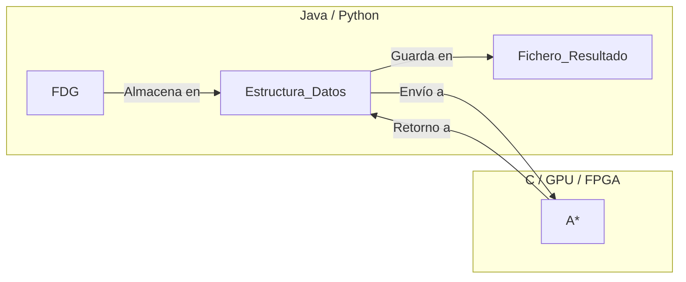

# Anotaciones
2024-02-29 (YYYY-MM-DD) @ 10:03
Rodríguez López, Alejandro // UO281827

Tags:
	#showable
	Hecho en #Viesques 
	Sobre #TFG
	Para #Apuntes
	Otros:
	Refs:
 
<hr>

## Introducción

El proyecto consiste en un programa capaz de calcular un camino desde un nodo inicial hasta un nodo final dado un grafo cuyos vértices tienen pesos.

Qué es un heurístico?
La función h(a, b)

Enrutamiento de vehiculos
Multiples furgonetas a entregar $N$ productos en $K$ localizaciones

Scheduling distintas maquinas para distintos productos
los distintos productos requieren utilizar distintas maquinas

Averiguar los compromisos necesarios para obtener un rendimiento similar en una FPGA y CPU/GPU
En qué puntos hay que dejar de utilizar una FPGA para obtener rendimiento similar a una CPU

El programa recibe entradas:
- Fichero descriptor del grafo
- Nodo inicial
- Nodo final

El programa:
1. Lee el grafo del fichero
2. Guarda el grafo en una estructura de datos
3. Halla el camino desde el nodo inicial al nodo final utilizando un algoritmo
	- [Wikipedia - A*](https://en.wikipedia.org/wiki/A*_search_algorithm#Pseudocode)
4. Presenta la solución:
	- Por pantalla
	- En un fichero
5. Muestra el tiempo utilizado en el paso 3

## Fichero Descriptor del Grafo

> [!note] Fichero Descriptor de Grafo
> De ahora en adelante abreviado como FDG.

El FDG puede ser un [GraphML](https://en.wikipedia.org/wiki/GraphML#Overview), un fichero XML para representar nodos y vértices que los conectan.
Este es un ejemplo de [GraphML - Basic Concepts](http://graphml.graphdrawing.org/primer/graphml-primer.html#BC):
```XML
<?xml version="1.0" encoding="UTF-8"?>
<graphml
	xmlns="http://graphml.graphdrawing.org/xmlns"  
    xmlns:xsi="http://www.w3.org/2001/XMLSchema-instance"
    xsi:schemaLocation="http://graphml.graphdrawing.org/xmlns
	    http://graphml.graphdrawing.org/xmlns/1.0/graphml.xsd"
>
	<graph id="g" edgedefault="directed">
		<key id="d0" for="node" attr.name="color" attr.type="string">
		    <default>yellow</default>
		</key>
		<key id="d1" for="edge" attr.name="weight" attr.type="double"/>
		<node id="n0"/>
		<node id="n1">
			<data key="d0">NOMBRE_NODO</data>
		</node>
	    <edge id="e0" source="n0" target="n1">
	    </edge>
	    <edge id="e1" source="n1" target="n0">
	      <data key="d1">PESO_VÉRTICE</data>
	    </edge>
	</graph>
</graphml>
```

### Lectura del FDG

Para no tener que meterse en un parser de XML para C, sería interesante extraer los datos desde otro lenguaje que soporte librerías externas más fácilmente.
- Java
- Python

Estos lenguajes tienen a su vez librerías para llamar funciones C (alojadas en un fichero .so/.dll).

#### Librerías

Es necesario encontrar una librería que permita leer los datos del FDG para meterlos en una ED.

##### Leer ficheros XML

##### Llamar funciones C

Java: [GitHub - JNI](https://github.com/mkowsiak/jnicookbook/tree/master)
Python: [GitHub - PCP](https://github.com/alexZeLoCO/PCP/tree/master/04)

#### Estructura de Datos

Es necesario encontrar una estructura que permita almacenar los datos leidos del FDG.
Requisitos:
- Almacena los nodos con sus ID y Nombres
- Almacena los vértices con sus ID y Pesos
- Almacena qué nodos une cada vértice
- Es serializable en un diccionario/json para enviar como primitivos a C

##### Nodo raíz con vértices a otros nodos

```java
public class Node {
	private int id;
	private String name;
	private List<Edge> edges;
}

public class Edge {
	private int id;
	private int weight;
	private Node target;
}
```

> [!check] PROS
> Recursiva

> [!fail] CONTRAS
> Recursiva
> Serialización fea. Lo más inteligente sería serializarlo como si fuese [[Anotaciones#Dos listas]].

##### Dos listas

```java
public class Graph {
	private Set<Node> nodes;
	private Set<Edge> edges;
}

public class Node {
	private int id;
	private String name;
}

public class Edge {
	private int id;
	private int weight;
	private Node source;
	private Node target;
}
```

> [!check] PROS
> Fácil de implementar

> [!fail] CONTRAS
> Coste de obtener los vecinos de un nodo O(n)
> ```java
> myCoolGraph.getEdges().stream()
>	.filter((edge) -> edge.getSource().equals(myCoolNode))
> 	.collect(Collectors.toList());
> ```

##### Dos listas Vértices Ordenados

```java
public class Graph {
	private Set<Node> nodes;
	private SortedSet<Edge> edges; // Ordenados de menor a mayor utilizando el id de los nodos source
	private Set<Integer> paddings;
}

public class Node {
	private int id;
	private String name;
}

public class Edge {
	private int id;
	private int weight;
	private Node source;
	private Node target;
}
```

El `Set<Integer> paddings` contiene tantas entradas como nodos haya.
`paddings.get(n)` contiene el índice del conjunto `edges` donde empiezan los vértices cuyo nodo `source` tiene `id = n`.
De esta forma, `edges.get(paddings.get(2))` retorna el primer vértice cuyo `source` tiene `id = 2`.

> [!check] PROS
> Fácil de implementar

> [!fail] CONTRAS
> Acceso a vecinos de un nodo en `log(n)` (binary search)

##### Dos listas Vértices Indexados

```java
public class Graph {
	private Set<Node> nodes;
	private Set<Set<Edge>> edges;
}

public class Node {
	private int id;
	private String name;
}

public class Edge {
	private int id;
	private int weight;
	private Node source;
	private Node target;
}
```

El `Set<Set<Edge>> edges` es un conjunto de conjuntos de vértices.
`edges.get(n)` contiene el conjunto de vértices cuyo nodo `source` tiene `id = n`.
De esta forma, `edges.get(2)` retorna el conjunto de vértices cuyo `source` tiene `id = 2`.

> [!check] PROS
> Fácil de implementar
> Acceso a vecinos en O(1)

> [!fail] CONTRAS
> Al enviar esta ED a C, se formaría un `Edge**`, cuyos datos no están localizados de forma consecutiva en memoria

## Algoritmo



### A*

```
// A* finds a path from start to goal.
// h is the heuristic function. h(n) estimates the cost to reach goal from node n.
function A_Star(start, goal, h)
    // The set of discovered nodes that may need to be (re-)expanded.
    // Initially, only the start node is known.
    // This is usually implemented as a min-heap or priority queue rather than a hash-set.
    openSet := {start}

    // For node n, cameFrom[n] is the node immediately preceding it on the cheapest path from the start
    // to n currently known.
    cameFrom := an empty map

    // For node n, gScore[n] is the cost of the cheapest path from start to n currently known.
    gScore := map with default value of Infinity
    gScore[start] := 0

    // For node n, fScore[n] := gScore[n] + h(n). fScore[n] represents our current best guess as to
    // how cheap a path could be from start to finish if it goes through n.
    fScore := map with default value of Infinity
    fScore[start] := h(start)

    while openSet is not empty
        // This operation can occur in O(Log(N)) time if openSet is a min-heap or a priority queue
        current := the node in openSet having the lowest fScore[] value
        if current = goal
            return reconstruct_path(cameFrom, current)

        openSet.Remove(current)
        for each neighbor of current
            // d(current,neighbor) is the weight of the edge from current to neighbor
            // tentative_gScore is the distance from start to the neighbor through current
            tentative_gScore := gScore[current] + d(current, neighbor)
            if tentative_gScore < gScore[neighbor]
                // This path to neighbor is better than any previous one. Record it!
                cameFrom[neighbor] := current
                gScore[neighbor] := tentative_gScore
                fScore[neighbor] := tentative_gScore + h(neighbor)
                if neighbor not in openSet
                    openSet.add(neighbor)

    // Open set is empty but goal was never reached
    return failure
```

Datos:
- `gScore`: Coste para llegar desde nodo inicial hasta el actual.
- `hScore`: Coste estimado para llegar desde nodo actual hasta final.
- `fScore`: `gScore + hScore`.
- `openSet`: Conjunto ordenado de menor a mayor `fScore`.
- `cameFrom`: Nodo anterior para llegar al actual por el camino más corto.

## FPGA

La FPGA en cuestión: [AMD - A FPGA Development Board](https://www.xilinx.com/products/boards-and-kits/1-t9ddos.html)
Vendedor de la FPGA: [EBAY - ALINX AX7020](https://www.ebay.com/itm/384735780466)

### Software

Cada marca de FPGA viene con su propio sofware.

AMD: [Xilinx - Vivado](https://www.xilinx.com/products/design-tools/vivado.html)
AUR Vivado Package: [AUR - Vivado](https://aur.archlinux.org/packages/vivado)

## Documentación

Es un proyecto de investigación, no de desarrollo.

- Estado del arte
- Sección muy detallada del problema
	- Problema
	- Metodo a resolver
	- Metodo de comparativas
- Experimentos
- Conclusiones
