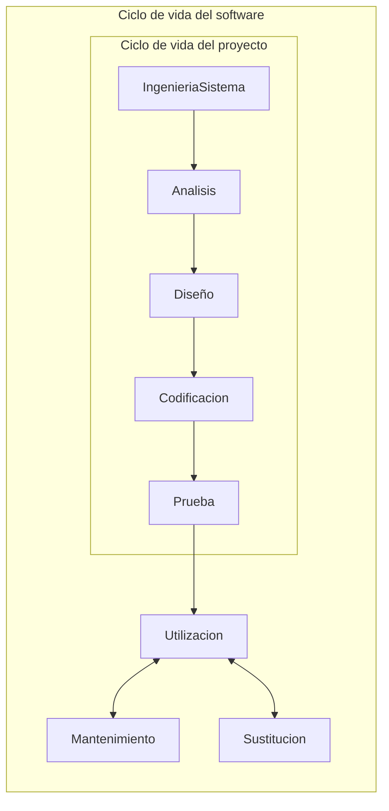
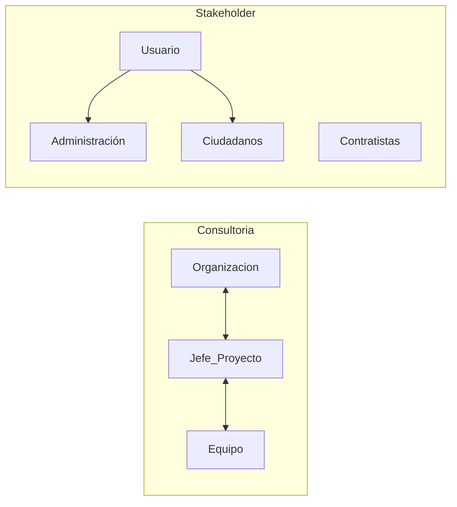

# 1. Concepto de proyecto
2024-02-02 (YYYY-MM-DD) @ 15:05
Rodríguez López, Alejandro // UO281827

Tags:
	#showable
	Hecho en #EPI
	Sobre #Proyectos 
	Para #Apuntes 
	Otros:
	Refs:
 

Los proyectos administran 10 variables distintas, las 3 más importantes:

- Coste
- Plazo
- Calidad

Los proyectos son una actividad temporal, no constante.

> [!note] Externalización
> Externalizar el proyecto es interesante para la empresa contratante porque:
> - Permite que una empresa especialista administre las variables del proyecto.
> - Evita contratar personal específico para el proyecto, personal que quedaría sin tareas una vez finalizado el proyecto.

Contratista: Realiza una tarea, lleva a cabo un proyecto. (Mano de obra)
Proveedor / Suministrador: Proporciona un bien / herramienta. (Bienes)

Consultor: Redacta un proyecto.
Auditoría:
Gestión de la calidad: ISO9k
Peritaciones:

El desarrollo del proyecto tiene otras 3 variables que se deben optimizar dependiendo del proyecto.

- Tiempo
- Coste
- Calidad

Incrementar una modifica el valor de otra.

## Riesgo

No es lo mismo tener un activo con un rendimiento de $x$ que $x$ activos con un rendimiento de 1.
Es preferible siempre tener el menor número de activos para reducir la cantidad de administración y coordinación a realizar.

El riesgo de un proyecto tiene dos características:

- La probabilidad de que suceda un fallo.
- La consecuencia de que suceda un fallo.

Estas dos características se comportan de forma inversamente proporcional a medida que pasa el tiempo:

- Al inicio del proyecto, la probabilidad de que haya un fallo es alta, pero no tiene grandes consecuencias.
- Al final del proycto, la probabilidad de que haya un fallo es baja, pero tiene grandes consecuencias.

2024-02-06 (YYYY-MM-DD) @ 15:04

Hecho en #EPI

## Irreversibilidad

En muchos casos hay que tener en cuenta que una vez realizada una inversión en un proyecto, los cambios realizados sean irreversibles.

## Ciclo de vida del proyecto

1. Aprobación
	- Estudios previos
	- Viabilidad
	- Aprobación de la invesrión
2. Planificación detallada
	- Definición del proyecto
	- Ingeniería básica 
	- Programación y presupuesto
	- Contratación
3. Ejecución
	- Ingeniería de desarrollo
	- Suministros
	- Construcción y montaje
4. Cierre 
	- Puesta en servicio
	- Instalación
	- Pruebas finales

Una actualización del proyecto cerrado no es otro proyecto, es parte del mantenimiento.
Otro tipo de actualizaciones que modifiquen substancialmente el proyecto original y requieran estudio, definicion... sí son otro proyecto.

> [!info] Cuestiones
> Q: Las pruebas del software (y correcciones) son parte de la ejecución o cierre?
> Q: El traspaso de datos de un software anterior al nuevo es parte del cierre?

### Ciclo de vida del software

## Organización de los proyectos

> [!error] _Esta definición cae siempre en examenes_
> Stakeholder: Grupo de personas, entidades y asociaciones que tienen intereses en, puede influir en, ser afectado por o percibirse afectado por cualquier aspecto de un proyecto.
>
> En el proyecto de Park&Go, algunos stakeholders son:
> - Vecinos
> - Clientes
> - Propietarios
> - Ayuntamiento
