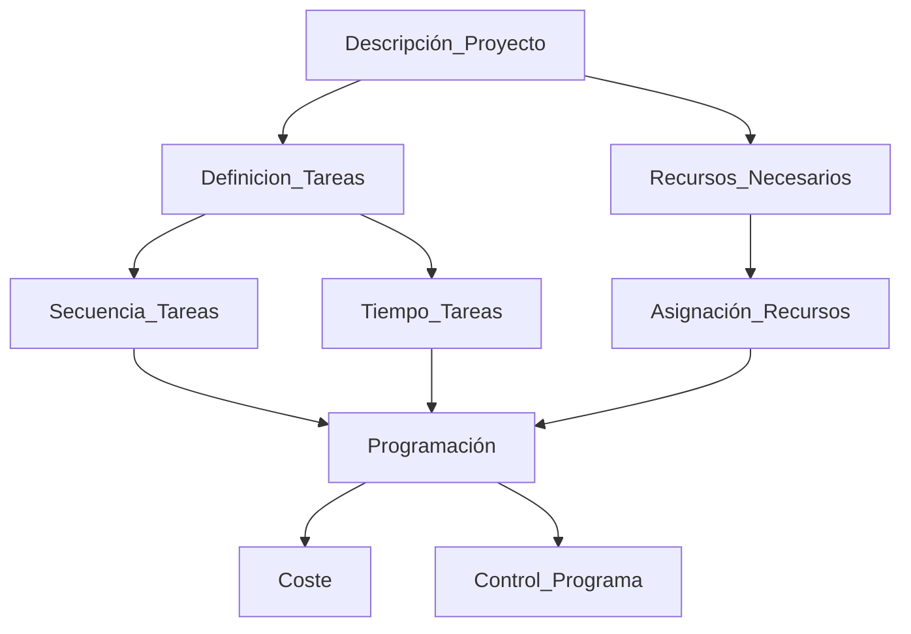
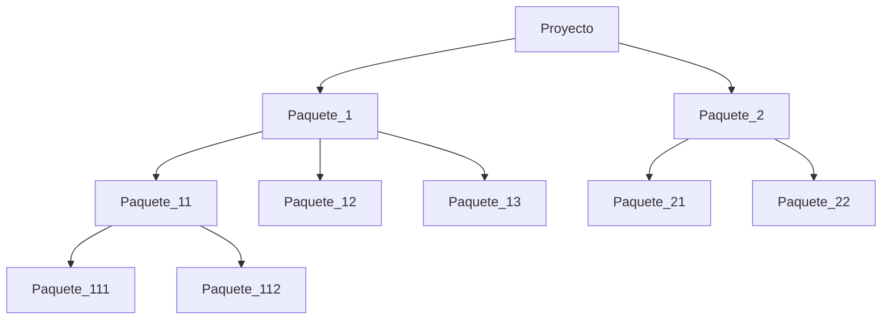

# PA2
2024-03-12 (YYYY-MM-DD) @ 15:12
Rodríguez López, Alejandro // UO281827

Tags:
	#showable
	Hecho en #EPI
	Sobre #Proyectos 
	Para #Apuntes 
	Otros:
	Refs:
 

El proyecto inicialmente es una idea abstracta sin desarrollar.
El proyecto es muy abierto, deja muchas cosas sin especificar.
A medida que se trabaja el proyecto, se van añadiendo restricciones sobre el qué hacer y el cómo.
El PPT, es la representación del proyecto cuando ya está restringido, ahora es una idea mucho más cerrada y controlada.

## EDT Diagrama de Descomposición de Trabajo

Se trata de descomponer un proyecto en varios paquetes de trabajo.

Que los paquetes estén enumerados no implica que se tengan que hacer en el orden de los índices.
Actividad es un nodo no hoja.
Tarea es un nodo hoja.
