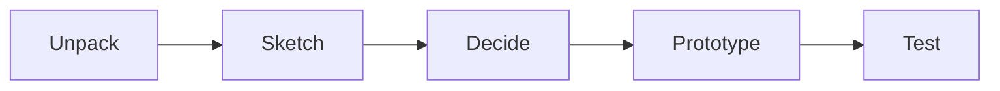

# PL-00
2024-01-30 (YYYY-MM-DD) @ 16:36
Rodríguez López, Alejandro // UO281827

Tags:
	#showable
	Hecho en #EPI
	Sobre #Proyectos
	Para #Apuntes
	Otros:
	Refs:
 

API Park & Go

- Usuarios pueden ofertar y alquilar plazas de aparcamiento.
- Plazas con cargador eléctrico están distinguidas.

2024-02-06 (YYYY-MM-DD) @ 16:17

Hecho en #EPI

## Google Design Sprint

Una metodología ágil útil para los proyectos.

- Desarrollar ~historias de usuario
- Desarrollar un mapa de pantallas

El proyecto tiene distintas partes:
- App
- Componentes eléctricos
- Web
- Servicios alojamiento (servidores)

## Perfiles

- Usuario que alquila una plaza
- Usuario que utiliza una plaza

### Usuario que alquila una plaza

1. La App muestra un mapa con las plazas disponibles y ocupadas.
	1. Color A cuando está disponible.
	2. Color B cuando está ocupada.
2. Al seleccionar una plaza, se muestra información sobre la misma y una imagen

Opción A:

1. El usuario selecciona una plaza disponible.
2. El usuario selecciona el tiempo a utilizar.
3. El sistema etiqueta la plaza como ocupada (color B)

Opción B: 

1. El usuario selecciona una plaza ocupada.
2. El sistema le muestra el tiempo restante de la reserva.

![[Drawing 2024-02-06 16.37.33.excalidraw|1900]]

Es interesante que el ofertante de la plaza pueda limitar los horarios en los que la plaza es accesible.

Qué pasa si vendo mi plaza?

- Sistema para acceder al entrar gallego ruben fran
- Sistema para salir del parking pablo diego guillermo
// - Sistema para conocer si un vehículo está ocupando la plaza de parking o no
- Storyboard ofertante paco alex victor
- Setup necesario
- Listado de filtros útiles para mostrar plazas en un listado xtian hernan hugo
	- Minusvalía
	- Tamaño
	- Cargador

Se supone que las comunidades de propietarios admiten la instalación de los dispositivos necesarios para abrir/cerrar portones.

Discusión sobre si un usuario debería esperar a que el propietario de la plaza admita su acceso.
Decidimos poner esto como opcional, varios pensamos que debería ser imposible y ya.
Yo creo que se debería implementar una lista de usuarios a los que NO permito aparcar.

Aún no entiendo las diferencias en el modelo funcional entre un usuario que busca un parking con planificacion previa y uno que no