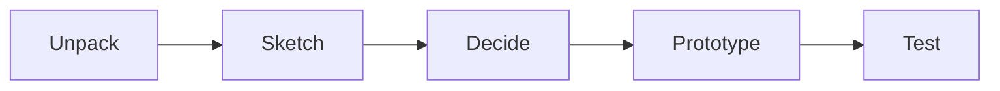

# PL-00
2024-01-30 (YYYY-MM-DD) @ 16:36
Rodríguez López, Alejandro // UO281827

Tags:
	#showable
	Hecho en #EPI
	Sobre #Proyectos
	Para #Apuntes
	Otros:
	Refs:
 

API Park & Go

- Usuarios pueden ofertar y alquilar plazas de aparcamiento.
- Plazas con cargador eléctrico están distinguidas.

2024-02-06 (YYYY-MM-DD) @ 16:17

Hecho en #EPI

# PL-01

## Google Design Sprint

Una metodología ágil útil para los proyectos.

- Desarrollar ~historias de usuario
- Desarrollar un mapa de pantallas

El proyecto tiene distintas partes:
- App
- Componentes eléctricos
- Web
- Servicios alojamiento (servidores)

## Perfiles

- Usuario que alquila una plaza
- Usuario que utiliza una plaza

### Usuario que alquila una plaza

1. La App muestra un mapa con las plazas disponibles y ocupadas.
	1. Color A cuando está disponible.
	2. Color B cuando está ocupada.
2. Al seleccionar una plaza, se muestra información sobre la misma y una imagen

Opción A:

1. El usuario selecciona una plaza disponible.
2. El usuario selecciona el tiempo a utilizar.
3. El sistema etiqueta la plaza como ocupada (color B)

Opción B: 

1. El usuario selecciona una plaza ocupada.
2. El sistema le muestra el tiempo restante de la reserva.

![[Drawing 2024-02-06 16.37.33.excalidraw|1900]]

Es interesante que el ofertante de la plaza pueda limitar los horarios en los que la plaza es accesible.

Qué pasa si vendo mi plaza?

- Sistema para acceder al entrar gallego ruben fran
- Sistema para salir del parking pablo diego guillermo
// - Sistema para conocer si un vehículo está ocupando la plaza de parking o no
- Storyboard ofertante paco alex victor
- Setup necesario
- Listado de filtros útiles para mostrar plazas en un listado xtian hernan hugo
	- Minusvalía
	- Tamaño
	- Cargador

Se supone que las comunidades de propietarios admiten la instalación de los dispositivos necesarios para abrir/cerrar portones.

Discusión sobre si un usuario debería esperar a que el propietario de la plaza admita su acceso.
Decidimos poner esto como opcional, varios pensamos que debería ser imposible y ya.
Yo creo que se debería implementar una lista de usuarios a los que NO permito aparcar.

Aún no entiendo las diferencias en el modelo funcional entre un usuario que busca un parking con planificacion previa y uno que no

2024-02-19 (YYYY-MM-DD) @ 16:29

Hecho en #Viesques 

### Usuario que ofrece una plaza

![[PL-00 2024-02-19 16.41.21.excalidraw|1900]]

2024-02-20 (YYYY-MM-DD) @ 16:05

Hecho en #EPI

# PL-02

## Resultados de las tareas de la semana pasada

### Entrada al párking

- Gallego
- Rubén
- Fran

#### Reconocimiento matrículas

Utiliza una cámara para reconocer la matrícula del coche a aparcar.
Necesario registrar matrículas.

#### Apertura remota con app

SE abre el portón con el teléfono (Bluetooth, NFC o WiFi).
~100€

#### Apertura por teclado numérico

Código estático? Cómo se hace dinámico?

### Salida del párking

- Pablo
- Diego
- Guillermo

#### Sensor de ultrasonidos

#### Sensor laser

#### Reconocimiento de matrícula

Utilizable por todos los propietarios también.
Asegura que el coche esté dentro o fuera.

#### Apertura bluetooth

Si se deja el coche dentro tras el período, no se podrá sacar el coche.
Esta me parece la más interesante, sirve tanto para entrar/salir con el coche como a pie.
Este sea probablemente el sistema más ágil que reduzca la cantidad de fallos.

### Listado de filtros

- Xtian
- Hernán
- Hugo

#### Ubicación
Geolocalización para ubicar plazas cercanas.
#### Fecha/Hora
Estancias largas, filtrar por plazas con largos períodos de alquiler.
Creo que sería interesante un algoritmo que haga un collage de plazas para varios dias en caso que no fuese posible una sola.
#### Tipo de vehículo
#### Tipo de plaza
#### Calificaciones y comentarios
Creo que sería interesante un NLP que procese los comentarios para ofrecer la plaza más interesante al usuario.
#### Vales de crédito en la App
#### Aspectos especiales
Cámaras de seguridad
#### Plazas especiales

### Storyboard del ofertante

Se elimina la calificación del cliente.
No tiene sentido ya que las reservas se aceptan automáticamente.

Se decide que debería de ser posible seleccionar un tiempo mínimo para ofertar la plaza.
Se decide que el ofertante debería poder seleccionar distintas tarifas en función de la hora y el día de la semana o mes.

## Tareas para la siguiente semana

### Continuación de la reserva tras el fin del período

Decidir si sí o no.
Decir que si comprometería el resto de reservas.

### Normativa respecto a puertas de salida de párkings de emergencia y sus cierres

- pablo, diego y guillermo

Averiguar si es obligatorio que exista una salida de emergencia.
En caso que exista, averiguar si es obligatorio utilizar una llave para salir.
En caso que exista, averiguar si es obligatorio utilizar una llave para entrar.

### Cargadores

- gallego, ruben y fran

Cómo se calcularía la cantidad gastada por un cargador?
Permitir o no utilizar el enchufe.
Gestionar el pago del cargador.

### Tarificación

- alex, paco y victor

Precios distintos para alquiler del día completo, semana completa.
Precios distintos en función del día semana / mes.
Tarifa automática recomendada en función de tarifas similares.

### Listado de aspectos de la plaza al ofertar

- xtian, hernan y hugo

Lo dicho sobre cámaras de seguridad, accesibilidad, cargadores etc.
Además de las características básicas como tamaño de la plaza, horarios de disponibilidad y tarifa.

### Resumen

#### Gallego, Rubeń y Fran: Puntos de carga

- Gestionar el pago del cargador
- Legalidad
- How-To

#### Alex, Juan y Víctor: Tarificación

- Precios distintos para alquilar el día completo o semana completa.
- Precios distintos en función del día de la semana o del mes.
- Precios distintos en función de la hora.

#### Cristian, Hernán y Hugo: Definir requisitos de las plazas

- Listado de atributos aplicables a cada plaza.
- Cámaras de seguridad
- Accesibilidad

#### Pablo, Diego y Guillermo: Normativa respecto a puertas de emergencia a pie en párkings

- Es obligatorio que exista una puerta de emergencia peatonal?
- Es obligatorio que dicha puerta tenga cerradura para salir?
- Es obligatorio que dicha puerta tenga cerradura para entrar?

## Memoria

Storyboards en la memoria
Introducción + objetivo
Alcance: Sistema que se pueda poner el producción que haga tal y tal utilizable por tal y cual a nivel nacional.
Alternativas: Lo puesto en este documento sobre distintas alternativas para cada problema.
- Aspectos económicos
- Pros y contras
- Aspectos legales
	- RGPD y LOPDP
	- La matrícula de un vehículo es información sensible
- Localización del servicio (cloud?)
- Tech Stack para la App

La memoria debería ser un documento compartido en el que todos tengamos acceso.

