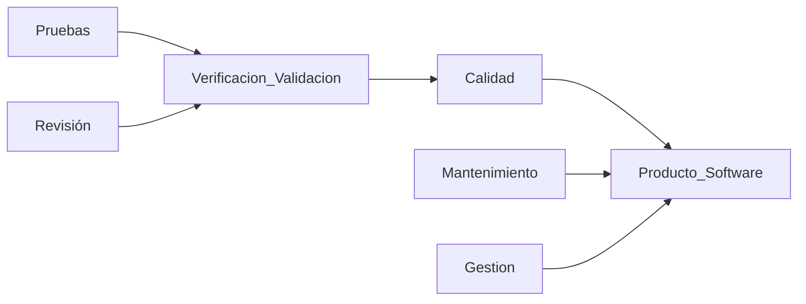
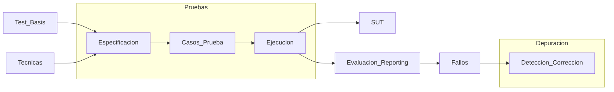

# 1. Intro y Conceptos Basicos
2024-01-31 (YYYY-MM-DD) @ 16:03
Rodríguez López, Alejandro // UO281827

Tags:
	#showable
	Hecho en #EPI
	Sobre  #Pruebas_Despegue 
	Para #Apuntes 
	Otros:
	Refs:
 

Un fallo en un software $A$ podría afectar a otro software dependiente $B$ donde una de las entradas de $B$ es una salida de $A$.

- Verificación: El producto satisface requisitos funcionales, de rendimiento y de calidad.
- Validación: Los requisitos corresponden a las necesidades del cliente.

La importancia de la usabilidad es directamente proporcional a la cantidad de usuarios que vayan a utilizar el software.

Error: Acción humana que produce un resultado incorrecto.
Fallo: Diferencia entre resultado esperado y obtenido.
Defecto: Desperfecto que puede causar un fallo.

> [!note] Error
> Un error es culpa por completo del usuario.
> No se corrigen desde el software.

La prueba que se realiza tras haber corregido (supuestamente) un defecto que causaba un fallo se denomina **prueba de regresión**.

Técnica de Prueba: Método que permite derivar un conjunto de casos de pruebas que maximicen la posibilidad de encontrar fallos.
Caso de Prueba: Conjunto de entradas, condiciones de ejecución y resultados esperados identificados.
Test Suite: Conjunto de casos de prueba.
