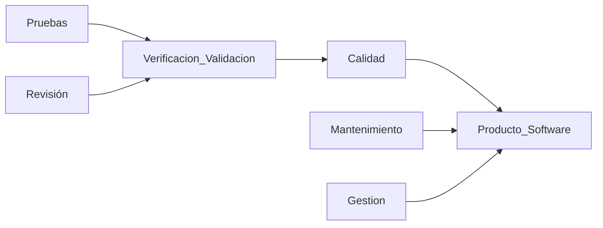
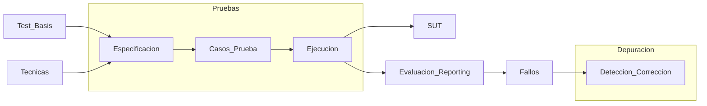
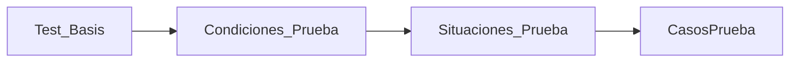

# 1. Intro y Conceptos Basicos
2024-01-31 (YYYY-MM-DD) @ 16:03
Rodríguez López, Alejandro // UO281827

Tags:
	#showable
	Hecho en #EPI
	Sobre  #Pruebas_Despegue 
	Para #Apuntes 
	Otros:
	Refs:
 

Un fallo en un software $A$ podría afectar a otro software dependiente $B$ donde una de las entradas de $B$ es una salida de $A$.

- Verificación: El producto satisface requisitos funcionales, de rendimiento y de calidad.
- Validación: Los requisitos corresponden a las necesidades del cliente.

La importancia de la usabilidad es directamente proporcional a la cantidad de usuarios que vayan a utilizar el software.

Error: Acción humana que produce un resultado incorrecto.
Fallo: Diferencia entre resultado esperado y obtenido.
Defecto: Desperfecto que puede causar un fallo.

> [!note] Error
> Un error es culpa por completo del usuario.
> No se corrigen desde el software.

La prueba que se realiza tras haber corregido (supuestamente) un defecto que causaba un fallo se denomina **prueba de regresión**.

Técnica de Prueba: Método que permite derivar un conjunto de casos de pruebas que maximicen la posibilidad de encontrar fallos.
Caso de Prueba: Conjunto de entradas, condiciones de ejecución y resultados esperados identificados.
Test Suite: Conjunto de casos de prueba.

2024-02-07 (YYYY-MM-DD) @ 16:04

Hecho en #EPI

# Tećnicas de prueba

### Clases de equivalencia

Test Basis: Especificación del programa.
Condiciones de Prueba: Características extraidas del Test Basis.
Situaciones de Prueba: Obtenidas a partir de hacer combinaciones lineales entre las condiciones de prueba.
Casos de Prueba: Conjunto de ... que cubren las situaciones de prueba.

Clase de equivalencia: Conjunto de datos de entrada para los que se supone que el programa tiene un comportamiento similar.

#### Enumeración
 
Dada una enumeración de datos de entrada, a cada uno se le asigna una clase de equivalencia $CX$ y se añade una más para otros datos:

- Rojo - C1
- Amarillo - C2
- Verde - C3
- Otro - C4

La C4 es para el caso en el que el semáforo esté estropeado y no tenga ningún color.

#### Valor lógico

True-False

- True - C1
- False - C2

#### Rango

En un programa donde hay un comportamiento distinto para valores menores de 0, menores de 100 y mayores de 100:

- $x < 0$ - C1
- $0 \le x \le 100$ - C2
- $x > 100$ - C3

> [!note] Ejemplo
> 
> El programa retorna un valor en función de los ingresos anuales del usuario:
> 
> Si el usuario tiene ingresos inferiores a 20k€, retorna 20%
> Si el usuario tiene ingresos entre 20k€ y 50k€, retorna 10%
>Si el usuario tiene ingresos superiores a 50k€, retorna 0%
>
> |--------|0|---------|20k|-----------|50k|----------|
>
> C1: $x < 0$
> C2: $x = 0$
> C3: $0 \lt x \le 20k$
> C4: $20k \lt x \le 50k$
> C5: $x > 50k$

Es necesario separar validación de datos de pruebas de negocio.
Introducir datos negativos o texto en un campo para los ingresos anuales son pruebas de validación, por lo que C1 es inválida.

> [!note] Ejemplo
> Añadimos alguna CE más al ejemplo, quedando:
> - Ingresos
> 	- Menor de 0 (Inválida)
> 	- Menor de 20k€
> 	- Menor de 50k€
> 	- Mayor de 50k€
> - Edad
> 	- Menor de 0 (Inválida)
> 	- Menor de 25
> 	- Menor de 50
> 	- Mayor de 50
> 	- Edad excesivamente alta (Inválida)
> - Membresía
> 	- Es miembro (Inválida)
> 	- No es miembro

CP Lógico: Condiciones que tiene que cumplir el CP físico.
CP Físico: Datos específicos del CP.

CPL: Ingresos: Menor de 20k€, Edad: Menor de 50, Membresía: No es miembro
CPF: 15k€, 30, no miembro.

### Análisis de Valores Límite

Si se tienen valores numéricos, se aplican las normas de clases de equivalencias.
En cada clase de equivalencia se realizan pruebas en:

- Valores límite (19999'99€).
- Valores típicos.
- Valor adyancente al límite (19999'98€).

2024-02-14 (YYYY-MM-DD) @ 16:09

Hecho en #EPI

## Combinaciones de Clases

### Base Choice

Para cada P se escoge un V base.
Se forman combinaciones donde cada P excepto uno permanece en su V base.

2024-02-21 (YYYY-MM-DD) @ 16:07

Hecho en #EPI

## Validación de datos en formularios

- Comprobar que el programa comprueba los tipos de datos
- Comprobar que el programa obliga a introducir los datos obligatorios

> [!warning] Lógica de negocio
Tras comprobar el tipo de dato de un dato, es necesario comprobar que cumple las reglas de negocio.
Si se pide una fecha de nacimiento, la fecha no puede ser futura.

### Enunciado - Interés

Programa calcula el tipo de interés en función del importe principal.

importe < 10000€ => 4%
importe > 50000€ => 2%
otherwise => 3%

edad < 21 =>  interes += 0.5%

Riesgo alto & importe < 50000€ => interes += 1%
Riesgo alto & importe > 50000€ => interes += 2%
Riesgo bajo =>  interes -= 0.5%

Importe 'alto' & riesgo alto & edad < 21 => Denegar crédito
Riesgo alto => Emitir email a Dpto. Gst. Riesgos

#### Clases de Equivalencia

##### Entrada

###### Importe

importe <= 0€ (I)
0€ < importe < 10000€
10000€ <= importe <= 50000€
50000€ < importe

###### Edad

edad <= 0 (I)
0 < edad < 18 (I)
18 <= edad < 21
21 <= edad

###### Riesgo

Riesgo bajo
Riesgo medio
Riesgo alto
Otro

##### Salida

Crédito denegado
1.5%
2%
2.5%
3%
3.5%
4%
4.5%
5%
5.5%
6%

2024-02-28 (YYYY-MM-DD) @ 16:05

Hecho en #EPI

(Sobre el enunciado anterior)

Existen clases de equivalencia de comportamiento, que no son ni de entrada ni de salida.
Estas clases tratan aspectos sobre el proceso del programa.

En el TicketRun se inserta una entrada en la tabla Inscripción cuando se inscribe un atleta en una carrera.
El hecho de que el atleta esté insertado o no es una clase de equivalencia sobre el comportamiento.

Si se hace AVL en el importe:
- 0€ <= importe <= 10000€
	- 0.01€
	- 9999.99€

Al hacer el testing, hay que darse cuenta de que pedir un préstamo por 0.01€ es imposible.
Es necesario preguntar el mínimo, y entonces:
- Marcar la clase 0.01€ como inválida
- Utilizar el mínimo como extremo izquierdo
	- Posiblemente aplicar AVL a este mínimo

Lo mismo sucedería con el 9999.99€.

## Condiciones

- Condición: SimpleLogicOperation
- Decisión: CompoundLogicOperation

2024-03-06 (YYYY-MM-DD) @ 16:05

Hecho en #EPI

> [!note] Situaciones de Prueba
> Al usar AVL: Los valores límite son las situaciones
> Al usar clases de equivalencia: Las clases son las situaciones
> Al usar combinaciones: Las combinaciones son las situaciones

Tener cobertura de condiciones no implica tener cobertura de decisiones.

Múltiple condición sí implica hacer todas las combinaciones lineales de condiciones.
Esto no se hace nunca porque el número de pruebas se dispara.

### MCDC

Pruebas de Condición / Decisión Modificada
Derivar pruebas de forma que cada condición afecta de forma independiente al resultado de la decisión.

A && (B || C)

(Hecho por mí, no estoy nada seguro de ello)

| Variables con efecto independiente | A   | B   | C   | Resultado |
| ---------------------------------- | --- | --- | --- | --------- |
| A, C                               | T   | F   | T   | T         |
| A, B                               | F   | F   | T   | F         |
| B, C                               | T   | F   | F   | F         |
| A, B                               | T   | T   | F   | T         |

> [!note] Entregable
> (A && B) || C
> C C F -> C (A, B)
> C F F -> F (B, C)
> F C F -> F (A, C)
> F F C -> C (C)
