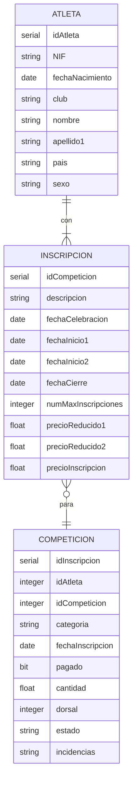

# PL02
2024-02-07 (YYYY-MM-DD) @ 17:09
Rodríguez López, Alejandro // UO281827

Tags:
	#showable
	Hecho en #EPI
	Sobre #Pruebas_Despegue 
	Para #Apuntes
	Otros:
	Refs:
 

## TICKETRUN

### Carrera

- Cuota en función de la fecha de inscripción: A más cerca de la fecha, mayor es la cuota.

### Atleta

- Categoría en función de género y edad.

Masculino

| Edad | Categoria |
| ---- | ---- |
| 18-34 | SM |
| 35-39 | M35 |
| 40-44 | M40 |
| 45-49 | M45 |
| 50-54 | M50 |
| 55-60 | M55 |
| 60-64 | M60 |
| 65-70 | M65 |
| 70- | M70 |

#### Inscripción Individual

Atleta se registra en la APP.
Atleta se inscribe en una carrera utilizando su NIF.

- Plazo 1: Desde la apertura de inscripciones (Fecha inicio 1) hasta otra fecha (Fecha inicio 2).
- Plazo 2: Desde la Fecha de inicio 2 hasta la fecha de cierre de inscripciones.
- Plazo 3: Desde la fecha del cierre de inscripciones hasta 2 días antes de la fecha de celebración de la carrera.

- Cuota reducida 1 - Plazo 1
- Cuota reudcida 2 - Plazo 2
- Cuota de inscripción - Plazo 3

Una inscripción se rechaza si:

- Se realiza fuera de las fechas de inscripcion establecidas.
- Se excede el aforo de la competición.

## Diseño

Las fechas se categorizan utilizando un rango:

![[PL02 2024-02-07 17.30.27.excalidraw|1900]]

Lo mismo sucede para las edades de masculino y femenino.

### Fecha

- C1: Fecha anterior a Inicio 1 (Inválido)
- C2: Fecha entre Inicio 1 e Inicio 2
- C3: Fecha entre Inicio 2 y cierre
- C4: Fecha entre cierre y celebración
- C5: Fecha posterior a celebración (Inválido)

### Género

- C1: Masculino
- C2: Femenino
- C3: Otros

### Edad

#### Masculino

- C1: Inferior a 0 (Inválida) // Igual descartamos esta? C1 == C2?
- C2: Inferior a 18 (Inválida)
- C3: Inferior a 34
- C4: Inferior a 39
- C5: Inferior a 44
- C6: Inferior a 49
- C7: Inferior a 55
- C8: Inferior a 59
- C9: Inferior a 64
- C10: Inferior a 69
- C11: Superior a 70
- C12: Superior a excesivo (Inválida)

#### Femenino

- C1: Inferior a 0 (Inválida) // Igual descartamos esta? C1 == C2?
- C2: Inferior a 18 (Inválida)
- C3: Inferior a 39
- C5: Inferior a 44
- C6: Inferior a 49
- C7: Inferior a 55
- C8: Inferior a 59
- C9: Inferior a 69
- C11: Superior a 70
- C12: Superior a excesivo (Inválida)

> [!error] ERROR
> Los intervalos son siempre abierto-cerrados

### Plazas

- C1: Quedan plazas
- C2: No quedan plazas (Inválida)

### Inscripción

- C1: Inscrito (Inválida)
- C2: No inscrito

El programa debería permitir inscribirme en 2 carreras que se superponen en el tiempo?
Sí, igual debería poner un aviso sin más.

## Salida

- Categoría
- Cuota
- Juan F. Mier Montoto: 'Bien o no'

La aplicación debe permitr registar a usuarios menores de edad, pero no inscribirse en carreras.
Se utiliza la edad del día de la celebracion de la carrera, no de la inscripcion, lo mismo para la categoría en la que correrá.

## Base de Datos

### Atleta

### Competición

### Inscripción

# PL03

En la documentación debe aparecer un apartado con la base de datos inicial.
Describir también el proceso para obtener la base de datos en cuestión.

## Género - Edad

Combinatoria (Pair-Wise) utilizando la edad y el género del atleta.
Esto asegura que todas las categorías de salida (SM, SF, M35, F40...) son cubiertas.
Pero se pierde granularidad porque no se utiliza AVL.
Se debería de probar AVL en algunos casos (como el intervalo de 18 a 35) de forma intermitente.

## Fecha Nacimiento en momento de INSCRIPCION - Plazo

## Número de plazos - plazo en inscripción

Las competiciones pueden tener 2 o 3 plazos (el plazo 2 es opcional).
¿Cómo se comporta una competición de 2 plazos cuando alguien se inscribe?
