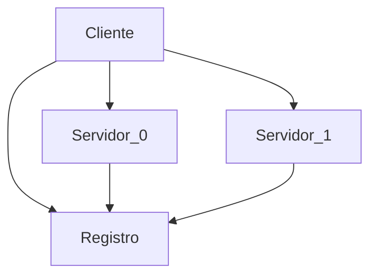
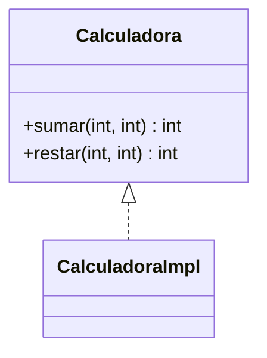

# 5.2. RMI
<% tp.file.creation_date() %> (YYYY-MM-DD) @ 14:06
Rodríguez López, Alejandro // UO281827

Tags:
	#showable
	Hecho en #EPI
	Sobre #Distribuidos 
	Para #Apuntes
	Otros:
	Refs:
	 [Transparencias](https://www.campusvirtual.uniovi.es/pluginfile.php/983845/mod_resource/content/0/02-3-RPC.pdf#line=31)
 
<hr>

## Puntos en común
- Una clase remota que contiene las funciones (métodos) que el cliente quiere llamar.
- El cliente invoca un *stub* local.
- Una clase remota implementa el esqueleto con el que se conecta el cliente (*Stub* del servidor).
- Es necesario un registro que ponga en contacto el cliente con el servidor.
- El cliente conoce la IP y el registro.

## Características propias
- Parámetros de cualquier tipo básico u objeto serializable.
	- Se pueden transmitir clases completas incluyendo su código.
- La especificación se realiza mediante `interface`.
- No requiere una herramienta equivalente a `rpcgen`.
	- El código del cliente y servidor se encuentra en forma de fuente.
 
## Arquitectura RMI


## Implementación

 
### Servidor
```java
public interface Calculadora extends java.rmi.Remote {
	public int suma (int o1, int o2) throws RemoteException;
	public int resta (int o1, int o2) throws RemoteException;
}
```

```java
public class CalculadoraImpl extends java.rmi.server.UnicastRemoteObject implements Calculadora {
	public CalculadoraImpl () throws java.rmi.RemoteException
	{ super(); }

	public int suma (int o1, int o2) {
		return o1+o2;
	}

	public int resta (int o1, int o2) {
		return o1-o2;
	}
}
```

```java
public class Server {
	public static void main (String[] args) throws java.rmi.RemoteException {
		Calculadora obj = new CalculadoraImpl ();
		java.rmi.Naming.rebind("CalculadoraServer", obj);
	}
}
```

### Cliente
```java
public class Client {
	public static void main (String[] args) throws java.rmi.RemoteException {
		Calculadora obj = (Calculadora) java.rmi.Naming.lookup("rmi://mi.servidor.com/CalculadoraServer");
		System.out.println(obj.sumar(16, 8));
	}
}
```