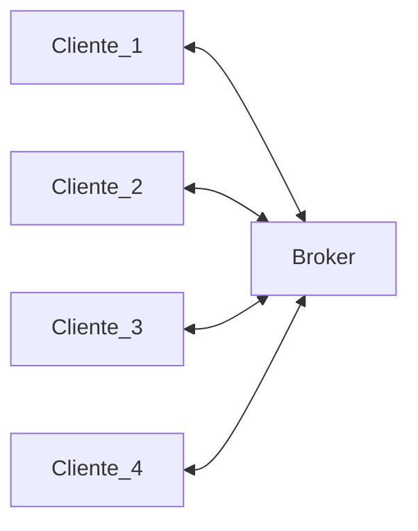
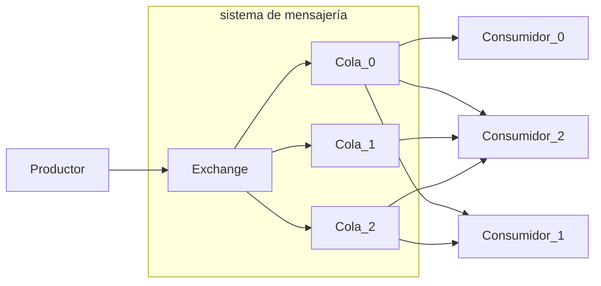

# 6.1 El Broker
<% tp.file.creation_date() %> (YYYY-MM-DD) @ 10:06
Rodríguez López, Alejandro // UO281827

Tags:
	#showable
	Hecho en #EPI
	Sobre #Distribuidos 
	Para #Apuntes
	Otros:
	Refs:
	 [[6. Message Oriented Middleware (MOM)]]
 

Los mensajes que llegan al Exchange se pueden filtrar en colas dependiendo del tema.

## Problemas
- Modelo de programación asíncrona.
- Difícil de adaptar a un modelo síncrono (RPC).
- El Broker es un único punto de fallo.
- Rendimiento peor que RPC.
- Un suscriptor lento puede afectar a los demás.
	El exchange puede tener implementado un control de flujo, de forma que si los consumidores son lentos y las colas se llenan, ordene al productor enviar actualizaciones con menor frecuencia.
