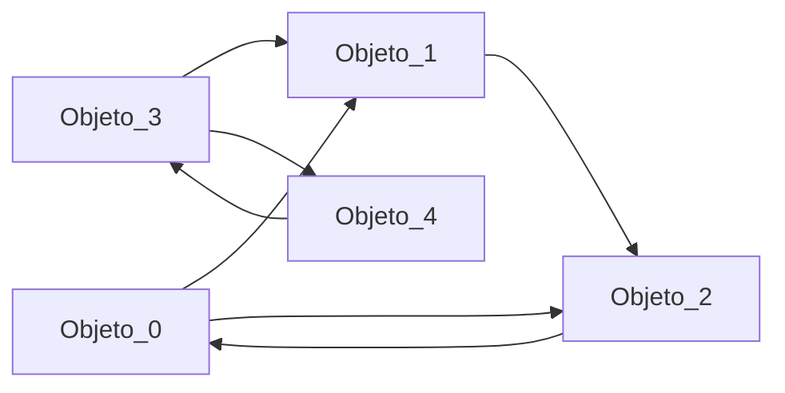
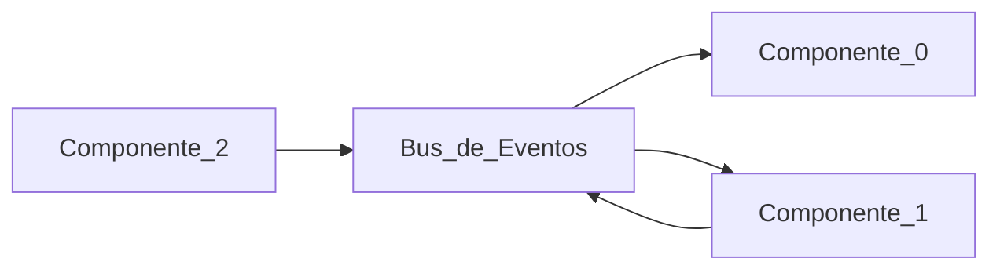

# 7. Arquitecturas de los Sistemas Distribuidos
<% tp.file.creation_date() %> (YYYY-MM-DD) @ 10:31
Rodríguez López, Alejandro // UO281827

Tags:
	#showable
	Hecho en #EPI
	Sobre #Distribuidos 
	Para #Apuntes
	Otros:
	Refs:

## Estilos de arquitectura:
- Arquitectura en capas.
- Arquitecturas basadas en objetos.
- Arquitecturas basadas en eventos.
- Arquitecturas basadas en datos.

### Basado en capas

### Basado en objetos
Cada '->' es una llamada a un método.

### Basado en eventos

### Centrada en datos
Las comunicaciones se realizan a través de un repositorio compartido.

## Arquitecturas de sistema
### Centralizadas
- Cliente-Servidor.
- 3 Niveles (Navegador, Servidor, BBDD).
- Multinivel.

#### Cliente-Servidor
Tiene 3 tareas pero 2 actores. No está clara la división.
- Interfaz de usuario.
- Lógica de la aplicación.
- Base de Datos.

### No centralizadas
