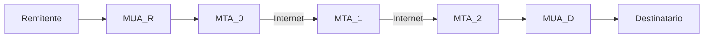
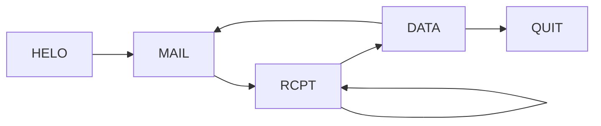
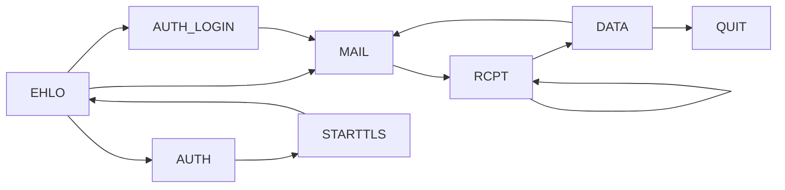
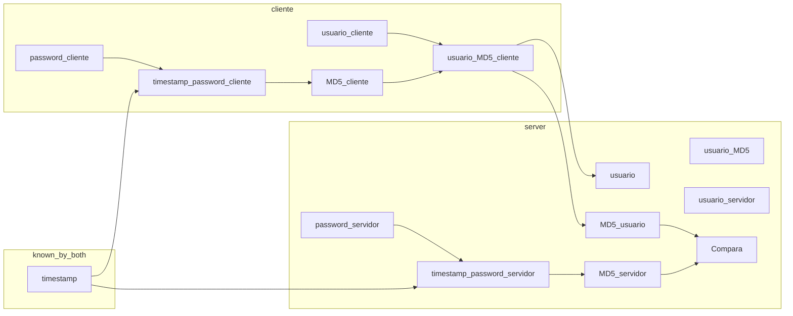

# 4. Correo Electrónico
2023-10-31 (YYYY-MM-DD) @ 17:05
Rodríguez López, Alejandro // UO281827

Tags:
	#showable
	Hecho en #EPI
	Sobre #Ing_Svcs 
	Para #Apuntes
	Otros:
	Refs:
 
<hr>

El objetivo es enviar mensajes de texto entre dos máquinas de forma asíncrona.

- Remitente: Quien escribe y envía el mensaje.
- Destinatario: Quien recibe el mensaje.
- MUA: Programa que usa el remitente para enviar y destinatario para recibir.
- MTA: Programa que recibe el mensaje del MUA y lo transmite a otro MTA en una máquina a la que el destinatario tiene acceso.
- Buzón: Archivo o carpeta en donde se almacenan los mensajes para ser leidos.



Dependiendo de la configuración, puede haber 0 o varios MTA intermedios.
Los MTA intermedios (MTA_1 en el dibujo) se llaman _relays_.
Los _relays_ se pueden utilizar como cuello de botella para filtrar correos de una organización.

## Cabeceras Mensajes y Buzones

### Cabeceras

Todas son opcionales.

Añadidas por MUA:
- From: Remitente.
- To: Destino.
- Reply-To: Quién debe recibir la respuesta.
- Cc: Carbon Copy.
- Bcc: Blind Carbon Copy.
- Subject: Asunto.
- Date: Fecha y hora de la salida del mensaje.
- Message-Id: Identificador único.

Añadidas por MTA:
- Date, From, To, Message-Id: Añadidas por el primer MTA si no estaban.
- Received: Añadida por cada MTA atravesado, registra qué MTA es, la fecha y hora.
- Return-Path: Añadida por el último MTA. Contiene cómo hacer llegar el mensaje de vuelta.

### Mensajes

Están compuestos por caracteres ASCII de 7 bits.
Caracteres no permitidos (no ASCII de 7 bits) se añaden utilizando MIME.

### Buzones

Formato no estandarizado.
- Cada mensaje en un fichero de un directorio (Formato Maildir).
- Cada mensaje concatenado en un fichero (Formato mbox).
- Formato propietario (.pst de Outlook).

### MIME

El estándar MIME permite envíar cualquier tipo de contenido en el cuerpo del mensaje.

#### Cabeceras MIME

- MIME-version
- Content-Type
- Content-Transfer-Encoding

#### Multiparte

Un correo puede estar formado por varias partes.
Se utiliza la cabecera `Content-Type: multipart/alternative` y `boundary="==_mimepart_523c348923bd_769632994811581d"` para indicar que es un mensaje multiparte y el separador que separa las partes.

#### Codificaciones

##### Codificación Quoted Printable

Los caracteres ASCII no imprimibles se sustituyen por `=XX`, siendo `XX` el hex del byte.

##### Codificación base64

1. Contenido se agrupa en grupos de 3 bytes.
2. Cada grupo se divide en trozos de 6 bits.
3. Cada trozo se convierte en un símbolo.
4. La secuencia resultante se divide en líneas de 76.

## SMTP

- Va sobre TCP.
- La conexión puede ir cifrada con TLS.
- Los correos pueden estar cifrados en el tránsito entre MUA y MTA.
- Dentro de un MTA, el correo no está cifrado.
- Los correos no suelen ir cifrados en el tránsito entre MTAs.

- Protocolo orientado a líneas de texto.
	- Petición: Comando + Parámetros
	- Respuesta: Código + Descripción textual
	- Terminador de línea: CRLF `\r\n`.

### Comandos básicos

| Comando | Parámetros          | Significado                                                |
| ------- | ------------------- | ---------------------------------------------------------- |
| HELO    | nombre_nodo_origen  | Saludo del cliente                                         |
| MAIL    | FROM: remitente     | Solicita el envio de un correo desde el remitente indicado |
| RCPT    | TO: destinatario(s) | Indicia a quién debe enviar el mensaje                     |
| DATA    | --                  | Separa el helo, mail y rcpt del resto del mensaje          |
| QUIT    | --                  | Finaliza la conexión SMTP                                  |

> [!info] DATA
> El mensaje que sigue a DATA contiene las cabeceras y el cuerpo del texto.
> Las cabeceras van separadas por un CRLF.
> Las cabeceras van separadas del cuerpo por una línea vacía.
> El fin del cuerpo viene marcado con una línea con un solo punto (`\r\n.\r\n`).



El cliente puede enviar varios correos en una misma conexión.
El cliente puede volver a enviar el comando `MAIL` con otro remitente para enviar otro correo.
El cliente puede enviar el mismo mensaje a varios destinatarios enviando varias veces el comando `RCPT`.
El cliente indica que no tiene más correos que enviar con el comando `QUIT`.

El sobre también tiene cabeceras `FROM` y `TO`.
Estas no tienen por qué estar relacionadas con las de SMTP.
Estas pueden tener informacion distinta.
Estas pueden ser utilizadas para implementar el campo Blind Carbon Copy.

Si se añade un `TO` a la cabecera del sobre pero no a la del mensaje, el destinatario es un BCC.

Este sistema es muy abierto. Permite tener dos remitentes en un mismo email.

##### SPF

Sólo se permitirán los correos cuyo dominio del remitente tenga una entrada en el DNS.
Dicha entrada tiene que tener un campo TXT que liste la serie de IPs permitidas.
La IP del remitente tiene que estar entre las permitidas del TXT.

##### SMTP-AUTH

Es una extensión de SMTP que permite autenticar al remitente con nombre, clave u otros métodos.

### Extensiones de SMTP

Existen otros comandos SMTP como `AUTH`, pero para acceder a estos es necesario utilizar una versión moderna de SMTP.
Para utilizar esta versión, el cliente sustituye el comando `HELO` por `EHLO`.

Otros beneficios de la versión moderna:
- El cliente puede usar `STARTTLS` para iniciar comunicación cifrada.
- El cliente puede usar `AUTH {método}`
	- `LOGIN`: Nombre de usuario y contraseña en Base 64.
	- `PLAIN`: Nombre de usuario y contraseña en texto plano.

> [!info] Respuesta multilínea
> El servidor puede enviar una respuesta multilínea.
> La diferencia entre ésta y una normal es que la última línea de la respuesta tiene un espacio entre el código y la explicación.
> El resto de líneas del mensaje tienen el código y la explicación separados por un guión.
> ```
> 250-...
> 250-...
> 250-...
> 250 ... <-- Última línea
> ```



## POP3 (Post Office Protocol)

1. Conectarse al MTA que tiene el buzón de mensajes.
2. Consultar cuántos mensajes hay en el buzón.
3. Descargar mensajes seleccionados.
4. Borrar mensajes del buzón.

### Autorización

Inicialmente utilizaba:
- USER
- PASS

Posteriormente utilizó:
- APOP




> [!warning] Examen
> Paso del ejemplo APOP
> Paso de los estados de POP3
> Paso de todo hasta IMAP

### Transacción

En este estado, el usuario envía comandos al servidor:

- STAT - Obtiene el número de mensajes del buzón y el espacio ocupado.
- LIST\[m\]  - Muestra los bytes ocupados por el mensaje m.
- RETR m - Descarga el mensaje m.
- DELE m - Marca el mensaje m para eliminar.
- TOP m n - Descarga las cabeceras y las n primeras líneas del mensaje m.
- QUIT - Desconecta

### Actualización

Ocurre cuando el cliente envía QUIT.
El servidor borra todos los mensajes que se les haya hecho DELE.
Si ninguno se ha marcado, esta fase no tiene lugar.

<hr>

2023-11-14 (YYYY-MM-DD) @ 17:07

Hecho en #EPI

### Limitaciones de POP3

Si llegan mensajes a un MTA lleno, los mensajes se reenvían al emisor utilizando la cabecera `Return-Path`. (Es necesario borrarlos).
Con el protocolo POP3, los mensajes están en un único dispositivo.
Con el protocolo POP3, no hay forma de saber qué mensajes están ya leidos.

## IMAP

IMAP presupone que el usuario consulta sus emails desde varios dispositivos.
- Almacena todos los emails en el servidor.
- Supone que el almacén del MTA es muy grande y no se puede llenar.
- Se pueden buscar mensajes en el servidor.

> [!warning] Examen
> A partir del diagrama de IMAP (incluido) NO entra en el examen.
