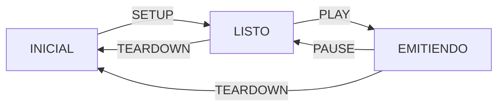

# 5. Servicios Multimedia
2024-01-08 (YYYY-MM-DD) @ 09:17
Rodríguez López, Alejandro // UO281827

Tags:
	#showable
	Hecho en #Viesques
	Sobre #Ing_Svcs 
	Para #Apuntes
	Otros:
	Refs:
 
<hr>

- No interactivos (Imágen, Audio, Vídeo).
- Interactivos (VoIP, Videoconferencia).

## Imagen

### Mapa de Bits

Consiste en un array de pixeles.
Cada pixel almacena un color utilizando una serie de bits.

El tamaño depende de:
- Número de píxeles.
- Número de bits en cada píxel.

#### Compresión

En las imágenes existen píxeles con el mismo color consecutivos.
Estos se pueden comprimir.

##### Sin pérdida / Lossless

A partir de la imágen comprimida es posible obtener la original.

##### Con pérdida / Lossy

A partir de la imágen comprimida NO es posible obtener la original.
En función de la cantidad de compresión, la imagen resultante tendrá mayor o menor calidad.
### Vectorial

Consiste en un array de objetos.
Cada objeto tiene atributos.

```json
circle: {
	x: 0,
	y: 0,
	radius: 5
}
```

Independiente de la resolución del dispositivo en el que se muestre.

## Vídeo

Un vídeo es una secuencia de frames.
Cada frame es un mapa de bits.
El tamaño del vídeo depende de:
- Número de frames. (aka _framerate_ y duración del vídeo)
- Calidad de cada frame.

> [!note] Bitrate
> $Bitrate = f(frame_{size}, frame_{rate})$

### Ejemplo

Resolución: 1920x1080, 24 bits por pixel
Frame Rate: 24 fps
Duración: 90 minutos

$video_{size} = res \cdot bits_{pixel} \cdot fps \cdot length = 1920 \cdot 1080 \cdot {{24} \over {8}} \cdot 24 \cdot (90 \cdot 60) = 806GB$
$bitrate = res \cdot bits_{pixel} \cdot fps = 1920 \cdot 1080 \cdot 24 \cdot 24 = 1194 {{MBit}\over{s}}$

### Compresión

#### Intra-Frame

Se comprimen los frames en sí utilizando [Compresión de Imágenes](#Imagen#Compresión).

#### Inter-Frame

En muchos casos frames consecutivos son iguales o muy parecidos.
Se comprime codificando sólo las diferencias entre el frame actual y el siguiente.

#### Tipos de Frame

En función de la compresión:

- IFrame: Intra-Coded. [[#Intra-Frame]].
- PFrame: Predicted. [[#Inter-Frame]].
- BFrame: Bi-Predictive. [[#Inter-Frame]] respecto al anterior y el siguiente.

#### Algoritmos de Compresión (Códecs)

// TODO

## Audio

- Período de muestreo: El doble de la frecuencia más alta a retener (generalmente 44.1KHz).
- Bits de resolución: Número de bits en cada muestra.
- Número de canales.

$$
	Bitrate = periodo \cdot bits \cdot canales
$$

### Compresión

#### Sin Compresión

#### Lossless

#### Lossy

## Contenedores Digitales

Archivo que contiene varios flujos de audio, vídeo y datos.

### Contenedores Habituales

## Protocolos

### HTML

Previamente se utilizaba la etiqueta `<object>` y plugins para reproducir multimedia.
Actualmente (HTML5) se utiliza la etiqueta `<image>` y `<video>` para reproducit multimedia.

### Descarga Progresiva

Se utiliza HTTP para descargar el fichero.
El cliente puede comenzar a reproducir el fichero aunque no se haya terminado de descargar.
Requiere que la velocidad de descarga sea mayor a la de reproducción.

El cliente puede seleccionar el inicio del vídeo utilizando la cabecera `Range`.
El servidor debe proporcionar la cabecera `Accept-Ranges`.

- Derroche del ancho de banda.
- Incapacidad de adaptar la calidad al vuelo.
- No válido para contenido en vivo.

### Streaming

- Requiere un protocolo específico en el servidor.
- Requiere un reproductor específico en el cliente.
- Capaz de adaptar la calidad al vuelo.

Requiere los siguientes protocolos (4):
- Protocolo para transportar frames.
- Protocolo para transportar información de sincronización de flujos.
- Protocolo para transportar estadísticas de errores para ajustar el grado de compresión.
- Protocolo para controlar la reproducción de los flujos según indicaciones del usuario.

#### RTP

Define un estándar de paquete por el que enviar contenido multimedia.
Envía audio o vídeo separadamente.
Permite recibir y enviar múltiples flujos de distintos orígenes y destinos.

##### Audio

1. La información se separa en frames.
2. Los frames se comprimen en un códec.
3. Los frames comprimidos se empaquetan.
4. El paquete se envía al componente RTP.

##### Vídeo

1. Los frames se cortan o unen en función del tamaño.
2. El paquete contiene información extra:
	- Número de secuencia.
	- Timestamp
	- Formato del payload
	- Identificador de la fuente (SSRC)
3. El paquete se envía al componente RTP.

##### Sesiones

Una sesión es un canal utilizado por RTP para transmitir.
La sesión está identificada por los pares IP y puerto de emisor y receptor.
El puerto es siempre par, el siguiente puerto impar es utilizado por [[#RTCP]].

#### RTCP

Transporta los siguientes tipos de paquetes:

- RR (Reciver Report): Estadísticas sobre la sesión.
- SR (Sender Report): Hora universal del envío y timestamp equivalente del flujo RTP. Sincroniza múltiples sesiones (i.e. audio y vídeo).
- SDES (Source Description): Asocia un nombre a los SSRC.

El servidor recibe paquetes RR periódicamente con información sobre la pérdida de paquetes RTP.
Utiliza esta información para reducir o aumentar la calidad de la transmisión.

#### RTSP

Actúa como control remoto de RTP.
Negocia los puertos con RTP.
Permite iniciar y finalizar conexiones con servidores RTP.
Permite pausar, continuar, avanzar y rebobinar en los flujos de sesiones.
Permite añadir y cambiar flujos.

Utiliza TCP.
Mantiene la conexión abierta permanentemente.
Mantiene estado en función del último comando recibido:



##### Sintaxis RTSP

###### Peticiones

```
METODO URI VERSION\r\n
CABECERA: VALOR\r\n
\r\n
Cuerpo Opcional
```

###### Respuestas

```
VERSION CÓDIGO MENSAJE\r\n
CABECERA: VALOR\r\n
\r\n
Cuerpo Opcional
```

#### SDP

SDP es una sintaxis de datos que permite transmitir información sobre RTSP.
Cada letra tiene una cadena de caracteres asociada.
Cada letra tiene un significado, corresponde a un trozo de información (i.e. título, versión...).

### HTML Adaptativo

- Utiliza el modo `chunked` de HTTP para transmitir trozos del contenido.
- El cliente puede modificar la calidad al vuelo, cambiando la calidad del contenido en el siguiente chunk.
