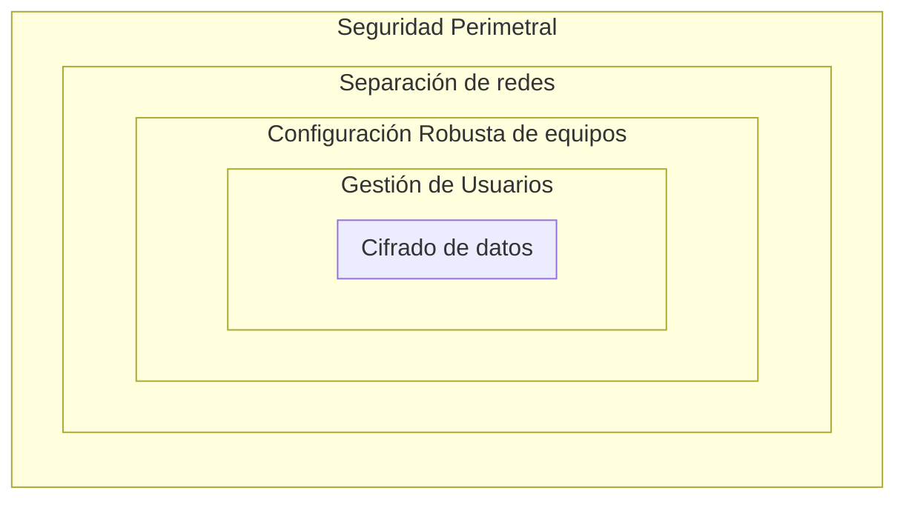
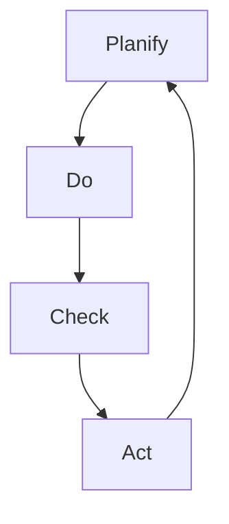

# 1. Seguridad
<% tp.file.creation_date() %> (YYYY-MM-DD) @ 16:19
Rodríguez López, Alejandro // UO281827

Tags:
	#showable
	Hecho en #EPI
	Sobre #Seguridad
	Para #Apuntes
	Otros:
	Refs:
 

Seguridad de la información: Preservación de Confidencialidad, Integridad y Disponibilidad de la información. (aka CIA, Confidentiality, Integrity and Availability).

## Confidencialidad

**Ocultación de la información y otros recursos.**
Principio 'Need to Know': Cada usuario accede sólo a la información que necesita.

Mecanismos para asegurar la confidencialidad:
- Contraseñas
- Cifrado
- ...

## Integridad

**Ausencia de alteraciones no autorizadas de la información.**
Asegura que la información es correcta (trustworthy), o lo que es lo mismo, que no ha sido indebidamente alterada.

Aspectos de la integridad

- Integridad de los datos.
- Integridad de la fuente de los datos.

Mecanismos:

- Prevencion
- Detección

// (Rellenar datos sobre cada mecanismo)

### Prevención

### Detección

## Disponibilidad

**Probabilidad de que un recurso se encuentre utilizable cuando se desee utilizar.**
Generalmente, un usuario puede intentar sobrecargar un servicio con el objetivo de saturarlo, haciendolo inaccesible para el resto de usuarios (Denial of Service, DoS).

Dificultad: Diferenciar un pico de carga de un DoS.

## Amenaza

**Causa potencial de una brecha de seguridad.**
Es necesario proteger al sistema de los ataques ejecutados por atacantes.

Ejemplos:
- Revelación de información confidencial.
- Man in the middle.
- DoS.
- Usurpación del control de un sistema.

## Objetivos de la seguridad

- Detectar amenazas y problemas.
- Minimizar riesgos de seguridad.
- Garantizar la correcta utilización de los recursos y aplicaciones.
- En caso de incidente limitar los daños.
- Cumplir la legislación.

### Aspectos de la seguridad

- Aspectos Legislativos: Firma electrónica,
- Aspectos Organizativos: Planes de contingencia,
- Aspectos Humanos: Control de los empleados,
- Aspectos Técnicos: Tecnologías de HW y SW,

## No repudio

- No repudio de **origen**: Permite demostrar la autoría y envío de un mensaje.
- No repudio de **destino**: Permite demostrar la recepción de un mensaje.

## Auditoría o Trazabilidad

Monitoriza el uso de recursos del sistema por los usuarios para detectar comportamientos anómalos.
Monitoriza el rendimiento del sistema para detectar anomalías.

## Reclamación de propiedad

Permite probar que un documento o contenido digital es de un autor.

## Anonimato

Garantiza en anonimato de los usuarios al acceder a recursos y servicios.
NOTA: Entra en conflicto con otros servicios como autenticación, acceso y auditoría.

## Protección contra réplicas

Impide ataques basados en la replicación de operaciones.

## Confirmación de operarciones

## Certificación de fecha y hora

## Certificación mediante terceros de confianza

---
## Técnicas y mecanismos de seguridad

Estas son las tecnologías necesarias para proporcionar los servicios previamente mencionados.

- Copias de seguridad y centros de respaldo.
- Protocolos criptográficos.
- Identificación de usuarios y control de acceso a los recursos.
- Huella digital de mensajes y sellado temporal de mensajes.
- Antivirus y sistemas de detección de intrusiones.
- Análisis y filtrado de tráfico (cortafuegos) y servidores proxy.

### Niveles de defensa

### Aspectos a considerar

1. Formalizar la gestión de la seguridad de la información
2. Analizar y gestionar los riesgos de seguridad.
3. Establecer procesos de gestión de seguridad (Utilizando metodología PDCA).

PDCA:

