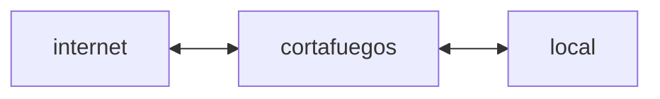

# 8. Seguridad Perimetral
2023-11-10 (YYYY-MM-DD) @ 17:28
Rodríguez López, Alejandro // UO281827

Tags:
	#showable
	Hecho en #EPI
	Sobre #Seguridad 
	Para #Apuntes
	Otros:
	Refs:
 
<hr>

Un cortafuegos es un elemento de control ubicado entre la red local e internet.



## Filtro de Paquetes

Las reglas de filtrado se basan en información contenida en la cabecera del paquete:
- IP
- Puerto
- Interfaces de origen y destino

Si no se puede aplicar ninguna regla a un paquete, se aplica una regla por defecto:
- Descartas (prohibir)
- Reenviar (permitir)

Los filtros de paquetes actúan a nivel:
- Transporte (Puertos)
- Internet (IPs)
- Enlace (MACs)

Pero no protegen de ataques hacia la aplicación.

#### Con inspección de estados

Sólo permite el tráfico entrante a puertos altos que se encuentren en la lista de conexiones TCP salientes.
La lista de conexiones TCP salientes tiene una entrada para cada puerto alto.

<hr>

2023-11-16 (YYYY-MM-DD) @ 16:08

Hecho en #EPI

## Cortafuegos

(Ejercicios)

| Regla | Dirección  | Dirección Origen | Dirección Destino | Protocolo  | Puerto Destino | Acción   |
| ----- | ---------- | ---------------- | ----------------- | ---------- | -------------- | -------- |
| A     | Entrante   | Externa          | Interna           | TCP        | 25             | Permitir |
| B     | Saliente   | Interna          | Externa           | TCP        | > 1023         | Permitir |
| C     | Saliente   | Interna          | Externa           | TCP        | 25             | Permitir |
| D     | Entrante   | Externa          | Interna           | TCP        | > 1023         | Permitir |
| E     | Cualquiera | Cualquiera       | Cualquiera        | Cualquiera | Cualquiera     | Permitir |

![[8. Seguridad Perimetral 2023-11-16 16.32.55.excalidraw|1900]]

| Paquete | Dirección | Dirección Origen | Dirección Destino | Protocolo | Puerto Destino | Acción             |
| ------- | --------- | ---------------- | ----------------- | --------- | -------------- | ------------------ |
| 1       | Entrante  | 192.168.3.4      | 172.16.1.1        | TCP       | 25             | Permitir (Regla A) |
| 2       | Saliente  | 172.16.1.1       | 192.168.3.4       | TCP       | 1234           | Permitir (Regla B) |
| 3       | Entrante  | 172.16.1.1       | 192.168.3.4       | TCP       | 25             | Permitir (Regla C) |
| 4       | Entrante  | 192.168.3.4      | 172.16.1.1        | TCP       | 1234           | Permitir (Regla D) |

<hr>

2023-11-17 (YYYY-MM-DD) @ 17:04

Hecho en #EPI

## Malware y Antimalware

Cualquier software que impide el funcionamiento normal de un computador.

Un malware puede estar en uno de 3 estados:
- In the wild (En múltiples computadores)
- In the zoo virus (Siendo investigado)
- In the wild list (?) (Registrado, sólo unos pocos son peligrosos)

### Tipos

#### Virus

- Se ejecuta sin el consentimiento del usuario.
- Causa daños.
- Se propaga.
	- Para ello, infecta otros programas.

##### Componentes básicos

- Mecanismo de replicación
- Tarea a ejecutar para dañar
- Trigger para activar la replicación y tarea

##### Fases

1. Latente: Está a la espera. No todos tienen esta fase, algunos no se encuentran nunca latentes.
2. Propagación / Infección: Se copia a sí mismo en otros programas.
3. Activación: Se activa para realizar la función.
4. Ejecución: Realiza su tarea.

##### Tipos de Virus

###### Virus Genérico

```
fun infectar_ejecutable () {
	while (true) {
		exe = coger_ejecutable_aleatorio();
		if (!exe.esta_ya_infectado()) { // Se busca la marca de infección
			exe.infectar(); // Al infectar, se añade la marca
		}
	}
}
```

###### Virus Compresor

Comprime los ejecutables infectados y los descomprime cuando el usuario quiere ejecutarlos para que se puedan ejecutar normalmente y el usuario no se de cuenta.

###### Virus sector de arranque

Se aloja en el primer sector de una unidad de disco.

###### Virus de archivo ejecutable

Se instala en un ejecutable que actúa como portador.
Es específico, se escribe para un tipo de ejecutable y operativo.

###### Virus de macro

Se instala en documentos.
Son multiplataforma.

###### Virus de correo electrónico

Se instala en el programa de correo electronico.
Puede enviar correos masivamente para colapsar el sistema.

#### Puertas traseras

Mecanismo que permite el proceso normal de autenticación utilizado para acceder al sistema / aplicación.

Existen puertas simétricas y asimétricas.
Las simétricas permiten a cualquiera acceder.
Las asimétricas sólo permite a quien la ha insertado.

#### Troyano

Permite la ejecución de comandos sin la autorización del propietario.
Generalmente lo instala el propio usuario pensando que es otro programa.

#### Gusanos

Se replica a sí mismo.
Utiliza una red para enviar copias de sí mismo.
<font color=green>No requiere la intervención del usuario. ES INDEPENDIENTE.</font>

Un gusano suele traer una carga que suele ser otro tipo de virus para dañar el sistema.
El gusano entonces suele ser un mero medio de transporte del virus real.

Los gusanos suelen formar botnets, para enviar spam o DDoS.

#### Bomba lógica o de tiempo

Es un malware que permanece latente hasta ser activado por un evento.
- Puede activarse tras una fecha en concreto.
- Puede activarse tras n arranques del SO.

Los virus y gusanos se suelen usar para instalar alguna bomba de tiempo.

#### Spyware

Se utiliza para recopilar información sin el conocimiento del usuario.

#### Adware

Banners no deseados en pantalla.

### Contramedidas

#### Virus

##### Antivirus

1. Detectar el programa infectado.
2. Identificar el virus.
3. Eliminación del virus y devolver el programa a su estado original.

No en todos los casos es posible identificar y eliminar al virus detectado.
A una mala, si se detecta el virus, se puede desinstalar el programa infectado y reinstalarlo.

###### Escáneres Sencillos

Utilizan firmas (no firmas digitales, no tienen nada que ver) para identificar los virus en programas.
Las firmas deben tener la suficiente longitud como para evitar falsas detecciones.
Un mismo virus tiene una firma distinta para cada antivirus.

Los escáneres buscan firmas conocidas en ficheros del sistema

> [!warning]
> Es necesario que la firma se conozca para detectar al virus.

###### Escáneres Heurísticos

No buscan una firma específica para cada virus.

Analizan bloques de código que se asocien frecuentemente con virus (Ejemplo, bucle de cifrado en un programa de compresión).

También utilizan la comprobación de la integridad (checksum) de los programas.
Un virus puede también cambiar el checksum una vez instalado en el programa.
Entonces, el checksum calculado se cifra con una clave ajena al programa, desconocida por el virus.

###### Monitores de Actividades

Identifican a los virus por las acciones que realizan.

No es necesario crear una BBDD de virus.
Sólo hay que identificar comportamientos.

Comportamientos de un virus:
- Reescribirse a sí mismo.
- Inicio de comunicaciones anómalas en la red.
- Modificación de parámetros del sistema.
- ...

###### Combinaciones

Hoy en día se realiza una combinacion de las anteriores estrategias.

#### Gusanos

Consiste en analizar los paquetes de red para detectar programas cuya carga puedan ser otros virus.

> [!error] Examen
> Un virus que muta trata de añadir ordenes inocuas para invalidar las firmas de los antivirus.
