# Examen 2
2023-12-06 (YYYY-MM-DD) @ 10:21
Rodríguez López, Alejandro // UO281827

Tags:
	#showable
	Hecho en #Viesques
	Sobre #Seguridad
	Para #Apuntes
	Otros:
	Refs:
 
<hr>

## Protocolos de Seguridad

Secuencia de funciones necesarias para garantizar la protección de la información.

### Enfoques básicos

#### Protocolo de Seguridad Separado

Inserta una capa extra entre el protocolo de aplicación y transporte.

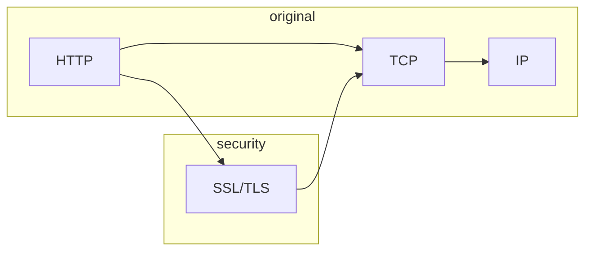
```mermaid
flowchart LR
	subgraph original
		HTTP --> TCP --> IP
	end
	subgraph security
		HTTP --> SSL/TLS --> TCP
	end 
```

La capa SSL ofrece un servicio para proporcionar seguridad.
La capa SSL no sólo se puede utilizar con HTTP.
Debido a las diferencias entre SSL y TCP, es necesario modificar HTTP.
HTTPS es el protocolo equivalente a HTTP que permite utilizar la capa SSL.

> [!warning] HTTPS
> HTTPS no proporciona seguridad de por sí, HTTPS permite utilizar SSL.
> SSL sí proporciona seguridad.

#### Integrar Seguridad en el Protocolo de Aplicación

Consiste en modificar el protocolo de aplicación para proporcionar funciones de seguridad.
S-HTTP es un protocolo equivalente al HTTP con funciones de seguridad.

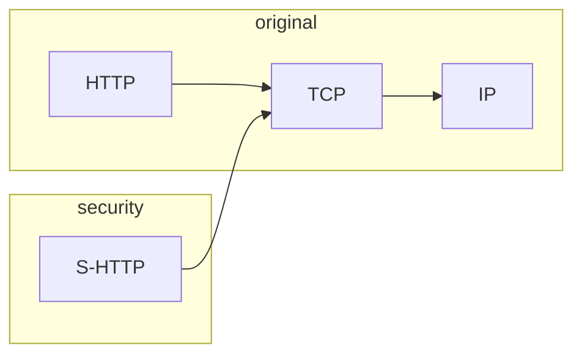
```mermaid
flowchart LR
	subgraph original
		HTTP --> TCP --> IP
	end
	subgraph security
		S-HTTP
	end
	S-HTTP --> TCP
```

#### Integrar Seguridad en el Protocolo de Transporte

Consiste en modificar el protocolo de transporte para proporcionar funciones de seguridad.
IPSec es un protocolo equivalente a IP con funciones de seguridad.

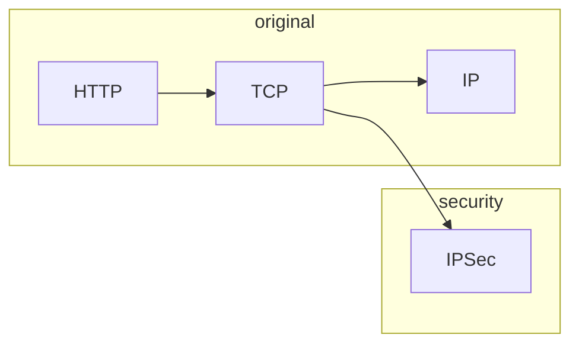
```mermaid
flowchart LR
	subgraph original
		HTTP --> TCP --> IP
	end
	subgraph security
		IPSec
	end
	TCP --> IPSec
```

> [!info] Aplicación
> Este acercamiento es independiente de la aplicación, sirve para todas.

#### Protocolo de Seguridad Paralelo

Consiste en ejecutar un servicio de seguridad en paralelo a los protocolos de red.
Los protocolos de red se pueden comunicar con este servicio para ejecutar sus funciones de seguridad.

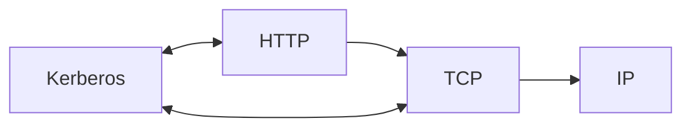
```mermaid
flowchart LR
	HTTP --> TCP --> IP
	Kerberos <--> HTTP & TCP
```

### SSL / TLS

Objetivos:

1. Establecer un canal cifrado entre cliente y servidor.
2. Autenticar al cliente ante el servidor.
3. Autenticar al servidor ante el cliente.

#### Comunicaciones
##### Comunicaciones Cifradas

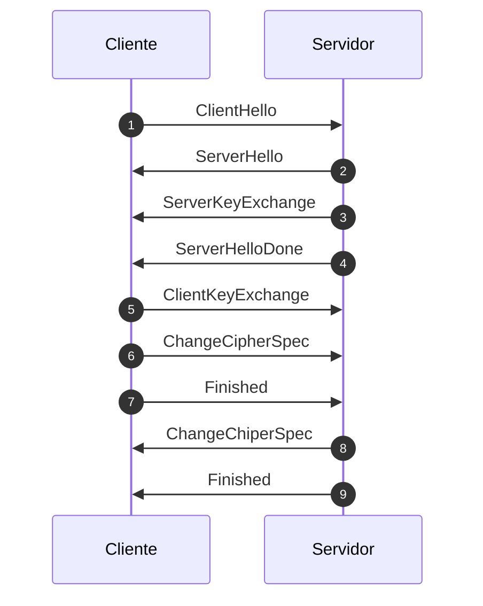
```mermaid
sequenceDiagram
	autonumber
	Cliente ->> Servidor: ClientHello 
	Servidor ->> Cliente: ServerHello
	Servidor ->> Cliente: ServerKeyExchange
	Servidor ->> Cliente: ServerHelloDone
	Cliente ->> Servidor: ClientKeyExchange
	Cliente ->> Servidor: ChangeCipherSpec
	Cliente ->> Servidor: Finished
	Servidor ->> Cliente: ChangeChiperSpec
	Servidor ->> Cliente: Finished
```

1. El cliente envía opciones.
2. El servidor elije opciones.
3. El servidor envía su PUBKEY.
4. El servidor pasa el testigo al cliente.
5. El ciente envía su clave simétrica cifrada con la PUBKEY, esta clave es la SESSION_KEY.
6. El cliente pasa a modo cifrado.
7. El cliente envía información previamente conocida cifrada al servidor.
8. El servidor pasa a modo cifrado.
9. El servidor envía información previamente conocida cifrada al cliente.

##### Comunicaciones Cifradas + Autenticación Servidor

###### Misma Clave

Se utiliza la PUBKEY del certificado del servidor para cifrar la SESSION_KEY.

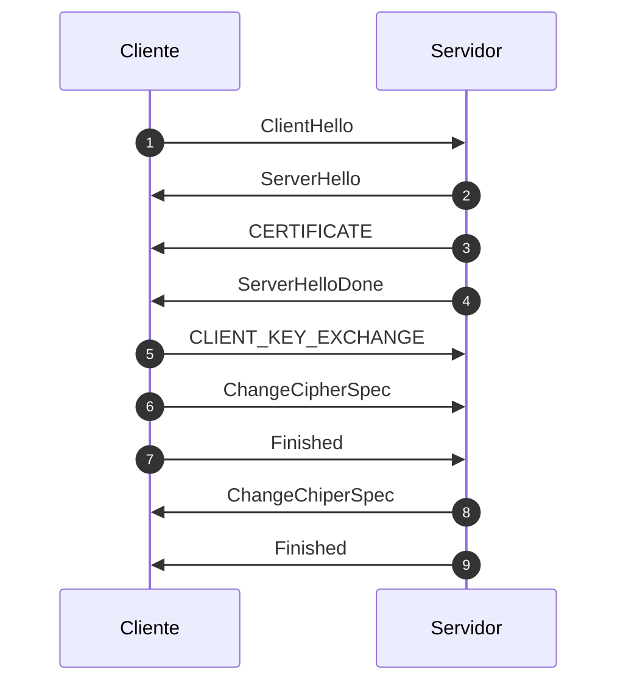
```mermaid
sequenceDiagram
	autonumber
	Cliente ->> Servidor: ClientHello 
	Servidor ->> Cliente: ServerHello
	Servidor ->> Cliente: CERTIFICATE
	Servidor ->> Cliente: ServerHelloDone
	Cliente ->> Servidor: CLIENT_KEY_EXCHANGE
	Cliente ->> Servidor: ChangeCipherSpec
	Cliente ->> Servidor: Finished
	Servidor ->> Cliente: ChangeChiperSpec
	Servidor ->> Cliente: Finished
```

3. La PUBKEY que se enviaba antes va ahora integrada en un certificado.
5. La SESSION_KEY ahora está cifrada con la PUBKEY del certificado.

###### Distinta Clave

La PUBKEY del certificado y la PUBKEY utilizada para cifrar la SESSION_KEY son distintas.

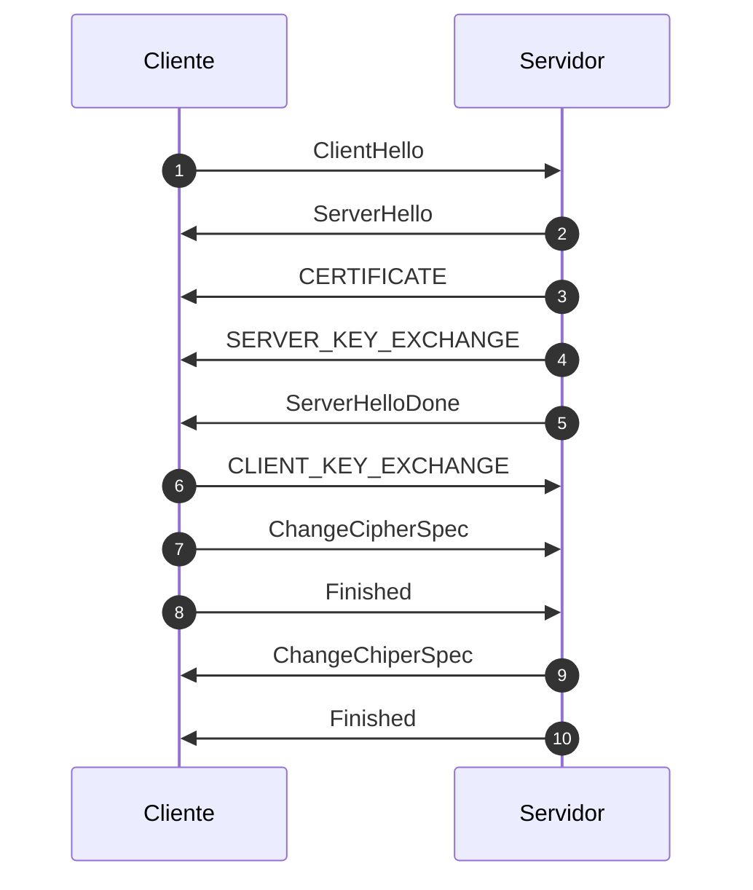
```mermaid
sequenceDiagram
	autonumber
	Cliente ->> Servidor: ClientHello 
	Servidor ->> Cliente: ServerHello
	Servidor ->> Cliente: CERTIFICATE
	Servidor ->> Cliente: SERVER_KEY_EXCHANGE
	Servidor ->> Cliente: ServerHelloDone
	Cliente ->> Servidor: CLIENT_KEY_EXCHANGE
	Cliente ->> Servidor: ChangeCipherSpec
	Cliente ->> Servidor: Finished
	Servidor ->> Cliente: ChangeChiperSpec
	Servidor ->> Cliente: Finished
```

4. El servidor envía la PUBKEY para cifrar la SESSION_KEY.

##### Comunicaciones Cifradas + Autenticación Servidor + Autenticación Cliente

La PUBKEY del certificado y la PUBKEY utilizada para cifrar la SESSION_KEY son distintas.

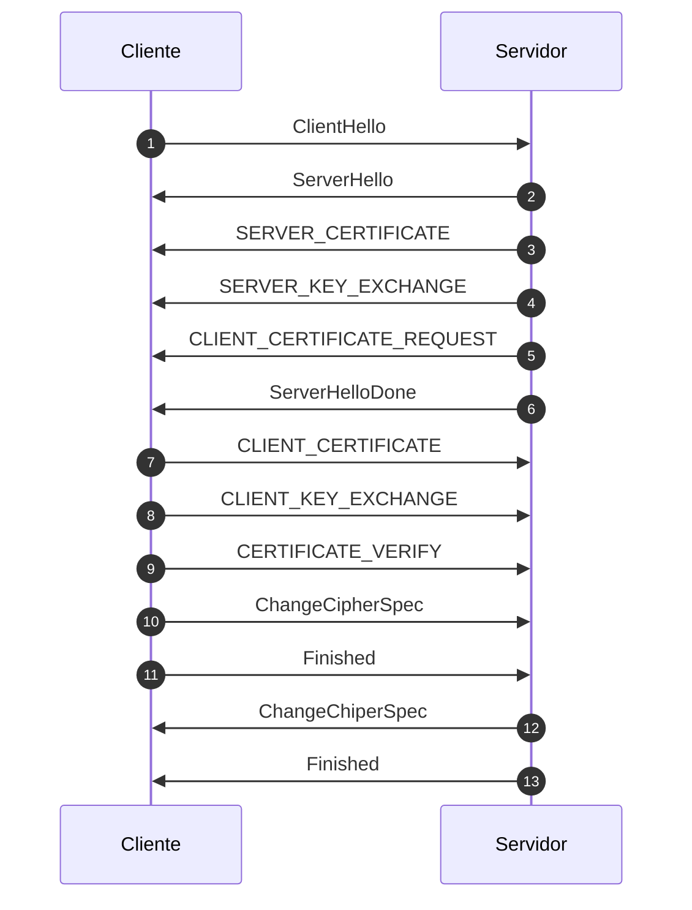
```mermaid
sequenceDiagram
	autonumber
	Cliente ->> Servidor: ClientHello 
	Servidor ->> Cliente: ServerHello
	Servidor ->> Cliente: SERVER_CERTIFICATE
	Servidor ->> Cliente: SERVER_KEY_EXCHANGE
	Servidor ->> Cliente: CLIENT_CERTIFICATE_REQUEST
	Servidor ->> Cliente: ServerHelloDone
	Cliente ->> Servidor: CLIENT_CERTIFICATE
	Cliente ->> Servidor: CLIENT_KEY_EXCHANGE
	Cliente ->> Servidor: CERTIFICATE_VERIFY
	Cliente ->> Servidor: ChangeCipherSpec
	Cliente ->> Servidor: Finished
	Servidor ->> Cliente: ChangeChiperSpec
	Servidor ->> Cliente: Finished
```

#### Finalización de una Sesión

El protocolo SSL no incluye procedimientos para cierre de sesión.
Cualquier computador puede enviar un mensaje `CLOSURE_ALERT` para indicar que la comunicación ha finalizado.

La intención de `CLOSURE_ALERT` es evitar el ataque por truncación.

#### Reutilización de una Sesión

Crear una sesión implica un overhead en la negociación de algoritmos e intercambio de claves.
Se pueden reutilizar los algoritmos y claves de una sesión SSL previa:

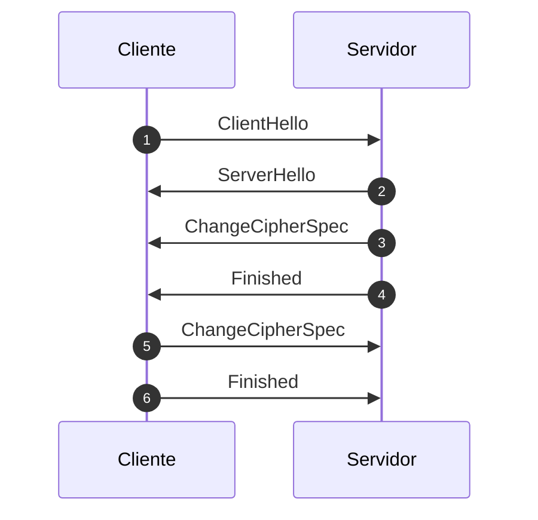
```mermaid
sequenceDiagram
	autonumber
	Cliente ->> Servidor: ClientHello
	Servidor ->> Cliente: ServerHello
	Servidor ->> Cliente: ChangeCipherSpec
	Servidor ->> Cliente: Finished
	Cliente ->> Servidor: ChangeCipherSpec
	Cliente ->> Servidor: Finished
```

1. Contiene el campo SessionID de una sesión SSL previa.
	1. Si la sesión SSL fuese nueva, el campo SessionID estaría vacío.
2. El servidor puede aceptar o denegar la propuesta.
	1. Si ACEPTA la propuesta, el ServerHello contiene el mismo SessionID que envió el cliente.
	2. Si DENIEGA la propuesta, el ServerHello contiene un nuevo SessionID.

##### Caché SSL

La reutilización de sesiones es posible gracias a que los parámetros permanecen en las cachés de cliente y servidor durante un tiempo.
A mayor sea el tiempo que permanecen en las cachés, más insegura es la comunicación.

### IPSec

Conjunto de protocolos para asegurar la comunicación con el protocolo IP autenticando y/o cifrando cada paquete IP.

#### Protocolos

- AH - Authentication Header
- ESP - Encapsulating Security Payload

> [!note] IPSec
> Las implementaciones IPSec deben implementar ESP y deberían soportar AH.

#### Modos

##### Modo Transporte

Sólo se cifra y/o autentica la carga útil del paquete IP.
El paquete es enrutable (no se modifica la cabecera IP).

##### Modo Túnel

Se cifra y/o autentica todo el paquete IP.
El paquete no es enrutable (se modifica la cabecera IP).
Es necesario encapsular el paquete en una nueva cabecera IP para que sea enrutable.

#### Asociación de Seguridad (AS / SA)

Conexión lógica unidireccional entre emisor y receptor.
Especifica cómo proporcionar seguridad al tráfico IP.

> [!warninig] Unidireccional
> Por lo tanto, si la comunicación debe ser segura en ambas direcciones, harán falta 2 AS.

La AS viene identificada por:

- Índice de parámetros de seguridad: `uint_32`.
- Dirección IP destino.
- Identificador del protocolo: AH o ESP.

##### Combinación de Asociaciones de Seguridad

Una AS permite utilizar el protocolo AH o el ESP, no ambos a la vez.
Para implementar ambos, es necesario encadenar dos o más AS.

#### Base de Datos de Políticas de Seguridad (SPD)

Relaciona cada paquete IP con una AS.
Contiene:

- Direcciones IP local y remota.
- Protocolo de la capa siguiente.
- Puertos locales y remotos.

#### Procesamiento de Tráfico con IPSec

##### Outbound

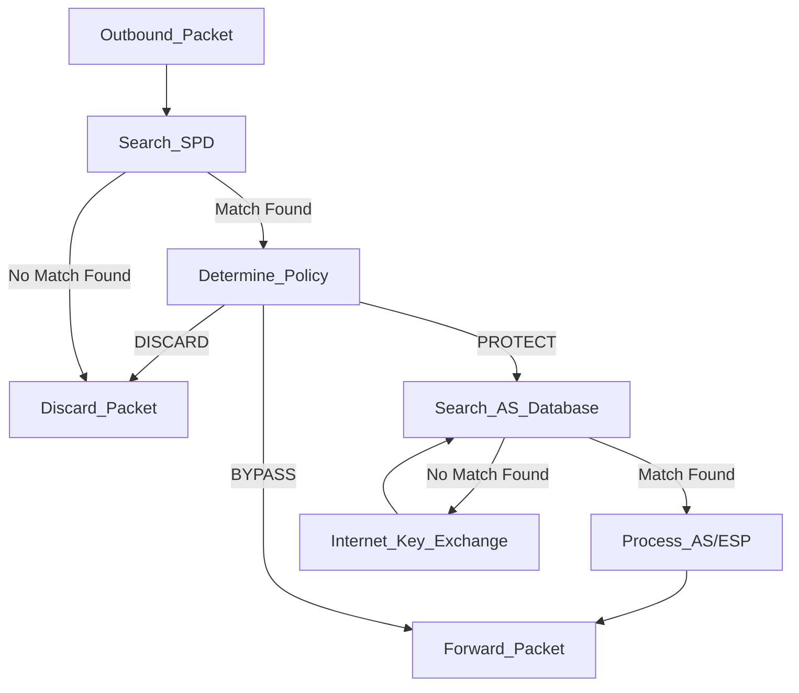
```mermaid
flowchart TD
	Outbound_Packet --> Search_SPD --Match Found--> Determine_Policy --DISCARD--> Discard_Packet
	Search_SPD --No Match Found--> Discard_Packet
	Determine_Policy --PROTECT--> Search_AS_Database --Match Found--> Process_AS/ESP --> Forward_Packet
	Search_AS_Database --No Match Found--> Internet_Key_Exchange --> Search_AS_Database
	Determine_Policy --BYPASS--> Forward_Packet
```

##### Inbound

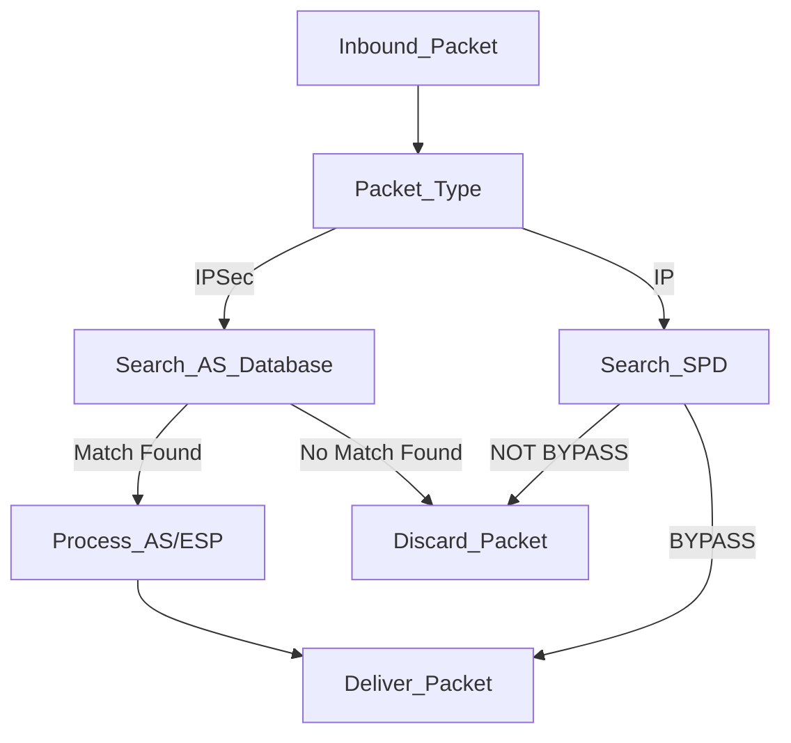
```mermaid
flowchart TD
	Inbound_Packet --> Packet_Type --IPSec--> Search_AS_Database --Match Found--> Process_AS/ESP --> Deliver_Packet
	Search_AS_Database --No Match Found--> Discard_Packet
	Packet_Type --IP--> Search_SPD --BYPASS--> Deliver_Packet
	Search_SPD --NOT BYPASS--> Discard_Packet
```

#### Internet Key Exchange Protocol (IKE)

IPSec necesita un estado compartido entre los dos extremos.
Las comunicaciones de IKE son siempre una petición y una respuesta, a cada envio del par petición+respuesta, se le denomina exchange.

<hr>

## Seguridad WiFi

- STA: Station
- AP: Access Point
- DS: Distribution System

- BSS: Basic Service Set.
	- Conjunto de STAs compitiendo por el mismo medio compartido.
- IBSS: Independent BSS.
	- BSS sin AP.
	- Las STAs se comunican directamente entre ellas.
- ESS: Extended Service Set.
	- Dos o mas BSS unidos por un DS.

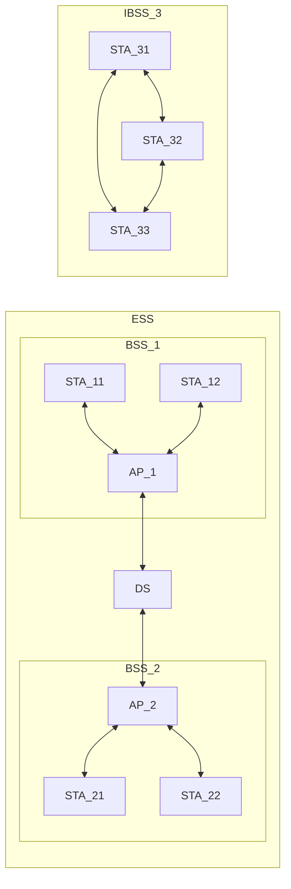
```mermaid
flowchart LR
	subgraph ESS
		DS
		subgraph BSS_1
			AP_1
			STA_11
			STA_12
		end
		subgraph BSS_2
			AP_2
			STA_21
			STA_22
		end
		STA_11 & STA_12 <--> AP_1 <--> DS <--> AP_2 <--> STA_21 & STA_22
	end
	subgraph IBSS_3
		STA_31
		STA_32
		STA_33	
		STA_31 & STA_32 <--> STA_33
		STA_31 <--> STA_32
	end
```

#### Capas de WiFi

...

#### Servicios IEE 802.11

##### Transferencia de Datos

- Distribution Service: Envio de datos de un BSS a otro BSS a través de un DS.
- Integration Service: Envio de datos de una LAN 802.11 a otra LAN 802.XX.
- MSU Delivery: Envio de datos básico.

###### Asociaciones

- SIN Transición: La STA se mueve dentro del rango del mismo BSS.
- Transición BSS: La STA se mueve a otro BSS del mismo ESS.
- Transición ESS: La STA se mueve a otro BSS de otro ESS.

##### Seguridad

###### Servicio de Asociación

Establece asociación entre una STA y un AP.

> [!info] En un mismo instante:
> Una STA sólo puede estar asociada a un AP.
> Un AP puede tener asociación con varios STA.

> [!warning] Condiciones
> La asociación es <font color=yellow>necesaria</font> para soportar transiciones BSS. $Asociacion <== Transicion_{BSS}$
> La asociación es <font color=red>suficiente</font> para soportar un funcionamiento sin transiciones. $Asociacion ==> SinTransiciones$
###### Servicio de Reasociación

Una STA se reasocia al hacer una transición BSS.

> [!warning] Condiciones
> La reasociación es <font color=red>suficiente</font> para soportar transiciones BSS. $Reasociacion ==> Transicion_{BSS}$

###### Servicio de Desasociación

Una STA o un AP notifica a DS que una asociación ya no existe.

- STA se desasocia al cambiar de AP.
- AP se desasocia al detener su servicio.

> [!warning] Desasociación
> Es una notificación, no una petición.
> Al ser una notificación, no es denegable.

#### Operación de una RSN

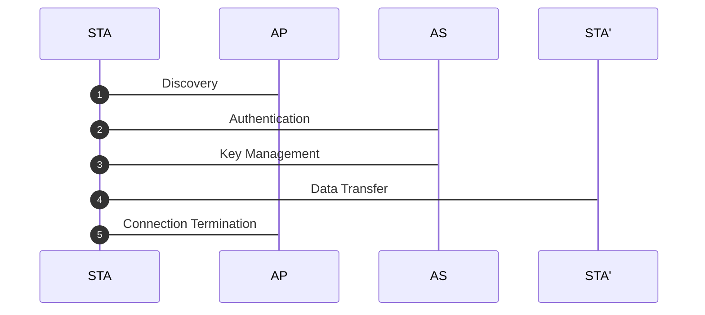
```mermaid
sequenceDiagram
	autonumber
	STA -> AP: Discovery
	STA -> AS: Authentication
	STA -> AS: Key Management
	STA -> STA': Data Transfer
	STA -> AP: Connection Termination
```

##### Discovery

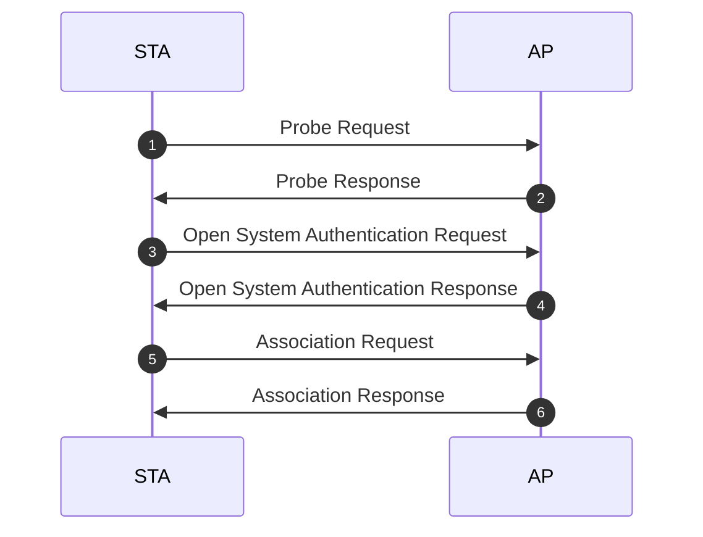
```mermaid
sequenceDiagram
	autonumber
	STA ->> AP: Probe Request
	AP ->> STA: Probe Response
	STA ->> AP: Open System Authentication Request
	AP ->> STA: Open System Authentication Response
	STA ->> AP: Association Request
	AP ->> STA: Association Response
```

1. STA solicita unirse a una red.
2. AP responde a solicitd.
3. STA solicita hacer una null authentication.
4. AP ejecuta la null authentication.
5. STA solicita asociarse.
6. AP responde a la solicitud de asociación.

> [!info] Resumen
> La primera interacción (1 y 2) consiste en que el STA solicite acceso y el AP retorne las opciones de seguridad que implementa.
> La segunda interacción (3 y 4) existe para mantener la compatibilidad con versiones previas del estándar (se intercambian IDs).
> La tercera interacción (5 y 6) consiste en que el STA solicite la asociación utilizando opciones de las implementadas.

##### Authentication

###### Extensible Authentication Protocol (EAP)

EAP encapsula múltiples métodos de autenticación

- EAP-TLS
- EAP-TTLS
- EAP-GPSK
- EAP-IKEv2
- ...

El protocolo EAP es iniciado por el AP para autenticar al STA.
En el contexto de EAP, el AP es un EAP Authenticator y el STA es un EAP Peer.

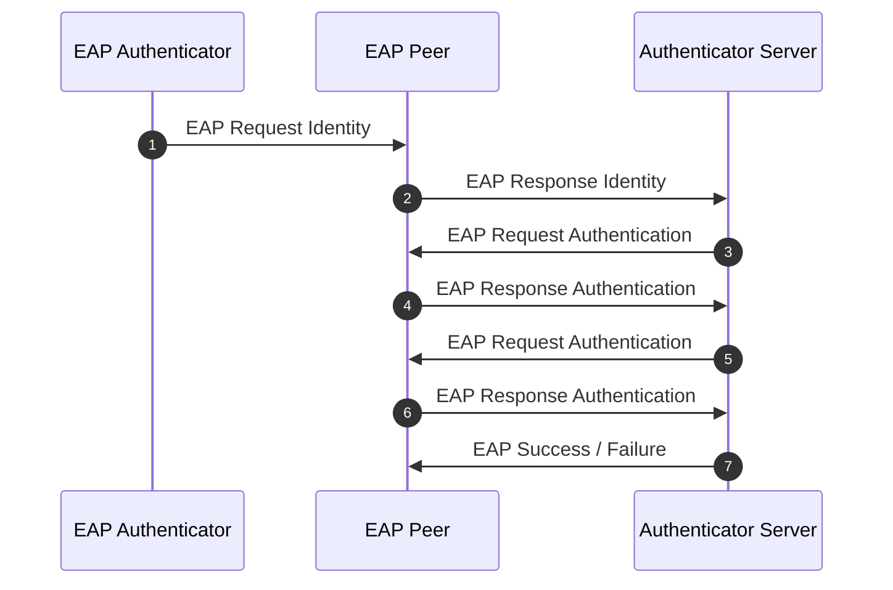
```mermaid
sequenceDiagram
	autonumber
	EAP Authenticator ->> EAP Peer: EAP Request Identity
	EAP Peer ->> Authenticator Server: EAP Response Identity
	Authenticator Server ->> EAP Peer: EAP Request Authentication
	EAP Peer ->> Authenticator Server: EAP Response Authentication
	Authenticator Server ->> EAP Peer: EAP Request Authentication
	EAP Peer ->> Authenticator Server: EAP Response Authentication
	Authenticator Server ->> EAP Peer: EAP Success / Failure
```

###### EAPOL (EAP Over LAN)

Paquetes:

- EAPOL-EAP: Contiene un paquete EAP.
- EAPOL-Start: Enviado por el Peer al comenzar comunicación.
- EAPOL-Logoff: Enviado cuando el suplicante termina el uso de la red.
- EAPOL-Key: Enviado para intercambiar claves criptográficas.

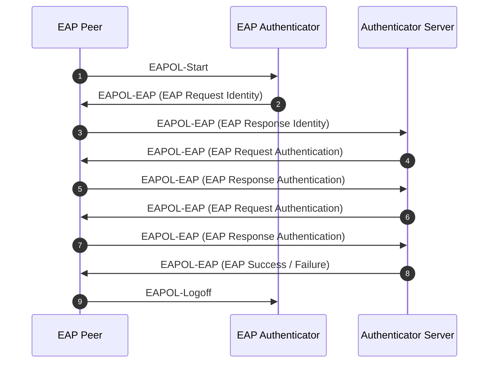
```mermaid
sequenceDiagram
	autonumber
	EAP Peer ->> EAP Authenticator: EAPOL-Start
	EAP Authenticator ->> EAP Peer: EAPOL-EAP (EAP Request Identity)
	EAP Peer ->> Authenticator Server: EAPOL-EAP (EAP Response Identity)
 	Authenticator Server ->> EAP Peer: EAPOL-EAP (EAP Request Authentication)
	EAP Peer ->> Authenticator Server: EAPOL-EAP (EAP Response Authentication)
	Authenticator Server ->> EAP Peer: EAPOL-EAP (EAP Request Authentication)
	EAP Peer ->> Authenticator Server: EAPOL-EAP (EAP Response Authentication)
	Authenticator Server ->> EAP Peer: EAPOL-EAP (EAP Success / Failure)
	EAP Peer ->> EAP Authenticator: EAPOL-Logoff
```

##### Key Management

- Clave de Parejas (Pairwise Keys): Usadas en la comunicación entre STA y AP.
- Clave de Grupos (Group Keys): Usadas para la comunicación multicast.

###### Pairwise Keys

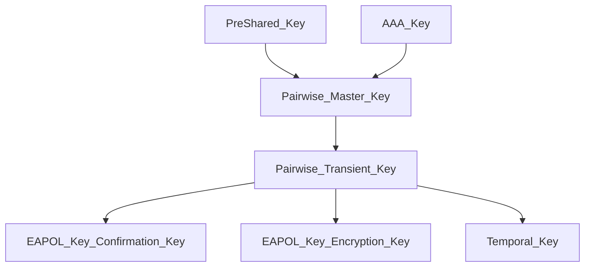
```mermaid
flowchart TD
	PreShared_Key & AAA_Key --> Pairwise_Master_Key --> Pairwise_Transient_Key --> EAPOL_Key_Confirmation_Key & EAPOL_Key_Encryption_Key & Temporal_Key
```

###### Group Keys

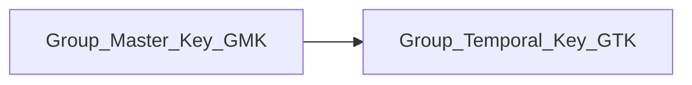
```mermaid
flowchart LR
	Group_Master_Key_GMK --> Group_Temporal_Key_GTK
```

La GMK es generada por el AS.
El AS envía la GMK a cada AP.
Cada AP genera una GTK a partir de la GMK.
La GTK generada es indistinguible de un valor aleatorio.
Cada AP envía su GTK a sus STA asociados.
La GTK se regenera cada vez que un equipo se desasocia de la red.

##### Data Transfer

TODO

<hr>

## Autenticación de Usuarios

### (Local)

1. Fase de Identificación.
2. Fase de Verificación.

#### Autenticación basada en Contraseñas

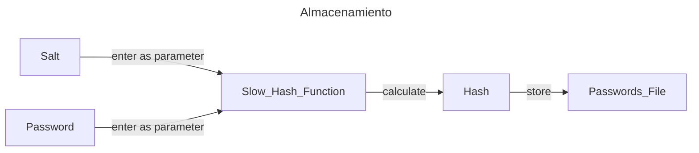
```mermaid
---
title: Almacenamiento
---
flowchart LR
	Salt & Password --enter as parameter--> Slow_Hash_Function --calculate--> Hash --store--> Passwords_File
```

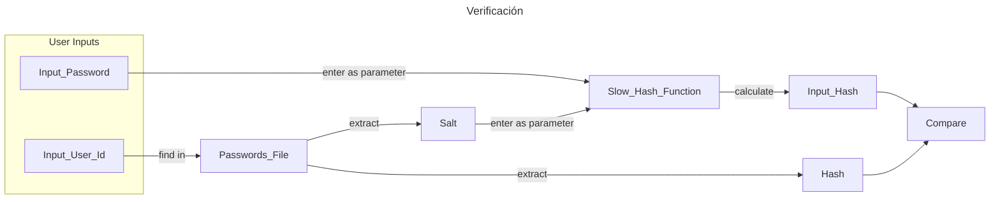
```mermaid
---
title: Verificación
---
flowchart LR
	subgraph User Inputs
		Input_Password
		Input_User_Id
	end
	Input_Password --enter as parameter--> Slow_Hash_Function
	Input_User_Id --find in--> Passwords_File --extract--> Salt --enter as parameter--> Slow_Hash_Function --calculate--> Input_Hash --> Compare
	Passwords_File --extract--> Hash --> Compare
```

##### Ataques a contraseñas

###### Ataque de Diccionario

- Sin Salt: Contraseñas iguales tienen el mismo hash.
- Con Salt: Contraseñas iguales tienen distinto hash.

###### Ataque a una cuenta específica

Probar contraseñas en una misma cuenta hasta acertar.

###### Ataque a una contraseña popular

Elegir una contraseña popular y probarla con varias cuentas.

###### Adivinar la contraseña de una cuenta específica

Utilizar información conocida para adivinar la contraseña.

###### Explotar errores de usuario

El usuario muestra su contraseña en un fichero de texto.

###### Explotar el uso múltiple de una misma contraseña

Un usuario utiliza la misma contraseña en varios dispositivos.

##### Elección de Contraseñas

1. Longitud razonable.
2. No adivinable fácilmente.

1. Educación del usuario.
2. Comprobación Reactiva: El sistema trata de averiguar contraseñas para hallar las débiles.
3. Comprobación Proactiva: El sistema comprueba si la contraseña cumple reglas generales.

#### Autenticación basada en token

Un token es un objeto poseido por el usuario.

- Token Sin / Con conexión. ==> Autenticación de doble factor.
- Contraseña estática.
- Contraseña dinámica.
- Desafío - Respuesta.
- Tarjetas Inteligentes.

#### Autenticación Biométrica

Se basa en las características físicas.

Los sistemas biométricos deben utilizar un umbral de decisión para aceptar o denegar a un usuario.
El umbral depende del uso de la aplicación.
A más estricto sea el umbral, más falsos negativos habrá y más segura será la aplicación.
A menos estricto sea el umbral, más falsos negativos habrá y menos segura será la aplicación.

### (Red)

#### Kerberos

Es un protocolo de autenticación.
Implementa una estrategia centralizada.
Kerberos está formado por dos servidores:
- Servidor de Autenticación.
- Servidor de Concesión de Tickets.

```mermaid
sequenceDiagram
	Cliente ->> Servidor de Autenticación : Solicita ticket de concesión de tickets
    Note over Servidor de Autenticación,Cliente: Una vez por cada inicio de sesión
	Servidor de Autenticación ->> Cliente : Tiget_TGS y Clave de sesión (C, TGS)
	Cliente ->> Servidor de Concesión de Tickets : Solicita ticket de concesión de servicio
    Note over Servidor de Concesión de Tickets,Cliente: Una vez por cada tipo de servicio
	Servidor de Concesión de Tickets ->> Cliente : Ticket_V y Clave de sesión (C, V)
	Cliente ->> Servidor : Solicita acceso al servicio
    Note over Servidor,Cliente: Una vez por cada sesión de servicio
	Servidor ->> Cliente : Autenticación del servidor
```

> [!info] Claves
> Este sistema utiliza clave simétricas.

#### Single Sign On (SSO)

Permite que un usuario se autentique en varias aplicaciones utilizando una única autenticación.

> [!info] Single Sign Off
> El Single Sign Off también se suele encontrar en sistemas que implementan Single Sign On.
> El Signel Sign Off permite cerrar la sesión en varias aplicaciones utilizando un único cierre de sesión.

#### Web SSO

El usuario se autentica en un servidor que le proporciona una cookie (token).
Poseer el token le permitirá al usuario acceder a diferentes servicios.

Web SSO es el mismo concepto que Single Sign On, pero aplicado a aplicaciones web.

##### CAS

```mermaid
sequenceDiagram
	Browser ->> Server : Initial Request
	Server ->> Browser : Redirect to CAS login page for this service
	Browser ->> CAS : Requests login page
	CAS ->> Browser : Login page	
	Browser ->> CAS : login and password
	CAS ->> Browser : Set CASTGC cookie and redirect to Server
	Browser ->> Server : Initial Request with ticket ST-xxxx
	Server ->> CAS : Validate ST-xxxx service ticket
	CAS ->> Server : Ticket validation response
	Server ->> Browser : Service
```

#### Identidad Digital

Algunas empresas con millones de usuarios sirven de proveedores de identidades digitales.
Permiten a usuario identificarse con sus cuentas en otros sitios para que el otro sitio no tenga que implementar las identidades digitales.

##### Federadas

Permtie a dos organizaciones utilizar las mismas identificaciones.
Es necesario que ambas acuerden un estándar para portar las identificaciones.
Una vez hecho, un usuario puede entrar en ambas organizaciones de forma transparente, sin volver a identificarse.

#### OpenID

Estándar abierto para autenticar usuarios utilizando un proveedor de identidad.

```mermaid
flowchart LR
	End_User <--> User_Agent <--> Relying_Party & OpenID_Provider
```

#### OAuth

```mermaid
sequenceDiagram
	autonumber
	Client ->> Resource Owner: Request Authorization Grant
	Resource Owner ->> Client: Authorization Grant
	Client ->> Authorization Server: Authorization Grant, Request Access Token
	Authorization Server ->> Client: Access Token
	Client ->> Resource Server: Access Token, Request Resource
	Resource Server ->> Client: Resource
```

#### OpenID Connect

Basada en OAtuh 2.0

```mermaid
sequenceDiagram
	Relying Party (RP) ->> OpenID Provider (OP) : AunthN Request
	OpenID Provider (OP) --> EndUser : AuthN and AuthZ
	OpenID Provider (OP) ->> Relying Party (RP) : AuthN Response
	Relying Party (RP) ->> OpenID Provider (OP) : User info Request
	OpenID Provider (OP) ->> Relying Party (RP) : User info Response
```

##### Authorization Code Flow

```mermaid
sequenceDiagram
	box OpenID Provider (OpenAM)
	participant Authorization Server
	participant Token Endpoint
	participant User Info Endpoint
	end
 
	Relying Party (RP) ->> Relying Party (RP) : Prepare Authorization Request
	Relying Party (RP) ->> Authorization Server : Authorization Request
	Authorization Server ->> EndUser : Authenticate End User
	EndUser ->> Authorization Server : Consent & Authentication
	Authorization Server ->> EndUser : Redirect with ...
	EndUser ->> Relying Party (RP) : ... Authorization Code
	Relying Party (RP) ->> Token Endpoint : Authorization Code
	Token Endpoint ->> Relying Party (RP) : Access token and ID token
	Relying Party (RP) ->> Relying Party (RP) : Validate ID token and get EndUser subject ID
	Relying Party (RP) ->> User Info Endpoint : (Optional) Access Token
	User Info Endpoint ->> Relying Party (RP) : (Optional) User Info Response
```

##### Implicit Flow

```mermaid
sequenceDiagram
	box OpenID Provider (OpenAM)
	participant Authorization Server
	participant User Info Endpoint
	end
 
	Relying Party (RP) ->> Relying Party (RP) : Prepare Authorization Request
	Relying Party (RP) ->> Authorization Server : Authorization Request
	Authorization Server ->> EndUser : Authenticate End User
	EndUser ->> Authorization Server : Consent & Authentication
	Authorization Server ->> EndUser : Redirect with ...
	EndUser ->> Relying Party (RP) : Access token and ID token
	Relying Party (RP) ->> Relying Party (RP) : Validate ID token and get EndUser subject ID
	Relying Party (RP) ->> User Info Endpoint : (Optional) Access Token
	User Info Endpoint ->> Relying Party (RP) : (Optional) User Info Response
```


<hr>

## Seguridad de Aplicaciones

<hr>

## Cortafuegos

Elemento de control colocado entre internet y la red local.

```mermaid
flowchart LR
	Internet <--> Firewall <--> LAN
``` 

### Filtros de Paquetes

Se trata de routers que filtran los paquetes a nivel de capa IP.
En función de:
- Dirección IP origen / destino.
- Puerto origen / destino.
- Interfaz origen / destino.

Existe una acción por defecto que se aplica cuando ningún filtro coincide con el paquete en evaluado.

#### Ventajas

- Rápidos
- Transparentes a las aplicaciones
- Escalables

#### Desventajas

- No previenen ataques que explotan vulnerabilidades en aplicaciones
- Funcionalidades limitadas
- No soportan autenticación de usuarios
- Pueden crear brechas de seguridad si no se configuran adecuadamente

### Pasarelas

Se trata de establecer un intermediario (proxy) a través del cual pasan los paquetes de entrada y salida.
Tras el filtrado de paquetes.

#### Nivel de Aplicación

Un programa recibe los paquetes, los analiza y los envía al destinatario.
- Es más seguro que el filtro de paquetes.
- Produce overhead en el transporte.

#### Nivel de Circuito

Un programa recibe los paquetes y decide qué paquetes transmitir.
Se suele implementar una pasarela a nivel de aplicación para paquetes entrantes y a nivel de circuito para los salientes.

### Cortafuegos

#### Bastión

Un bastión es un equipo designado como crítico para la seguridad.

#### Basados en Host

Es un módulo software utilizado para proteger a un host individual.
El cortafuegos reside en el host.

#### Personales

Controla el tráfico entre un PC y la red corporativa.
Suele estar alojado en un router que conecte la red a internet.

<hr>

## Malware y Antimalware

Cualquier software que impide el funcionamiento normal de un computador.

Un malware puede estar en uno de 3 estados:
- In the wild (En múltiples computadores)
- In the zoo virus (Siendo investigado)
- In the wild list (?) (Registrado, sólo unos pocos son peligrosos)

### Virus

- Se ejecuta sin el consentimiento del usuario.
- Causa daños.
- Se propaga.
	- Para ello, infecta otros programas.

#### Componentes básicos

- Mecanismo de replicación
- Tarea a ejecutar para dañar
- Trigger para activar la replicación y tarea

##### Fases

1. Latente: Está a la espera. No todos tienen esta fase, algunos no se encuentran nunca latentes.
2. Propagación / Infección: Se copia a sí mismo en otros programas.
3. Activación: Se activa para realizar la función.
4. Ejecución: Realiza su tarea.

### Tipos

#### Virus Genérico

```
fun infectar_ejecutable () {
	while (true) {
		exe = coger_ejecutable_aleatorio();
		if (!exe.esta_ya_infectado()) { // Se busca la marca de infección
			exe.infectar(); // Al infectar, se añade la marca
		}
	}
}
```

#### Virus Compresor

Comprime los ejecutables infectados y los descomprime cuando el usuario quiere ejecutarlos para que se puedan ejecutar normalmente y el usuario no se de cuenta.

#### Virus sector de arranque

Se aloja en el primer sector de una unidad de disco.

#### Virus de archivo ejecutable

Se instala en un ejecutable que actúa como portador.
Es específico, se escribe para un tipo de ejecutable y operativo.

#### Virus de macro

Se instala en documentos.
Son multiplataforma.

#### Virus de correo electrónico

Se instala en el programa de correo electronico.
Puede enviar correos masivamente para colapsar el sistema.

#### Puertas traseras

Mecanismo que permite el proceso normal de autenticación utilizado para acceder al sistema / aplicación.

Existen puertas simétricas y asimétricas.
Las simétricas permiten a cualquiera acceder.
Las asimétricas sólo permite a quien la ha insertado.

#### Troyano

Permite la ejecución de comandos sin la autorización del propietario.
Generalmente lo instala el propio usuario pensando que es otro programa.

#### Gusanos

Se replica a sí mismo.
Utiliza una red para enviar copias de sí mismo.
<font color=green>No requiere la intervención del usuario. ES INDEPENDIENTE.</font>

Un gusano suele traer una carga que suele ser otro tipo de virus para dañar el sistema.
El gusano entonces suele ser un mero medio de transporte del virus real.

Los gusanos suelen formar botnets, para enviar spam o DDoS.

#### Bomba lógica o de tiempo

Es un malware que permanece latente hasta ser activado por un evento.
- Puede activarse tras una fecha en concreto.
- Puede activarse tras n arranques del SO.

Los virus y gusanos se suelen usar para instalar alguna bomba de tiempo.

#### Spyware

Se utiliza para recopilar información sin el conocimiento del usuario.

#### Adware

Banners no deseados en pantalla.

### Contramedidas

#### Virus

##### Antivirus

1. Detectar el programa infectado.
2. Identificar el virus.
3. Eliminación del virus y devolver el programa a su estado original.

No en todos los casos es posible identificar y eliminar al virus detectado.
A una mala, si se detecta el virus, se puede desinstalar el programa infectado y reinstalarlo.

###### Escáneres Sencillos

Utilizan firmas (no firmas digitales, no tienen nada que ver) para identificar los virus en programas.
Las firmas deben tener la suficiente longitud como para evitar falsas detecciones.
Un mismo virus tiene una firma distinta para cada antivirus.

Los escáneres buscan firmas conocidas en ficheros del sistema

> [!warning]
> Es necesario que la firma se conozca para detectar al virus.

###### Escáneres Heurísticos

No buscan una firma específica para cada virus.

Analizan bloques de código que se asocien frecuentemente con virus (Ejemplo, bucle de cifrado en un programa de compresión).

También utilizan la comprobación de la integridad (checksum) de los programas.
Un virus puede también cambiar el checksum una vez instalado en el programa.
Entonces, el checksum calculado se cifra con una clave ajena al programa, desconocida por el virus.

###### Monitores de Actividades

Identifican a los virus por las acciones que realizan.

No es necesario crear una BBDD de virus.
Sólo hay que identificar comportamientos.

Comportamientos de un virus:
- Reescribirse a sí mismo.
- Inicio de comunicaciones anómalas en la red.
- Modificación de parámetros del sistema.
- ...

###### Combinaciones

Hoy en día se realiza una combinacion de las anteriores estrategias.

#### Gusanos

Consiste en analizar los paquetes de red para detectar programas cuya carga puedan ser otros virus.

> [!error] Examen
> Un virus que muta trata de añadir ordenes inocuas para invalidar las firmas de los antivirus.


<hr>

## Auditoría de Seguridad

Revisión y examen de los registros de las actividades de un sistema.
RAS: Registro de auditorías de seguridad.

Objetivo:
- Generar y grabar RAS.
- Revisar y analizar RAS.

### Eventos

```mermaid
flowchart TD
	Event_Generator --> Event_Discriminator --Alarm--> Alarm_Processor --> Action & Audit_Recorder
	Event_Discriminator --Audit Message--> Audit_Recorder --Audit Record--> Security_Audit_Trail --> Audit_Provider --> Audit_Trail_Examiner --> Security_Reports
	Security_Audit_Trail --> Audit_Analyzer --Alarm--> Alarm_Processor & Audit_Recorder 
	Security_Audit_Trail --> Audit_Archiver <--> Audit_Trail_Examiner
	Audit_Archiver --> Archives
```

### Common Criteria

Conjunto de criterios para especificar productos de seguridad.
Asegura que los productos son interoperables a nivel mundial.

### Registros

#### Requisitos de datos

La cantidad es una función del rango de áreas de interés y la granularidad de la captura.
La cantidad debe ser un compromiso entre cantidad y eficiencia.
- Registros con alta cantidad:
	- Degradan los sistemas en mayor grado
	- Sobrecargan el análisis
	- Tienden a generar muchos datos

#### Selección de datos

- Eventos
	- Del software de auditoría
	- Relacionados con los mecanismos de seguridad
	- Generados por mecanismos de seguridad
	- Relacionados con la gestión y el funcionamiento del sistema
- Accesos
	- Al sistema operativo
	- A aplicaciones seleccionadas
	- Remotos

##### Sugerencias del ISO 27002

- Accesos autorizados
- Operaciones realizadas utilizando privilegios
- Accesos no autorizados
- Alertas por fallos
- Cambios e intentos de cambio en configuraciones del sistema

#### Eventos

##### Tipos

- A nivel del sistema (`dmesg`).
- A nivel de aplicación (`logs`).
- A nivel de usuario (`history`).

En cualquier caso, los registros que se tomen deben estar seguros para asegurar la CIA (Confidentiality, Integrity, Availability).

##### Propiedades de Eventos

- Origen (Programa que genera el evento)
- Identificador
- Nivel
	- Registro de Aplicación y Sistema
		- Información
		- Advertencia
		- Error
		- Crítico
	- Registro de Seguridad
		- Auditoría de Aciertos
		- Audit
- Usuario
- Código operativo
- Registro
- Categoría de tarea
- Palabras clave
- Equipo
- Fecha y hora

##### Windows

Se utiliza el `event viewer` para observar los eventos de windows.

Existen 2 categorías de servicios:

- Registros de windows.
	- Aplicación (deprecated, ahora se utilizan los Registros de Aplicaciones y Servicios)
	- Seguridad
	- Instalación
	- Sistema
	- Eventos reenviados
- Registros de Aplicaciones y Servicios.
- Vistas personalizadas.
	- Permite almacenar un filtro (conjunto de reglas).
	- Mostrará los eventos que cumplan el filtro.
- Suscripciones.
	- Permite recopilar datos de eventos de varios equipos remotos.

##### Unix

```mermaid
flowchart TD
	subgraph Kernel
		Audit_Subsystem
	end
	subgraph Audit Event Handlers
		Custom_Program_1
		Custom_Program_2
		Ausearch
		Aureport
	end
	Audit_Subsystem --> Auditd --> Auditspd --> Custom_Program_1 --> Custom_Output_1
	Auditspd --> Custom_Program_2 --> Custom_Output_2
	Auditd --> Disk_Based_Audit_Files --> Ausearch --> Specific_Audit_Records
	Disk_Based_Audit_Files --> Aureport --> Audit_Summaries
	/etc/audit/audit.rules --> auditctl --> Audit_Subsystem
```

En UNIX se utiliza el proceso `syslogd` para administrar los logs.

Cada paquete de `syslog` consiste de 3 partes:
- Prioridad = $Prioridad = 8 * Facility + Severity$
- Cabecera
- Mensaje

#### Cuándo se analiza el registro

- Tras el evento.
- Análisis periódico.
	- Se buscan patrones de eventos que muestren un problema de seguridad.
	- Desarrollar un perfil de comportamiento normal y buscar comportamientos anómalos.
	- Desarrollar un perfil para cada usuario / rol individual.
- Análisis en tiempo real.
	- Se realiza de forma automatizada para detectar intrusiones.

### SIEM

Un SIEM es un Security Information and Event Management.

```mermaid
flowchart LR
	Network & Windows --> Events --> Normalization --> Searching & Visualization & Reports & Alerts --> Analysis
	Network & Linux --> Syslog --> Events
```
