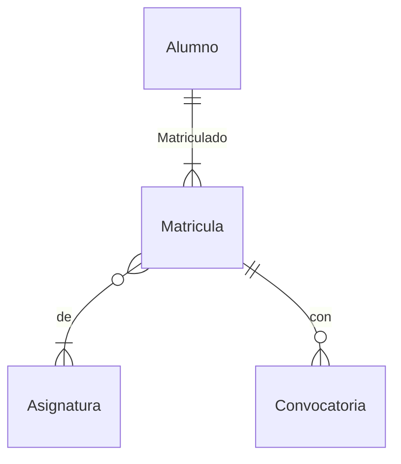

# Object Relational Mapping (ORM) & JPA
2023-11-07 (YYYY-MM-DD) @ 16:16
Rodríguez López, Alejandro // UO281827

Tags:
	#showable
	Hecho en #EPI
	Sobre  #Tec_Web
	Para #Apuntes
	Otros:
	Refs:
 
<hr>

Existe una clase por cada tabla con los siguientes atributos:
- Naturales: Propios de la tabla.
- Accidentales: Necesarios por implementación del ORM (relaciones). Un usuario que pertenece a comunidades tiene una lista de comunidades.
- Transitivos: Atributos del ORM que no se envían a la BBDD.

La clase ORM se anota con `@Entity`, los atributos transitivos con `@Transient` y los accidentales con `@OneToMany`, `@ManyToOne`, etc.
Los atributos naturales no tienen por qué ser anotados.

```java
@Entity
public class Alumno {

	@OneToMany
	private final Set<Matricula> matriculas = new HashSet<Matricula>;

	@Id
	@GeneratedValue
	private Long id;

	@Column(unique = true)
	private String dni;
	private String nombre;
	private String apellido;

	// public Alumno () { ... }
	// ...

}
```



- Q1: Es necesario hacer `em.persist(objeto)` para cada objeto, no hay un `em.persistAllModified()`?
- Q2: Los model del JPA sustituyen a los model del proyecto sin JPA?
- Q3: El atributo `OneToMany Set` es `final`. Why?