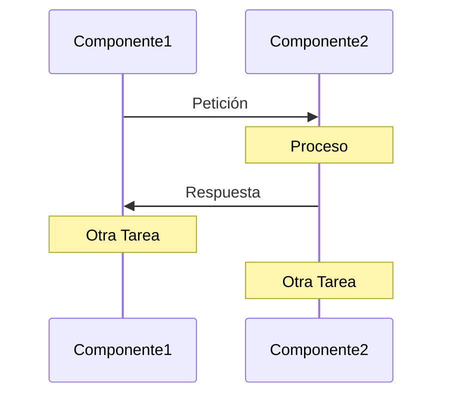
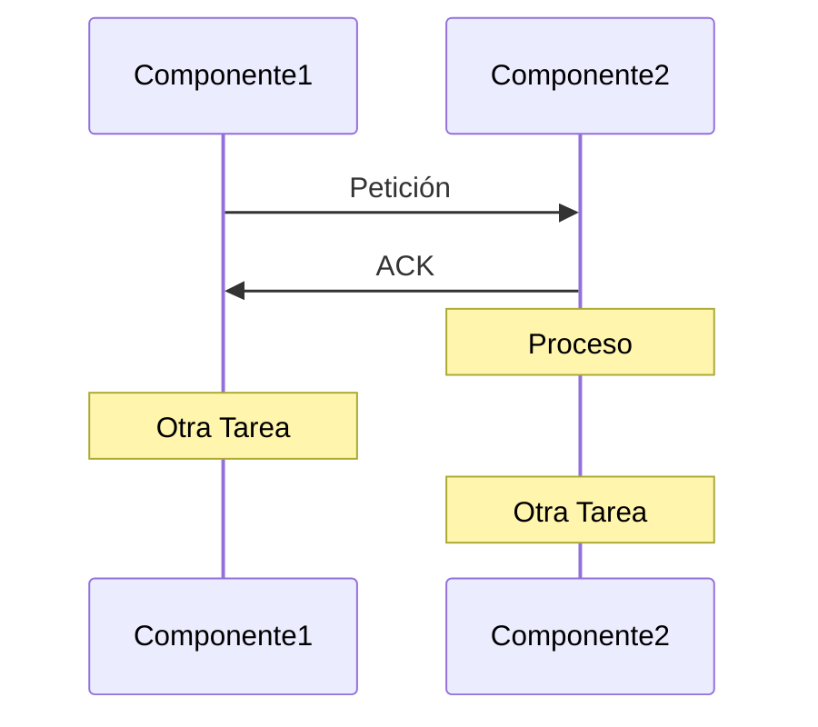
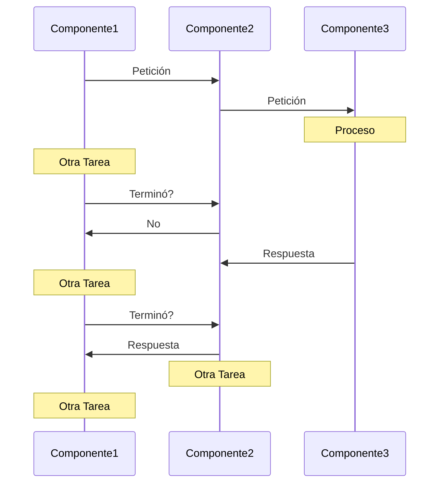
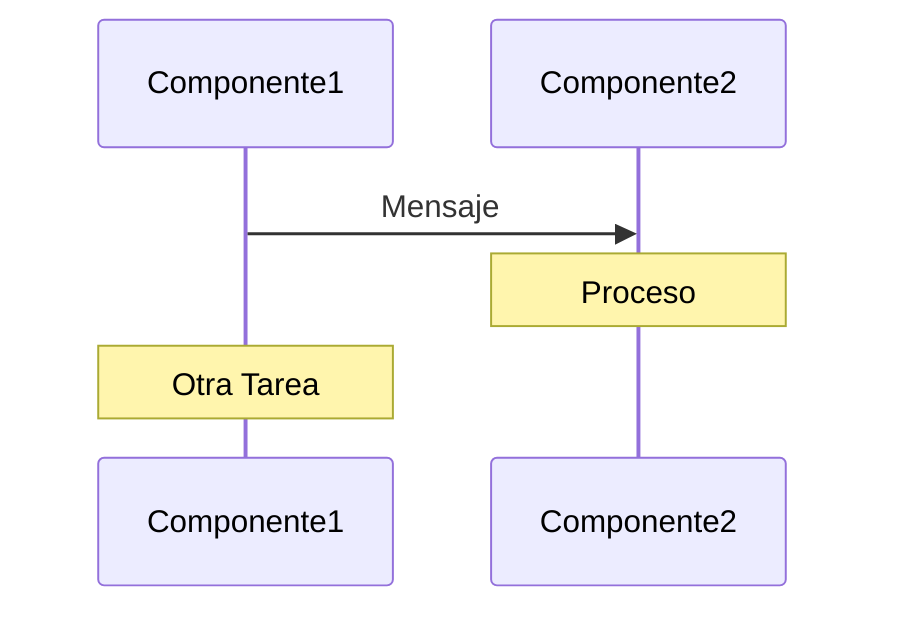
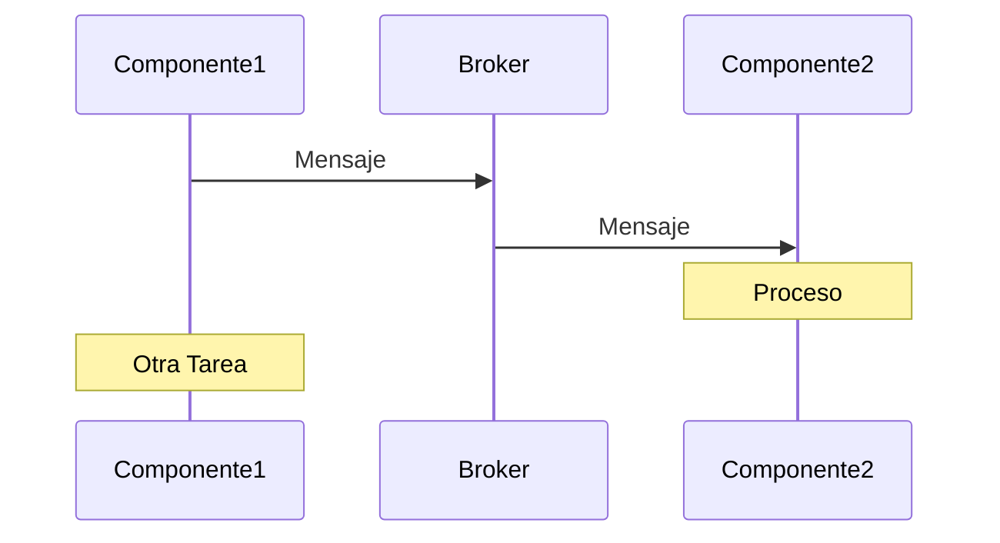
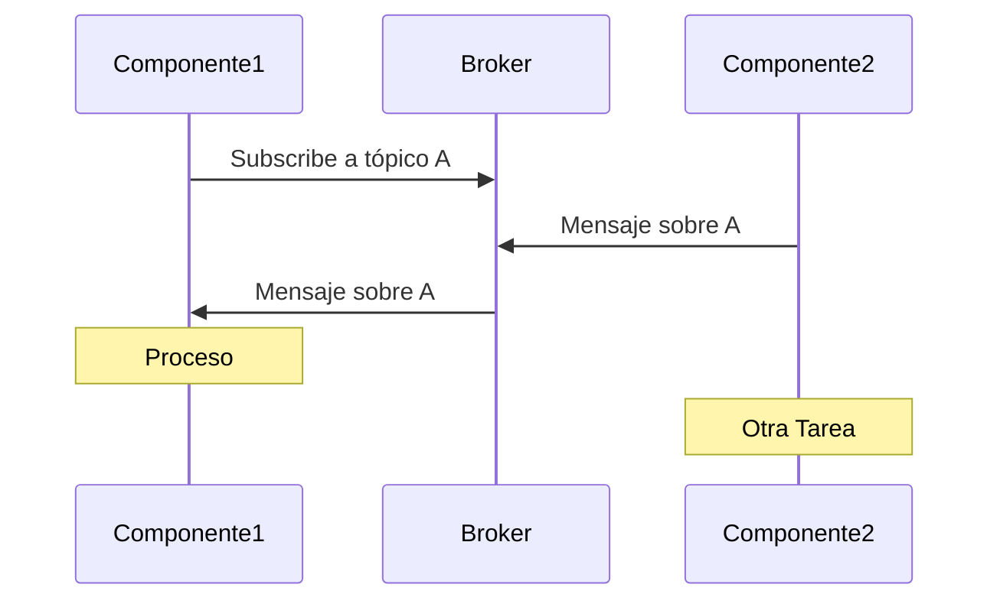
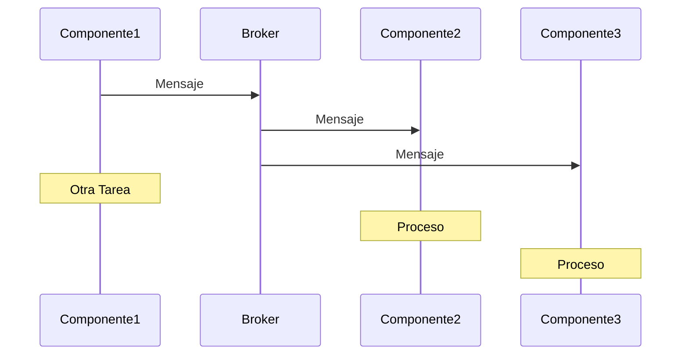

# 1. Introducción
2024-10-28 (YYYY-MM-DD) @ 17:31
Rodríguez López, Alejandro // UO281827

Tags:
	#showable
	Hecho en #EPI
	Sobre #ADS
	Para #Apuntes
	Otros:
	Refs:
 

## Características comunes

- No hay un reloj común: Problemas de sincronización.
- No hay memoria compartida: Necesario paso de mensajes.
- Separación geográfica.
- Autonomía y heterogeneidad: Los sistemas son distintos entre ellos.

## Motivos

- Compartir recursos.
- Reducción de coste (más máquinas más pequeñas).
- Escalabilidad (se añaden más máquinas).
- Rendimiento (paralelismo).
- Tolerancia a fallos (redundancia).

## Retos

- Recursos accesibles entre máquinas.
- Transparencia: Ocultar que los recursos están distribuidos.
- Apertura: Proporcionar servicios con sintaxis y semántica de acuerdo a reglas conocidas, interoperabilidad.
- Escalabilidad: Capacidad para adaptarse al crecimiento.
- Concurrencia: Gestión accesos simultáneos a información.
- Calidad de servicio: Asegurar cierto valor en métricas de calidad.
- Seguridad: Privacidad, integridad y autenticidad.

## Modelos de comunicaciones

- Modo en que dos aplicaciones puede interactuar:
	- Síncrona: Emisor espera por una respuesta.
		- El emisor necesita un resultado para seguir (API REST).
	- Asíncrona: Emisor continúa sin esperar respuesta.
		- El emisor no necesita un resultado para seguir (Stream).

### Síncrona

#### Petición / Respuesta

#### Sentido

#### Sondeo

### Asíncrona

#### Paso de mensajes

> [!fail] No hay confirmación
> Si hay fallos en la red, el `componente1` no se dará cuenta de que `componente2` NO ha recibido su mensaje.

Otras veces se delega el envío a un broker con el que la comunicación está asegurada.

#### Publicación / Subscripción

#### Difusión

### Mensajes

- El emisor: Crea el mensaje en el formato apropiado.
- El emisor: Envía el mensaje por el sistema de comunicaciones.
- El receptor: Recibe el mensaje del sistema de comunicaciones.
- El receptor: Extrae la información relevante y procesa.

> [!success] PROS
> - Bajo acoplamiento: Todo va en el mensaje.
> - Fácil de implementar.
> - Flexibe.

> [!fail] CONTRAS
> - Requiere estandarización.
> - No se sabe qué componentes aceptan qué mensajes.

### Interfaces

- El emisor: Crea una invocación o llamada al componente.
- El emisor: Ejecuta la llamada.
- El receptor: Recibe la invocación remota.
- El receptor: Ejecuta la acción de la interfaz invocada.

> [!success] PROS
> - Similar a un procedimiento convencional.
> - Fácil de reutilizar y mantener.

> [!fail] CONTRAS
> - Mayor acoplamiento.
