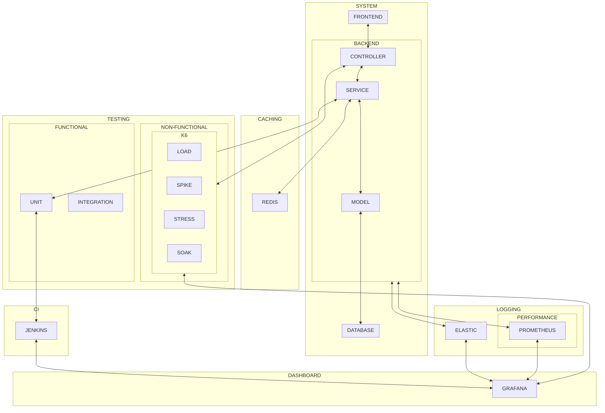

```mermaid
flowchart
	subgraph SYSTEM
		subgraph FRONTEND
		end
		subgraph BACKEND
			CONTROLLER
			SERVICE
			MODEL
		end
		subgraph DATABASE
		end
	end
	subgraph CACHING
		REDIS
	end
	subgraph TESTING
		subgraph NON-FUNCTIONAL
			subgraph K6
				LOAD
				SPIKE
				STRESS
				SOAK
			end
		end
		subgraph FUNCTIONAL
			UNIT
			INTEGRATION
		end
	end
	subgraph LOGGING
		subgraph PERFORMANCE
			PROMETHEUS
		end
		ELASTIC
	end
	subgraph DASHBOARD
		GRAFANA
	end
	subgraph CI
		JENKINS
	end
	
FRONTEND <--> CONTROLLER <--> SERVICE <--> MODEL <--> DATABASE
SERVICE <--> REDIS & UNIT
UNIT <--> JENKINS <--> GRAFANA
CONTROLLER <--> K6 <--> GRAFANA
BACKEND <--> ELASTIC <--> GRAFANA
BACKEND <--> PROMETHEUS <--> GRAFANA
```
