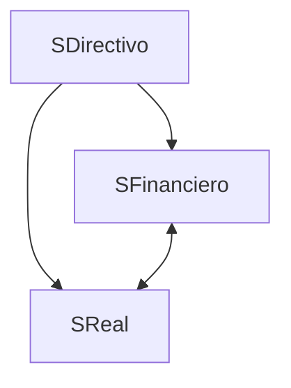

# 1. Introducción
2024-09-12 (YYYY-MM-DD) @ 17:43
Rodríguez López, Alejandro // UO281827

Tags:
	#showable
	Hecho en #EPI
	Sobre #EBT
	Para #Apuntes
	Otros:
	Refs:
 

- Subsistemas:
	- Directivo: Tomar decisiones
	- Financiero: Conseguir capital
	- Real: Invertir capital
		- Aprovisionamiento
		- Ejecución
		- Marketing

En una empresa de mayor tamaño se suelen distinguir los grupos fácilmente.
En una EBT (que suelen tener un menor tamaño) las fronteras entre los grupos son inexistentes, casi todos hacen de todo.

> [!info] EBT: Empresa de Base Tecnológica
> - Reciente.
> - Pequeña.
> - Independiente.
> - Sector Tecnológico.  
> - Flexibilidad: Suele poder adaptarse más rápidamente a cambios.
> - Dinamismo Tecnológico: Suele poder implementar nuevas tecnologías rápidamente.  
> - Frecuentemente se crean como spinoffs de otras empresas mayores o de universidades.

