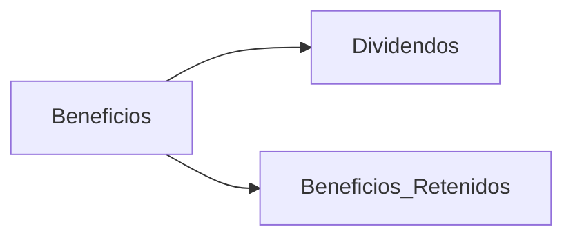
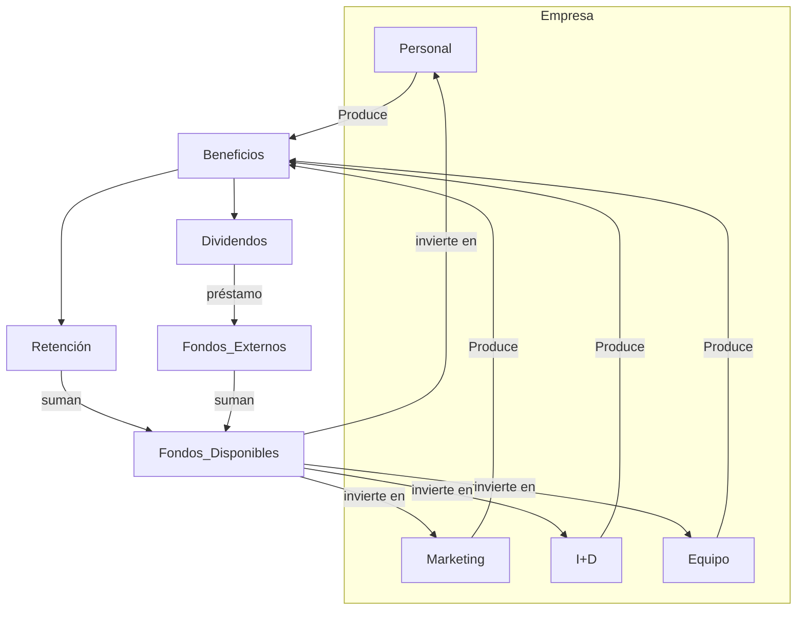
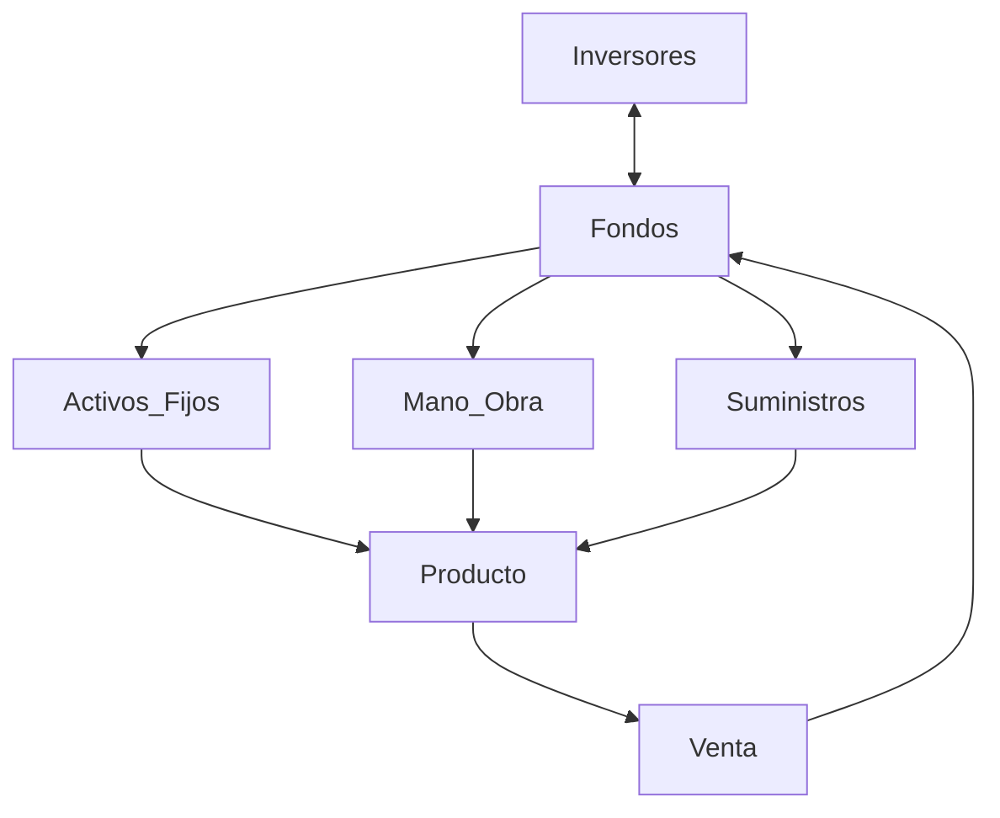
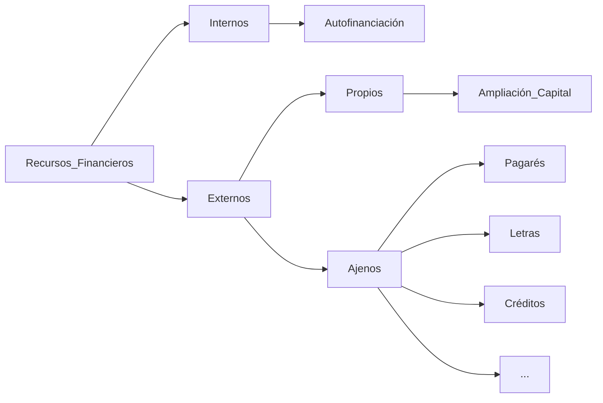
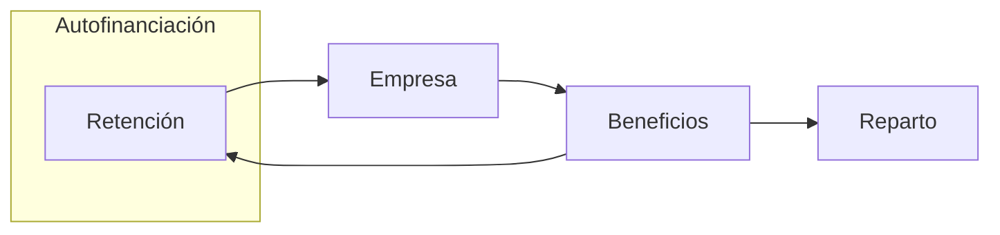

# 2. Financiación e Inversión
2024-09-12 (YYYY-MM-DD) @ 18:32
Rodríguez López, Alejandro // UO281827

Tags:
	#showable
	Hecho en #EPI
	Sobre #EBT
	Para #Apuntes
	Otros:
	Refs:
 

1. Obtención de fondos (Financiación).
2. Inversión de los recursos (Inversión).

Una empresa produce beneficios, con ellos puede hacer dos cosas:
1. Dividendos (repartirlos).
2. Retenerlos (ahorrarlos y reinvertirlos en la propia empresa).

Repartir dividendos es interesante para la empresa porque beneficia su situación.
Los dividendos (la situación financiera en general) mejora la evaluación de financieros intermediarios.

## Financiación

Activo Financiero:
- Primario: Emitido por la propia empresa.
- Secundario: Emitido por un intermediario (i.e. un banco).

### Financiación General

#### Interna
##### Autofinanciación

- Beneficios Retenidos: Proveniente de los beneficios.
- Dotación para Provisiones: Proveniente de la reserva para impuestos (a recuperar antes de pagar los impuestos).
- Dotación para Amortizaciones: Proveniente de la reserva para reemplazar activos amortizados (a recuperar antes del reemplazo).

#### Externa

##### Recursos Propios

Consiste en dividir el valor de la empresa en un número mayor de acciones para venderlas.

Valoración de Acciones:
- Valor nominal: $capitalInicial / nAccionesEmitidads$.
- Valor contable: $fondosPropios / nAcciones$.
- Valor de mercado: Cotización.
- Valor intrínseco: Valoración de los inversores.

> [!warning] Acciones
> Subdividir el valor de la empresa en un mayor número de acciones hace que el valor de cada acción disminuya.

Al subdividir en más acciones, las nuevas acciones se ofrecen primero a los accionistas existentes para que mantengan su nivel de propiedad.
Las acciones restantes se sacan al mercado.

##### Recursos Ajenos
- Títulos
- Préstamos
- Leasing
- Financiación a corto plazo

###### Títulos

- Obligaciones: Más de cinco años
- Bonos: Menos de cinco años.
- Cédulas: Garantía Hipotecaria.
- Pagarés: Menos de un año.

> [!question] Títulos
> ¿Esto son sólo diferentes sabores de préstamo?

Diferencia con las acciones

1. Renta fija.
2. Exigibles, es obligatorio retornarlos.
3. No dan propiedad sobre la empresa.

Intereses.
Se pueden pagar de diferentes formas:

1. Cupón Americano: A lo largo del tiempo, dividiendo los intereses de forma equitativa.
2. Cupón Cero: Al final del período del préstamo.
3. Al Descuento: Descontándolos del préstamo inicial.

Amortización

- Periódica: Pagar el capital periódicamente.
- Al vencimiento: Pagar el capital al final.

Derecho de Rescate

Posibilidad de finalizar el préstamo antes de su final previsto.

###### Préstamos y Créditos

Préstamo: Una cantidad predefinida.
Crédito: Una cantidad indefinida con un máximo definido.

Amortización

1. Sistema Americano: Se paga una cantidad constante de intereses y 0 de capital hasta el fin del préstamo.
2. Amortización Constante: Se paga una cantidad constante de capital y una variable de intereses.
3. Sistema Francés: Se paga una cantidad constante repartida entre intereses y capital.

> [!note] Gráficos
> Los gráficos de las traspas son bastante buenos.

###### Leasing

Contrato de arrendamiento de algún activo.
Al finalizar el plazo de arrendamiento:

1. Comprar el activo por su valor residual.
2. Devolverlo al arrendador.
3. Nuevo contrato con un precio igual al residual.

- Leasing Financiero: No es revocable (i.e. el activo no se puede devolver antes del fin del contrato).
- Leasing Operativo: Es revocable (i.e. el activo se puede devolver antes del fin del contrato).

> [!info] Financiero / Operativo
> Lógicamente, el tipo de leasing afecta al contrato.
> Los financieros serán más baratos que los operativos.

###### Corto Plazo

Cuenta de proveedores: Los proveedores pueden ofrecer en las condiciones de pago descuentos si se paga pronto.
Descuento comercial: Una entidad financiera le adelanta el dinero que debe un cliente. Si el cliente no paga, la empresa responde ante la entidad financiera.
Factoring: Igual que el anterior pero la entidad financiera asume el riesgo de insolvencia del cliente a costa de una comisión.

### Financiación EBT

- Fondos propios
- Créditos bancarios
- Subvenciones

1. Aportaciones de los promotores.
2. Aportaciones de Family, Friends and Fools.
3. Inversor Informal (Business Angel): Empresarios existentes con capacidad que invierten en empresas que no están en bolsa.
4. Entidad de Capital Riesgo: Inversiones temporales con el objetivo de obtener una plusvalía.
5. Financiación Bancaria: Sólo a corto y medio plazo (Salvo con Business Angel).
6. Financiación Pública: Subvenciones que suelen llegar tarde.

## Inversión

El problema de la inversión es comparar gastos actuales con rendimientos futuros.

Valor del dinero en el tiempo. Donde $C_k$ es el valor de una cantidad $C$ en el año $k$ e $i$ es el interés:
$$
	\begin{matrix}
	C_0 & = & C_0 \\
	C_1 & = & C_0 \cdot (1 + i) \\
	C_2 & = & C_1 \cdot (1 + i) & = & C_0 \cdot (1 + i)^2 \\
    ... \\
    C_n & = & C_0 \cdot (1 + i)^n
	\end{matrix}
	
$$

Entonces, dada una cantidad futura $C_n$ se puede conocer su valor $C_0$ de hoy con:
$$
	C_0 = { C_n \over (1 + i)^n }
$$

Entonces, dadas las cantidades que se recibirán en los $N$ flujos futuros se puede conocer el total de hoy con:
$$
T_0 = \sum_{t=0}^N{C_t \over {(1 + i)^t}}
$$

### Valor Actual Neto: VAN

- $A$: Desembolso Inicial.
- $n$: Horizonte Temporal.
- $C_t$: Entradas de dinero en el período $t$.
- $P_t$: Pagos originados por la inversión en el período $t$.
- $AM_t$: Amortización de los activos adquiridos para el proyecto en el período $t$.
- $V_r$: Valor residual de los activos adquiridos para el proyecto.
- $BEN_t$: Beneficios del Proyecto en el período $t$. ($BEN_t = C_t - P_t - AM_t$)
- $IMP_t$: Impuestos a pagar en el período $t$. ($IMP_t = 0.35 \cdot BEN_t$)
- $Q_t$: Flujo neto de tesorería en el período $t$. ($Q_t = C_t - P_t - IMP_t + V_r$)

$$
\begin{matrix}
	VAN & = & -A + & {Q_1 \over {(1 + i)}} + {Q_2 \over {(1 + i)^2}} + ... + {Q_n \over {(1 + i)^n}} \\
	VAN & = & -A + & \sum_{t=1}^n{Q_t \over {(1 + i)^t}}
\end{matrix}
$$

### Tasa Interna de Retorno: TIR

La TIR es el valor de $i$ que hace que el $VAN = 0$.
Por lo tanto:
- $TIR$ > $i$: Me interesa el proyecto.
- $TIR$ <= $i$: No me interesa el proyecto.

En otras palabras, me interesa un proyecto con una TIR mayor.

Observando dos proyectos distintos en un gráfico, el punto en el que las rectas se interseccionan se denomina punto de Fisher.
