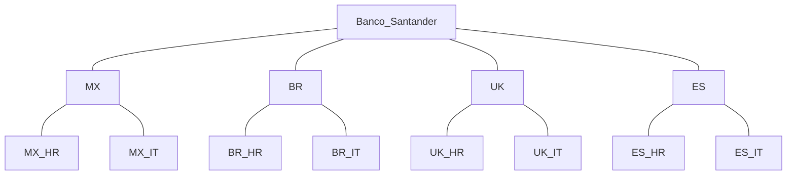

# 5. Estructuras Organizativas
2024-10-10 (YYYY-MM-DD) @ 17:16
Rodríguez López, Alejandro // UO281827

Tags:
	#showable
	Hecho en #EPI
	Sobre #EBT
	Para #Apuntes
	Otros:
	Refs:
 

Siempre se contemplan 5 elementos:
- Ápice: Dirección, CEO.
- Línea Media: Directivos y ejecutivos.
- Núcleo de operaciones: El resto de la plantilla.
- Tecnoestructura: Apoyan al ápice y a línea media.
- Staff de apoyo: Apoyan al núcleo de operaciones.

## Estructura Simple

- Jerárquica.
- Sencilla y facil de comprender.

## Estructura Funcional

- Departamentalización de la organización:
	- IT
	- HHRR
	- Legal
	- ...
- Permite fácil crecimiento:
	- Horizontal: Añadiendo departamentos de otras cosas.
	- Vertical: Incrementando el tamaño de un departamento existente.
- Crea barreras de conocimiento entre empleados:
	- Un miembro de HHRR conoce muy bien su departamenteo pero no sabe nada de IT.

## Estructura Divisional

- Mezcla de divisional y funcional:
	- Primero divisional y después funcional.
- Divide la empresa en varios grupos y cada grupo se estructura de forma funcional.
	- Zonas Geográficas.
	- Productos.
	- Clientes.

- Un departamento de una división se comporta de forma distina al mismo departamento de otra división.

## Estructura Matricial

- Mezcla de divisional y funcional.
	- Ambas a la vez.
- La división geográfica/producto/cliente se realiza a la misma altura que la departamental.
- Un empleado de España en HHRR tiene dos jefes: Uno de España y otro de HHRR.
